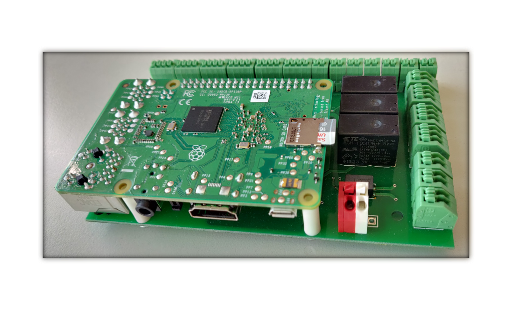
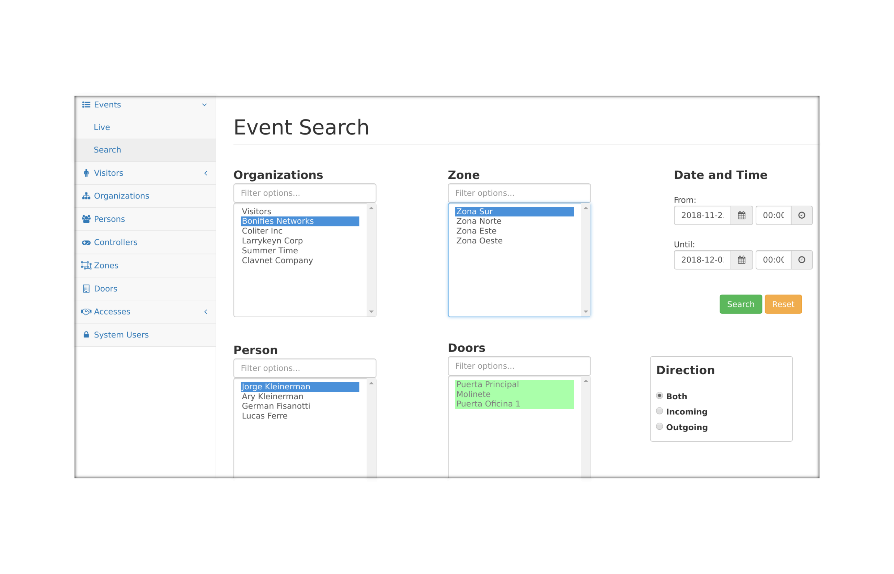
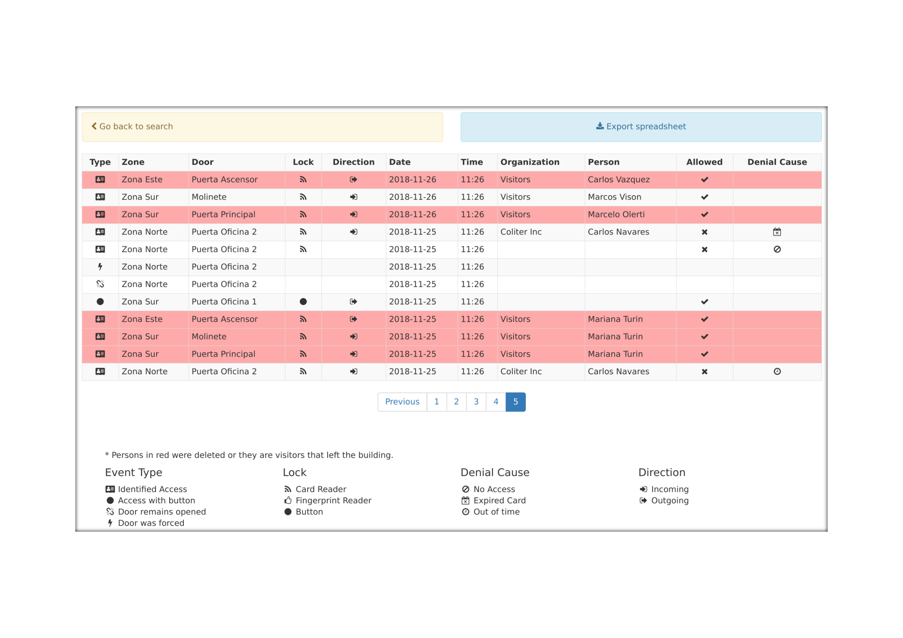
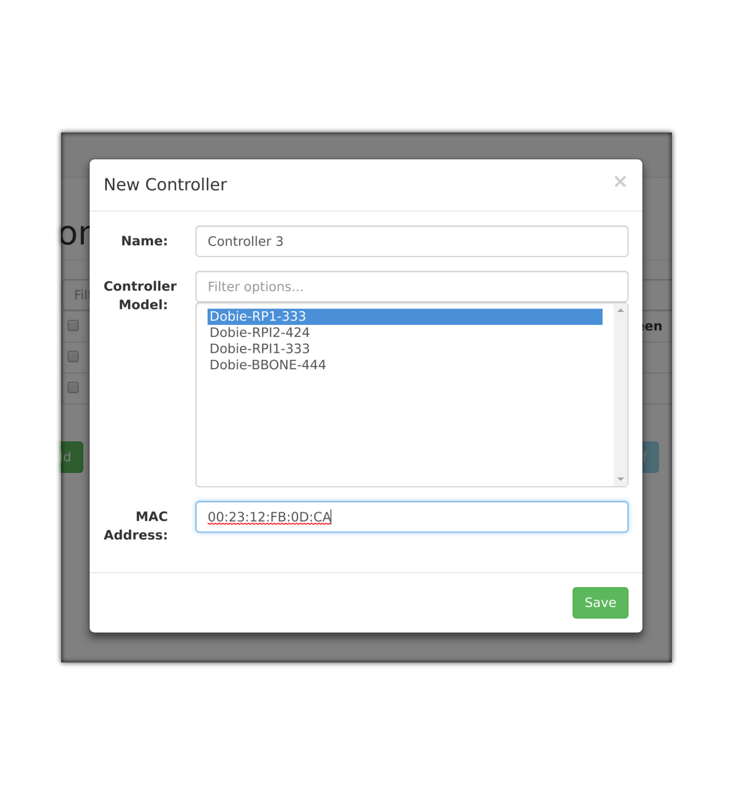
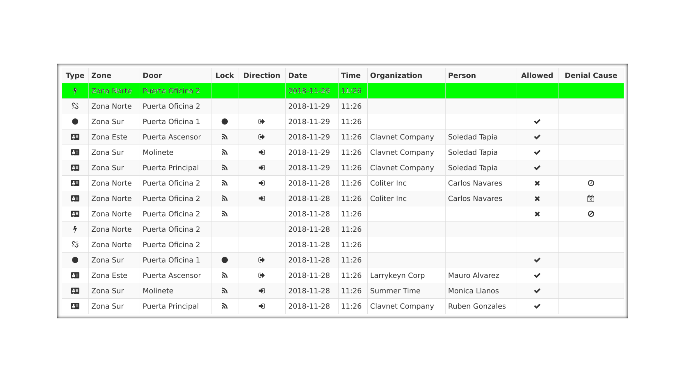

About
=====

Dobie is a reliable and high scalable access control system. It can fit in any kind of organization and it can manage a big amount of doors and people
The system can work with just one controller managing up to three doors and add controllers on demand to add more doors.  
Very flexible access managing, high detailed reports and real-time monitoring are some of the many strong features of the system.

Features
========

Detailed reports
----------------

The dashboard has a friendly user interface to query any kind of event captured by the controllers.
Smart filters can help you to search events by date, time slot, organization, person, zone, door and even direction.

Detailed reports can be retrieved and also exported as csv files.

High scalability
----------------

Dobie allows you to control from one access to hundreds of them.
The deployment of controllers can grow according to demand in a simple and easy way without changing the design of your infrastructure.
Each controller can deal with three doors with RFID readers in the entrance and the exit. Also a REX button can be installed in each door.
Each time a controller is added to the system, three doors more will be available to control. Adding controllers to the system is very easy from the dashboard.

Real-Time monitoring
--------------------

The dashboard allows you to capture events in real time by the controllers like door states, door opening, not allowed accesses and more. Besides, you can check the general health of the whole access system. The dashboard will alert you if any of the controllers fails or is not reachable anymore.

Autorecovery from network 0utages
---------------------------------

Faced to network outages, the controller board can work without network and it has the ability to automatically restore the connection with the central server without manual intervention. Also it can keep all activity logs and send them to the main server after restoring the connection.
In the same way, all pending configuration and accesses created in the dashboard, will be sent to the controller after the recovery.

Stand alone mode
----------------

For medium and small deployments, up to 50 doors, the central server and user interface can run in one of the controllers which acts as the master and there is no need of having a dedicated server for this.

Demo video
==========

