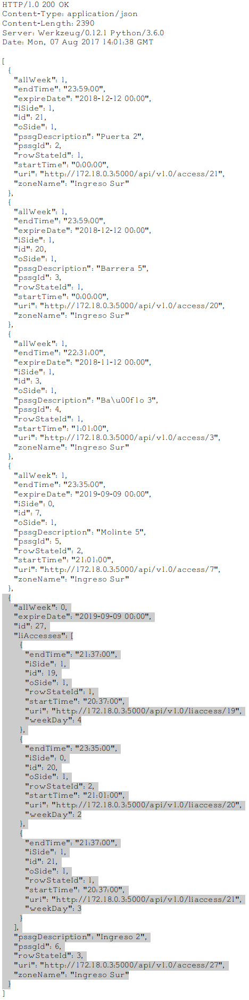
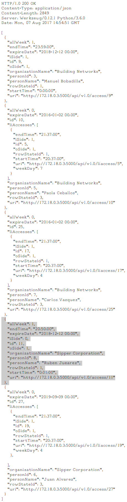

Dobie Front End Specification
=============================

.. contents::

Login Screen
------------

This screen is used to login the user into the system. According to the privilegies of the user,
the system will show different tabs and options.

.. image:: images_front_end_specs/login.png

To validate the username and password, it is necessary to get the following resource.

**Method:** GET

**URI:**

.. code-block::

  http://172.18.0.3:5000/api/v1.0/login

The default username is: ``admin`` and the default password is: ``admin``

A valid login will answer with:

**Response:**

.. code-block::

  HTTP/1.0 200 OK
  Content-Type: application/json
  Content-Length: 89
  Server: Werkzeug/0.12.1 Python/3.6.0
  Date: Wed, 12 Jul 2017 14:31:05 GMT
  
  {
    "description": "Administrator", 
    "id": 1, 
    "roleId": 1, 
    "username": "admin"
  }

An invalid login will answer with:

**Response:**

.. code-block::

  HTTP/1.0 403 FORBIDDEN
  Content-Type: application/json
  WWW-Authenticate: Basic realm="Authentication Required"
  Content-Length: 59
  Server: Werkzeug/0.12.1 Python/3.6.0
  Date: Wed, 12 Jul 2017 14:37:28 GMT
  
  {
    "error": "Unauthorized access", 
    "status": "error"
  }

  

Organization
------------

This screen is used to “add”, “edit” or “delete” organizations in the building.
For the system, an organization is just a name to group a set of persons.

.. image:: images_front_end_specs/organization.png

Get Organizations
~~~~~~~~~~~~~~~~~

To get from the server the current list of organizations, the following REST method should be sent:

**Method:** GET

**URI:**

.. code-block::

  http://172.18.0.3:5000/api/v1.0/organization

**Response:**

.. code-block::

  HTTP/1.0 200 OK
  Content-Type: application/json
  Content-Length: 481
  Server: Werkzeug/0.11.9 Python/3.5.1
  Date: Mon, 20 Mar 2017 14:49:41 GMT

  [
    {
      "id": 2, 
      "name": "Cloud Networks", 
      "rowStateId": 3, 
      "uri": "http://172.18.0.3:5000/api/v1.0/organization/2"
    }, 
    {
      "id": 3, 
      "name": "Global Corporate", 
      "rowStateId": 3, 
      "uri": "http://172.18.0.3:5000/api/v1.0/organization/3"
    }, 
    {
      "id": 4, 
      "name": "Machado y Asociados", 
      "rowStateId": 5, 
      "uri": "http://172.18.0.3:5000/api/v1.0/organization/4"
    }
  ]

  
**rowStateId** is a field that indicates the state of the organization into the system

To get all posible states, the following method should be sent to the server:

**Method:** GET

**URI:**

.. code-block::

  http://172.18.0.3:5000/api/v1.0/rowstate
  
**Response:**

.. code-block::

  HTTP/1.0 200 OK
  Content-Type: application/json
  Content-Length: 272
  Server: Werkzeug/0.11.9 Python/3.5.1
  Date: Mon, 27 Mar 2017 20:49:28 GMT
  
  [
    {
      "description": "To Add", 
      "id": 1
    }, 
    {
      "description": "To Update", 
      "id": 2
    }, 
    {
      "description": "Committed", 
      "id": 3
    }, 
    {
      "description": "To Delete", 
      "id": 4
    }, 
    {
      "description": "Deleted", 
      "id": 5
    }
  ]

The organizations in state: ``"Deleted"`` should not be shown and the other states should be shown in a different color.

Add Organization
~~~~~~~~~~~~~~~~

When “New” button is pressed the following pop-up will appear:

.. image:: images_front_end_specs/add_organization.png

The following REST method should be sent to the server:

**Method:** POST

**URI:**

.. code-block::

  http://172.18.0.3:5000/api/v1.0/organization
  
**JSON**

.. code-block::

  {"name": "Zipper Corp."}

**Response:**

.. code-block::

  HTTP/1.0 201 CREATED
  Content-Type: application/json
  Content-Length: 133
  Server: Werkzeug/0.11.9 Python/3.5.1
  Date: Tue, 07 Mar 2017 19:52:06 GMT
  
  {
    "code": 201, 
    "message": "Organization added", 
    "status": "OK", 
    "uri": "http://172.18.0.3:5000/api/v1.0/organization/5"
  }
  
  
Update Organization
~~~~~~~~~~~~~~~~~~~

When “Edit” button is pressed the following window will appear:

.. image:: images_front_end_specs/upd_organization.png

The following REST method should be sent to the server:

**Method:** PUT

**URI:**

.. code-block::

  http://172.18.0.3:5000/api/v1.0/organization/5
  
  
**JSON**

.. code-block::

  {"name": "Sipper Corporation"}
  

**Response:**

.. code-block::

  HTTP/1.0 200 OK
  Content-Type: application/json
  Content-Length: 59
  Server: Werkzeug/0.12.1 Python/3.6.0
  Date: Mon, 24 Jul 2017 19:51:48 GMT

  {
    "message": "Organization updated", 
    "status": "OK"
  }

  
Delete Organization
~~~~~~~~~~~~~~~~~~~

When “Delete” button is pressed the following pop-up will appear:

.. image:: images_front_end_specs/del_organization.png

The following REST method should be sent to the server:

**Method:** DELETE

**URI:**

.. code-block::

  http://172.18.0.3:5000/api/v1.0/organization/5
  
**Response:**

.. code-block::

  HTTP/1.0 200 OK
  Content-Type: application/json
  Content-Length: 59
  Server: Werkzeug/0.11.9 Python/3.5.1
  Date: Tue, 07 Mar 2017 20:02:33 GMT
  
  {
    "message": "Organization deleted", 
    "status": "OK"
  }

Persons
-------

This screen is used to “add”, “edit” or “delete” persons. For any of this actions,
an organizations should be selected first.

.. image:: images_front_end_specs/person.png

To get from server the current list of organizations, see `Get Organizations`_ section.

Get Persons
~~~~~~~~~~~

To get from server the current list of persons in each organization, the following REST method should be sent:

**Method:** GET

**URI:**

.. code-block::

  http://172.18.0.3:5000/api/v1.0/organization/2
  
  
**Response:**

.. code-block::
  
  
  HTTP/1.0 200 OK
  Content-Type: application/json
  Content-Length: 877
  Server: Werkzeug/0.12.1 Python/3.6.0
  Date: Mon, 24 Jul 2017 19:24:08 GMT
  
  [
    {
      "cardNumber": 4300737, 
      "id": 1, 
      "identNumber": "28063146", 
      "name": "Jorge Kleinerman", 
      "rowStateId": 3, 
      "uri": "http://172.18.0.3:5000/api/v1.0/person/1", 
      "visitedOrgId": null
    }, 
    {
      "cardNumber": 9038876, 
      "id": 3, 
      "identNumber": "22063146", 
      "name": "Carlos Gonzalez", 
      "rowStateId": 3, 
      "uri": "http://172.18.0.3:5000/api/v1.0/person/3", 
      "visitedOrgId": null
    }, 
    {
      "cardNumber": 4994413, 
      "id": 5, 
      "identNumber": "2463146", 
      "name": "Ernesto Chlima", 
      "rowStateId": 3, 
      "uri": "http://172.18.0.3:5000/api/v1.0/person/5", 
      "visitedOrgId": null
    }, 
    {
      "cardNumber": 4300757, 
      "id": 7, 
      "identNumber": "26063146", 
      "name": "Carlos Vazquez", 
      "rowStateId": 5, 
      "uri": "http://172.18.0.3:5000/api/v1.0/person/7", 
      "visitedOrgId": null
    }
  ]

    
**rowStateId** is a field that indicates the state of the person into the system

To get all posible state the following method should be sent to the server:

**Method:** GET

**URI:**

.. code-block::

  http://172.18.0.3:5000/api/v1.0/rowstate
  
**Response:**

.. code-block::

  HTTP/1.0 200 OK
  Content-Type: application/json
  Content-Length: 272
  Server: Werkzeug/0.11.9 Python/3.5.1
  Date: Mon, 27 Mar 2017 20:49:28 GMT
  
  [
    {
      "description": "To Add", 
      "id": 1
    }, 
    {
      "description": "To Update", 
      "id": 2
    }, 
    {
      "description": "Committed", 
      "id": 3
    }, 
    {
      "description": "To Delete", 
      "id": 4
    }, 
    {
      "description": "Deleted", 
      "id": 5
    }
  ]

The persons in state: "Deleted" should not be shown and the other states should be shown in a different color. 

 
Add Person
~~~~~~~~~~

When “New” button is pressed the following pop-up will appear:

.. image:: images_front_end_specs/add_person.png

The following REST method should be sent to the server:

**Method:** POST

**URI:**

.. code-block::

  http://172.18.0.3:5000/api/v1.0/person

**JSON**

.. code-block::

  {"name": "Ruben Juearez", "identNumber": "27063146", "cardNumber": 5300768, "orgId": 3, "visitedOrgId": null}
  
  
**Response:**

.. code-block::

  HTTP/1.0 201 CREATED
  Content-Type: application/json
  Content-Length: 121
  Server: Werkzeug/0.12.1 Python/3.6.0
  Date: Thu, 13 Jul 2017 13:40:56 GMT

  {
    "code": 201, 
    "message": "Person added", 
    "status": "OK", 
    "uri": "http://172.18.0.3:5000/api/v1.0/person/9"
  }

If "cardNumber" or "identNumber" is in use, the following response will arrive:

**Response:**

.. code-block::

  HTTP/1.0 409 CONFLICT
  Content-Type: application/json
  Content-Length: 250
  Server: Werkzeug/0.12.1 Python/3.6.0
  Date: Thu, 13 Jul 2017 18:46:52 GMT
  
  {
    "code": 409, 
    "error": "The request could not be completed due to a conflict with the current state of the target resource", 
    "message": "Can't add this person. Card number or Identification number already exists.", 
    "status": "conflict"
  }

Edit a Person
~~~~~~~~~~~~~

When “Edit” button is pressed the following pop-up will appear:

.. image:: images_front_end_specs/upd_person.png

The following REST method should be sent to the server:

**Method:** PUT

**URI:**

.. code-block::

  http://172.18.0.3:5000/api/v1.0/person/7

**JSON**

.. code-block::

  {"name": "Lucas Suarez", "identNumber": "23063146", "cardNumber": 9136307, "orgId": 3, "visitedOrgId": null}
  
  
  
  
**Response:**

.. code-block::

  HTTP/1.0 200 OK
  Content-Type: application/json
  Content-Length: 53
  Server: Werkzeug/0.12.1 Python/3.6.0
  Date: Thu, 13 Jul 2017 18:57:29 GMT

  {
    "message": "Person updated.", 
    "status": "OK"
  }

If "cardNumber" or "identNumber" is in use, the following response will arrive:

**Response:**

.. code-block::

  HTTP/1.0 409 CONFLICT
  Content-Type: application/json
  Content-Length: 253
  Server: Werkzeug/0.12.1 Python/3.6.0
  Date: Thu, 13 Jul 2017 18:54:53 GMT
  
  {
    "code": 409, 
    "error": "The request could not be completed due to a conflict with the current state of the target resource", 
    "message": "Can't update this person. Card number or Identification number already exists.", 
    "status": "conflict"
  }

Delete Person
~~~~~~~~~~~~~

When “Delete” button is pressed a pop-up will appear asking if the user is sure of this operation.

The following REST method should be sent to the server:

**Method:** DELETE

**URI:**

.. code-block::

  http://172.18.0.3:5000/api/v1.0/person/7

If the person was deleted successfully, the server will answer with the following response:

**Response:**

.. code-block::

  Response:
  HTTP/1.0 200 OK
  Content-Type: application/json
  Content-Length: 53
  Server: Werkzeug/0.11.9 Python/3.5.1
  Date: Wed, 08 Mar 2017 15:12:55 GMT
  
  {
    "message": "Person deleted", 
    "status": "OK"
  }
  
If the person is not present in the system, the following message will be received:

**Response:**

.. code-block::
  
  HTTP/1.0 404 NOT FOUND
  Content-Type: application/json
  Content-Length: 107
  Server: Werkzeug/0.12.2 Python/3.6.0
  Date: Mon, 17 Jul 2017 00:09:43 GMT
  
  {
   "code": 404, 
    "error": "request not found", 
    "message": "Person not found", 
    "status": "error"
  }

A pop up should inform the success or unsuccess of the operation

Accesses
--------

In access section there are two screens. One of them lets view, add, modify and delete accesses selecting the person and seeing the accesses of this person with the name of the passage and its corresponding zone.

.. image:: images_front_end_specs/access_per_pas.png

The second screen, lets view, add, modify and delete accesses selecting the passage and seeing the accesses on this passage
with the person name and its corresponding organization allowed to pass trough this passage.

.. image:: images_front_end_specs/access_pas_per.png

For the first screen **(Person -> Passage)**, the user should select the organization and the person which its accesses will be added, edited or removed.
In the right side of the screen, the accesses of the person will be shown with the description of the passage, its corresponding zone and a checkbox wich will show if the access is for all days of weeks.
For this screen, to get all accesses of an specific person to show them in the right side the following method should be sent to the server:

**Method:** GET

**URI:**

.. code-block::

  http://172.18.0.3:5000/api/v1.0/person/6

**Response:**

.. code-block::

  HTTP/1.0 200 OK
  Content-Type: application/json
  Content-Length: 2390
  Server: Werkzeug/0.12.1 Python/3.6.0
  Date: Fri, 04 Aug 2017 19:30:25 GMT
  
  [
    {
      "allWeek": 1, 
      "endTime": "23:59:00", 
      "expireDate": "2018-12-12 00:00", 
      "iSide": 1, 
      "id": 21, 
      "oSide": 1, 
      "pssgDescription": "Puerta 2", 
      "pssgId": 2, 
      "rowStateId": 1, 
      "startTime": "0:00:00", 
      "uri": "http://172.18.0.3:5000/api/v1.0/access/21", 
      "zoneName": "Ingreso Sur"
    }, 
    {
      "allWeek": 1, 
      "endTime": "23:59:00", 
      "expireDate": "2018-12-12 00:00", 
      "iSide": 1, 
      "id": 20, 
      "oSide": 1, 
      "pssgDescription": "Barrera 5", 
      "pssgId": 3, 
      "rowStateId": 1, 
      "startTime": "0:00:00", 
      "uri": "http://172.18.0.3:5000/api/v1.0/access/20", 
      "zoneName": "Ingreso Sur"
    }, 
    {
      "allWeek": 1, 
      "endTime": "22:31:00", 
      "expireDate": "2018-11-12 00:00", 
      "iSide": 1, 
      "id": 3, 
      "oSide": 1, 
      "pssgDescription": "Ba\u00f1o 3", 
      "pssgId": 4, 
      "rowStateId": 1, 
      "startTime": "1:01:00", 
      "uri": "http://172.18.0.3:5000/api/v1.0/access/3", 
      "zoneName": "Ingreso Sur"
    }, 
    {
      "allWeek": 1, 
      "endTime": "23:35:00", 
      "expireDate": "2019-09-09 00:00", 
      "iSide": 0, 
      "id": 7, 
      "oSide": 1, 
      "pssgDescription": "Molinte 5", 
      "pssgId": 5, 
      "rowStateId": 2, 
      "startTime": "21:01:00", 
      "uri": "http://172.18.0.3:5000/api/v1.0/access/7", 
      "zoneName": "Ingreso Sur"
    }, 
    {
      "allWeek": 0, 
      "expireDate": "2019-09-09 00:00", 
      "id": 27, 
      "liAccesses": [
        {
          "endTime": "21:37:00", 
          "iSide": 1, 
          "id": 19, 
          "oSide": 1, 
          "rowStateId": 1, 
          "startTime": "20:37:00", 
          "uri": "http://172.18.0.3:5000/api/v1.0/liaccess/19", 
          "weekDay": 4
        }, 
        {
          "endTime": "23:35:00", 
          "iSide": 0, 
          "id": 20, 
          "oSide": 1, 
          "rowStateId": 2, 
          "startTime": "21:01:00", 
          "uri": "http://172.18.0.3:5000/api/v1.0/liaccess/20", 
          "weekDay": 2
        }, 
        {
          "endTime": "21:37:00", 
          "iSide": 1, 
          "id": 21, 
          "oSide": 1, 
          "rowStateId": 1, 
          "startTime": "20:37:00", 
          "uri": "http://172.18.0.3:5000/api/v1.0/liaccess/21", 
          "weekDay": 3
        }
      ], 
      "pssgDescription": "Ingreso 2", 
      "pssgId": 6, 
      "rowStateId": 3, 
      "uri": "http://172.18.0.3:5000/api/v1.0/access/27", 
      "zoneName": "Ingreso Sur"
    }
  ]
  
When the access has "allWeek" field set to 1, the check icon in "all week" column should be set.
When a the access has "allWeek" field set to 0, the check icon in "all week" column should not be set.
In the last case, the access will have a field called "liAccesses" which will have a list with all the accesses for each day of the week.

For the second screen **(Passage -> Person)**, the user should select the zone and the passage which its accesses will be added, edited or removed.
In the right side of the screen, the accesses of the passage will be shown with the name of the person, its corresponding organization and a checkbox wich will shows if the access is for all days of weeks.
For this screen, to get all accesses of an specific passage to show them in the right side the following method should be sent to the server:

**Method:** GET

**URI:**

.. code-block::

  http://172.18.0.3:5000/api/v1.0/passage/4

**Response:**

.. code-block::

  HTTP/1.0 200 OK
  Content-Type: application/json
  Content-Length: 1248
  Server: Werkzeug/0.12.1 Python/3.6.0
  Date: Fri, 04 Aug 2017 20:20:34 GMT
  
  [
    {
      "allWeek": 1, 
      "endTime": "23:59:00", 
      "expireDate": "2018-12-12 00:00", 
      "iSide": 1, 
      "id": 1, 
      "oSide": 1, 
      "organizationName": "Kleinernet Corp.", 
      "personId": 1, 
      "personName": "Jorge Kleinerman", 
      "rowStateId": 1, 
      "startTime": "0:00:00", 
      "uri": "http://172.18.0.3:5000/api/v1.0/access/1"
    }, 
    {
      "allWeek": 0, 
      "expireDate": "2016-01-02 00:00", 
      "id": 2, 
      "liAccesses": [
        {
          "endTime": "21:37:00", 
          "iSide": 1, 
          "id": 1, 
          "oSide": 1, 
          "rowStateId": 1, 
          "startTime": "20:37:00", 
          "uri": "http://172.18.0.3:5000/api/v1.0/liaccess/1", 
          "weekDay": 2
        }
      ], 
      "organizationName": "Sipper Corporation", 
      "personId": 2, 
      "personName": "Ary Kleinerman", 
      "rowStateId": 3, 
      "uri": "http://172.18.0.3:5000/api/v1.0/access/2"
    }, 
    {
      "allWeek": 1, 
      "endTime": "22:31:00", 
      "expireDate": "2018-11-12 00:00", 
      "iSide": 1, 
      "id": 3, 
      "oSide": 1, 
      "organizationName": "Sipper Corporation", 
      "personId": 6, 
      "personName": "Juan Alvarez", 
      "rowStateId": 1, 
      "startTime": "1:01:00", 
      "uri": "http://172.18.0.3:5000/api/v1.0/access/3"
    }
  ]

  
When the access has "allWeek" field set to 1, the check icon in "all week" column should be set.
When a the access has "allWeek" field set to 0, the check icon in "all week" column should not be set.
In the last case, the access will have a field called "liAccesses" which will have a list with all the accesses for each day of the week.

Add Access
~~~~~~~~~~

For the first screen **(Person -> Pasage)**, before pressing **"add"** button an specific person or an entire organization should be selected and the following window will appear:

.. image:: images_front_end_specs/add_access_per_pas.png

In this window a **"Zone"** should be selected.
To get all the zones the following REST method should be sent to the server:

**Method:** GET

**URI:**

.. code-block::

  http://172.18.0.3:5000/api/v1.0/zone

 
**Response:**

.. code-block::

  HTTP/1.0 200 OK
  Content-Type: application/json
  Content-Length: 184
  Server: Werkzeug/0.12.1 Python/3.6.0
  Date: Fri, 21 Jul 2017 20:46:51 GMT
  
  [
    {
      "name": "Ingreso Sur", 
      "uri": "http://172.18.0.3:5000/api/v1.0/zone/1"
    }, 
    {
      "name": "Ingreso Norte", 
      "uri": "http://172.18.0.3:5000/api/v1.0/zone/2"
    }
  ]

Getting passages from a zone
++++++++++++++++++++++++++++

To get all passages from a zone, the following REST method should be sent to the server:

**URI:**

.. code-block::

  http://172.18.0.3:5000/api/v1.0/zone/1

 
**Response:**

.. code-block::

  HTTP/1.0 200 OK
  Content-Type: application/json
  Content-Length: 1432
  Server: Werkzeug/0.12.1 Python/3.6.0
  Date: Mon, 24 Jul 2017 15:06:13 GMT
  
  [
    {
      "alrmTime": 10, 
      "bzzrTime": 3, 
      "controllerId": 2, 
      "description": "Molinete 1", 
      "id": 1, 
      "pssgNum": 1, 
      "rlseTime": 7, 
      "rowStateId": 1, 
      "uri": "http://172.18.0.3:5000/api/v1.0/passage/1"
    }, 
    {
      "alrmTime": 10, 
      "bzzrTime": 3, 
      "controllerId": 2, 
      "description": "Puerta 2", 
      "id": 2, 
      "pssgNum": 2, 
      "rlseTime": 7, 
      "rowStateId": 1, 
      "uri": "http://172.18.0.3:5000/api/v1.0/passage/2"
    }, 
    {
      "alrmTime": 10, 
      "bzzrTime": 3, 
      "controllerId": 2, 
      "description": "Barrera 5", 
      "id": 3, 
      "pssgNum": 3, 
      "rlseTime": 7, 
      "rowStateId": 1, 
      "uri": "http://172.18.0.3:5000/api/v1.0/passage/3"
    }, 
    {
      "alrmTime": 10, 
      "bzzrTime": 3, 
      "controllerId": 1, 
      "description": "Ba\u00f1o 3", 
      "id": 4, 
      "pssgNum": 1, 
      "rlseTime": 7, 
      "rowStateId": 1, 
      "uri": "http://172.18.0.3:5000/api/v1.0/passage/4"
    }, 
    {
      "alrmTime": 10, 
      "bzzrTime": 3, 
      "controllerId": 1, 
      "description": "Molinte 5", 
      "id": 5, 
      "pssgNum": 2, 
      "rlseTime": 7, 
      "rowStateId": 1, 
      "uri": "http://172.18.0.3:5000/api/v1.0/passage/5"
    }, 
    {
      "alrmTime": 10, 
      "bzzrTime": 3, 
      "controllerId": 1, 
      "description": "Ingreso 2", 
      "id": 6, 
      "pssgNum": 3, 
      "rlseTime": 7, 
      "rowStateId": 1, 
      "uri": "http://172.18.0.3:5000/api/v1.0/passage/6"
    }
  ]

For the second screen **(Pasage -> Person)**, before pressing **"add"** button an specific passage or an entire zone should be selected and the following window will appear:

.. image:: images_front_end_specs/add_access_pas_per.png

In this window an **"Organization"** should be selected.
To get all the organizations the following REST method should be sent to the server:

**Method:** GET

**URI:**

.. code-block::

  http://172.18.0.3:5000/api/v1.0/organization

 
**Response:**

.. code-block::

  HTTP/1.0 200 OK
  Content-Type: application/json
  Content-Length: 414
  Server: Werkzeug/0.12.1 Python/3.6.0
  Date: Fri, 04 Aug 2017 20:03:28 GMT
  
  [
    {
      "id": 2, 
      "name": "Building Networks", 
      "rowStateId": 3, 
      "uri": "http://172.18.0.3:5000/api/v1.0/organization/2"
    }, 
    {
      "id": 3, 
      "name": "Sipper Corporation", 
      "rowStateId": 3, 
      "uri": "http://172.18.0.3:5000/api/v1.0/organization/3"
    }, 
    {
      "id": 4, 
      "name": "Movistel", 
      "rowStateId": 5, 
      "uri": "http://172.18.0.3:5000/api/v1.0/organization/4"
    }
  ]

To get all persons from an organization, the following REST method should be sent to the server:

**URI:**

.. code-block::

  http://172.18.0.3:5000/api/v1.0/organization/2

 
**Response:**

.. code-block::

  HTTP/1.0 200 OK
  Content-Type: application/json
  Content-Length: 877
  Server: Werkzeug/0.12.1 Python/3.6.0
  Date: Fri, 04 Aug 2017 20:05:41 GMT
  
  [
    {
      "cardNumber": 4300737, 
      "id": 1, 
      "identNumber": "28063146", 
      "name": "Jorge Kleinerman", 
      "rowStateId": 3, 
      "uri": "http://172.18.0.3:5000/api/v1.0/person/1", 
      "visitedOrgId": null
    }, 
    {
      "cardNumber": 9038876, 
      "id": 3, 
      "identNumber": "22063146", 
      "name": "Maria Bedolla", 
      "rowStateId": 3, 
      "uri": "http://172.18.0.3:5000/api/v1.0/person/3", 
      "visitedOrgId": null
    }, 
    {
      "cardNumber": 4994413, 
      "id": 5, 
      "identNumber": "2463146", 
      "name": "Paola Trujillo", 
      "rowStateId": 3, 
      "uri": "http://172.18.0.3:5000/api/v1.0/person/5", 
      "visitedOrgId": null
    }, 
    {
      "cardNumber": 4300757, 
      "id": 7, 
      "identNumber": "26063146", 
      "name": "Carlos Vazquez", 
      "rowStateId": 5, 
      "uri": "http://172.18.0.3:5000/api/v1.0/person/7", 
      "visitedOrgId": null
    }
  ]

Knowing the passage id and person id, it is possible to create the new **"All Week"** access or a **"Day"** access sending the following POST method to the server:

Add All Week Access
~~~~~~~~~~~~~~~~~~~

**Method:** POST

**URI:**

.. code-block::

  http://172.18.0.3:5000/api/v1.0/access

**JSON**

.. code-block::

  {"pssgId": 4, "personId": 6, "iSide": 1, "oSide": 1, "startTime": "01:01", "endTime": "22:31", "expireDate": "2018-11-12"}
 
  
**Response:**

.. code-block::

  HTTP/1.0 201 CREATED
  Content-Type: application/json
  Content-Length: 121
  Server: Werkzeug/0.12.1 Python/3.6.0
  Date: Mon, 24 Jul 2017 20:09:18 GMT
  
  {
    "code": 201, 
    "message": "Access added", 
    "status": "OK", 
    "uri": "http://172.18.0.3:5000/api/v1.0/access/3"
  }

Add Day Access (Limited Access)
~~~~~~~~~~~~~~~~~~~~~~~~~~~~~~~

**Method:** POST

**URI:**

.. code-block::

  http://172.18.0.3:5000/api/v1.0/liaccess

**JSON**

.. code-block::

  {"pssgId": 6, "personId": 7, "weekDay": 4, "iSide": 1, "oSide": 1, "startTime": "20:37", "endTime": "21:37", "expireDate": "2016-01-02"}
 
  
**Response:**

.. code-block::

  HTTP/1.0 201 CREATED
  Content-Type: application/json
  Content-Length: 124
  Server: Werkzeug/0.12.1 Python/3.6.0
  Date: Mon, 24 Jul 2017 20:17:48 GMT
  
  {
    "code": 201, 
    "message": "Access added", 
    "status": "OK", 
    "uri": "http://172.18.0.3:5000/api/v1.0/liaccess/17"
  }

For the first screen **(Person -> Passage)**, if all the passages of a zone is selected, an "access" or the necessary "limited access" should be sent to the server for each passage of the zone.
If an entire organization is selected, all the above should be repeated for each person of the organization. 

For the second screen **(Passage -> Person)**, if all the persons of an organization is selected, an "access" or the necessary "limited access" should be sent to the server for each person of the organizatino.
If an entire zone is selected, all the above should be repeated for each passage of the zone. 

An entire organization can be selected and an entire zone too.

Edit an Access
--------------

To edit and modify an access, an access should be selected. This can be done using the first access screen (Person -> Passage) or the second screen (Passage -> Person). When an access is selected and "edit" button is pressed the following  window should appear.

.. image:: images_front_end_specs/upd_access.png

All the information of the access shown in the above window should be retrieved in the same way to retrieve all the accesses for a person (Person -> Passage screen) or to retrieve all the accesses of a passage (Passage -> Person screen) but just using the information needed for this access.

For example, if the Day Accesses (Limited Access) of person with id = 7 and and passage with id = 6 should be edited from the Person -> Passage screen, the highlithed information of the GET response should be used to fill the information of the Edit Access window:

**Method:** GET

**URI:**

.. code-block::

  http://172.18.0.3:5000/api/v1.0/person/7

**Response:**

For example, if a Week Access in passage with id = 5 and person with id = 8 should be edited from the Passage -> Person screen, the highlithed information of the GET response should be used to fill the information of the Edit Access window:

**Method:** GET

**URI:**

.. code-block::

  http://172.18.0.3:5000/api/v1.0/passage/5

**Response:**

To **modify a Day Access (Limited Access)** the following PUT method should be send to the server:

**Method:** PUT

**URI:**

.. code-block::

  http://172.18.0.3:5000/api/v1.0/liaccess/20

**JSON**

.. code-block::

  {"weekDay": 2, "iSide": 0, "oSide": 1, "startTime": "21:01:00", "endTime": "23:35:00", "expireDate": "2019-09-09 00:00"}

    
**Response:**

.. code-block::

  HTTP/1.0 200 OK
  Content-Type: application/json
  Content-Length: 61
  Server: Werkzeug/0.12.1 Python/3.6.0
  Date: Thu, 27 Jul 2017 15:03:19 GMT
  
  {
    "message": "Limited Access updated", 
    "status": "OK"
  }

Modify a "Day Accesses" of a person could imply add new "Limited Access",  when adding a new day of access for the person, or delete "Limited Access", when removing a day of access for the person

To **modify a Week Access (Full Access)** the following PUT method should be send to the server:

**Method:** PUT

**URI:**

.. code-block::

  http://172.18.0.3:5000/api/v1.0/access/7 

**JSON**

.. code-block::

  {"iSide": 0, "oSide": 1, "startTime": "21:01:00", "endTime": "23:35:00", "expireDate": "2019-09-09 00:00"}

**Response:**

.. code-block::

  HTTP/1.0 200 OK
  Content-Type: application/json
  Content-Length: 53
  Server: Werkzeug/0.12.1 Python/3.6.0
  Date: Thu, 27 Jul 2017 18:28:08 GMT
  
  {
    "message": "Access updated", 
    "status": "OK"
  }

If a person has a "Limited Access" on a passage and the user modify it giving a "Full Access", a POST method with the "Full Access" should be sent to the server. This will automatically erase all the "Limited Accesses" who this person had on this passage.
In the same way, if the person had a "Full Access" and the user modify it giving a "Limited Access", a POST method with "Limited Access" should be sent to the server and this will automatically erase the previous "Full Access" 

Events
------

In event section, there are two screens. One of them lets view the events in real time. The second one, lets search historical events saved.

In the second screen screen organization, person, zone, passage, direction, start date and time and end date and time can be selected to retrieve events.

.. image:: images_front_end_specs/events_searcher.png

If an organization is selected, the person section should show all the persons of this organization and one of them should be picked up by the user.
To get from server the current list of persons of an organization, see `Get Persons`_ section.

The following REST method should be sent to the server.

**Method:** GET

**URI:**

.. code-block::

  http://172.18.0.3:5000/api/v1.0/events?personId=3&startDateTime=2017-08-16+20:21&endDateTime=2017-10-16+20:27&startEvt=1&evtsQtty=10

``startEvt`` variable should be the first event that the server will return.

``evtsQtty`` variable should be the quantity of events returned from server starting from ``startEvt``

  
If all the events from an entire organization is need, an organization should be selected in the organization window and the word "ALL" in the person window too. The following REST method shoud be sent to the server:

**Method:** GET

**URI:**

.. code-block::

  http://172.18.0.3:5000/api/v1.0/events?orgId=3&startDateTime=2017-08-16+20:21&endDateTime=2017-10-16+20:27&side=1&startEvt=1&evtsQtty=10

If a zone is selected, the passage window should show all the passages of this zone and one of them should be picked up by the user.
To get from server the current list of passages of a zone, see `Getting passages from a zone`_ section.

The following REST method should be sent to the server.

**Method:** GET

**URI:**

.. code-block::

  http://172.18.0.3:5000/api/v1.0/events?pssgId=2&startDateTime=2017-08-16+20:21&endDateTime=2017-10-16+20:27&side=1&startEvt=1&evtsQtty=10

If all the events from an entire zone is need, a zone should be selected in the zone window and the word "ALL" in the passage window too. The following REST method shoud be sent to the server:

**Method:** GET

**URI:**

.. code-block::

  http://172.18.0.3:5000/api/v1.0/events?zoneId=1&startDateTime=2017-08-16+20:21&endDateTime=2017-10-16+20:27&side=1&startEvt=1&evtsQtty=10

If events corresponding to incomings and outgoings at the same time are need, the "side" variable should be removed from the URI.

**Method:** GET

**URI:**

.. code-block::

  http://172.18.0.3:5000/api/v1.0/events?startDateTime=2017-08-16+20:21&endDateTime=2017-10-16+20:27&startEvt=1&evtsQtty=10
  
As can be noticed, if a variable is removed from the URI, the server will return all the events which this variable could filter. The only variables which couldn't be omitted are "startDateTime", "endDateTime", "startEvt" and "evtsQtty"

When a passage is opened using a button or a passage is forced, the "personId" of the event would be "null" meaning an "unknown" person passed trough this passage.
To query those events, personId=null in the URI:

**Method:** GET

**URI:**

.. code-block::

  http://172.18.0.3:5000/api/v1.0/events?personId=null&startDateTime=2017-08-16+20:21&endDateTime=2017-10-16+20:27&side=1&startEvt=1&evtsQtty=10

