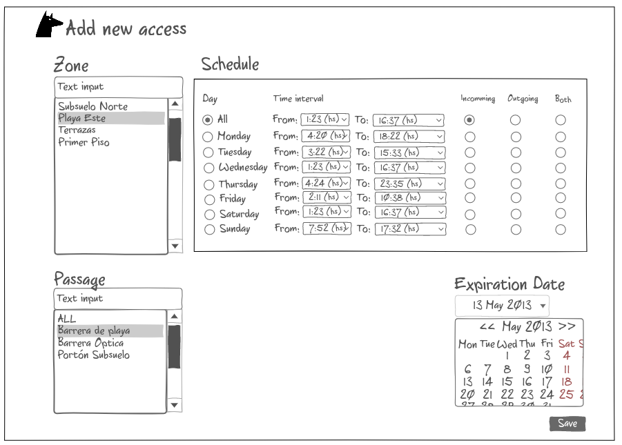
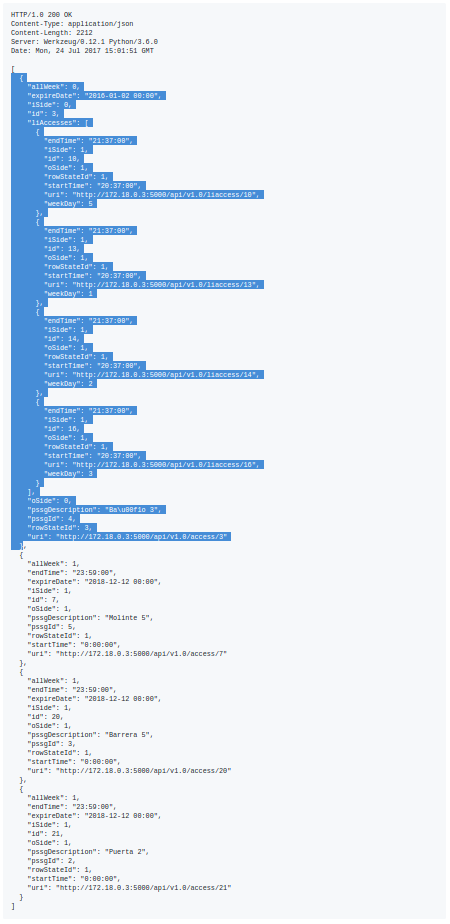

Dobie Front End Specification
=============================

.. contents::

Login Screen
------------

This screen is used to login the user into the system. According to the privilegies of the user,
the system will show different tabs and options.

.. image:: images_front_end_specs/login.png

To validate the username and password, it is necessary to get the following resource.

**Method:** GET

**URI:**

.. code-block::

  http://172.18.0.3:5000/api/v1.0/login

The default username is: ``admin`` and the default password is: ``admin``

A valid login will answer with:

**Response:**

.. code-block::

  HTTP/1.0 200 OK
  Content-Type: application/json
  Content-Length: 89
  Server: Werkzeug/0.12.1 Python/3.6.0
  Date: Wed, 12 Jul 2017 14:31:05 GMT
  
  {
    "description": "Administrator", 
    "id": 1, 
    "roleId": 1, 
    "username": "admin"
  }

An invalid login will answer with:

**Response:**

.. code-block::

  HTTP/1.0 403 FORBIDDEN
  Content-Type: application/json
  WWW-Authenticate: Basic realm="Authentication Required"
  Content-Length: 59
  Server: Werkzeug/0.12.1 Python/3.6.0
  Date: Wed, 12 Jul 2017 14:37:28 GMT
  
  {
    "error": "Unauthorized access", 
    "status": "error"
  }

  

Organization
------------

This screen is used to “add”, “edit” or “delete” organizations in the building.
For the system, an organization is just a name to group a set of persons.

.. image:: images_front_end_specs/organization.png

Get Organizations
~~~~~~~~~~~~~~~~~

To get from the server the current list of organizations, the following REST method should be sent:

**Method:** GET

**URI:**

.. code-block::

  http://172.18.0.3:5000/api/v1.0/organization

**Response:**

.. code-block::

  HTTP/1.0 200 OK
  Content-Type: application/json
  Content-Length: 481
  Server: Werkzeug/0.11.9 Python/3.5.1
  Date: Mon, 20 Mar 2017 14:49:41 GMT

  [
    {
      "id": 2, 
      "name": "Cloud Networks", 
      "rowStateId": 3, 
      "uri": "http://172.18.0.3:5000/api/v1.0/organization/2"
    }, 
    {
      "id": 3, 
      "name": "Global Corporate", 
      "rowStateId": 3, 
      "uri": "http://172.18.0.3:5000/api/v1.0/organization/3"
    }, 
    {
      "id": 4, 
      "name": "Machado y Asociados", 
      "rowStateId": 5, 
      "uri": "http://172.18.0.3:5000/api/v1.0/organization/4"
    }
  ]

  
**rowStateId** is a field that indicates the state of the organization into the system

To get all posible states, the following method should be sent to the server:

**Method:** GET

**URI:**

.. code-block::

  http://172.18.0.3:5000/api/v1.0/rowstate
  
**Response:**

.. code-block::

  HTTP/1.0 200 OK
  Content-Type: application/json
  Content-Length: 272
  Server: Werkzeug/0.11.9 Python/3.5.1
  Date: Mon, 27 Mar 2017 20:49:28 GMT
  
  [
    {
      "description": "To Add", 
      "id": 1
    }, 
    {
      "description": "To Update", 
      "id": 2
    }, 
    {
      "description": "Committed", 
      "id": 3
    }, 
    {
      "description": "To Delete", 
      "id": 4
    }, 
    {
      "description": "Deleted", 
      "id": 5
    }
  ]

The organizations in state: ``"Deleted"`` should not be shown and the other states should be shown in a different color.

Add Organization
~~~~~~~~~~~~~~~~

When “New” button is pressed the following pop-up will appear:

.. image:: images_front_end_specs/add_organization.png

The following REST method should be sent to the server:

**Method:** POST

**URI:**

.. code-block::

  http://172.18.0.3:5000/api/v1.0/organization
  
**JSON**

.. code-block::

  {"name": "Zipper Corp."}

**Response:**

.. code-block::

  HTTP/1.0 201 CREATED
  Content-Type: application/json
  Content-Length: 133
  Server: Werkzeug/0.11.9 Python/3.5.1
  Date: Tue, 07 Mar 2017 19:52:06 GMT
  
  {
    "code": 201, 
    "message": "Organization added", 
    "status": "OK", 
    "uri": "http://172.18.0.3:5000/api/v1.0/organization/5"
  }
  
  
Update Organization
~~~~~~~~~~~~~~~~~~~

When “Edit” button is pressed the following window will appear:

.. image:: images_front_end_specs/upd_organization.png

The following REST method should be sent to the server:

**Method:** PUT

**URI:**

.. code-block::

  http://172.18.0.3:5000/api/v1.0/organization/5
  
  
**JSON**

.. code-block::

  {"name": "Sipper Corporation"}
  

**Response:**

.. code-block::

  HTTP/1.0 200 OK
  Content-Type: application/json
  Content-Length: 59
  Server: Werkzeug/0.12.1 Python/3.6.0
  Date: Mon, 24 Jul 2017 19:51:48 GMT

  {
    "message": "Organization updated", 
    "status": "OK"
  }

  
Delete Organization
~~~~~~~~~~~~~~~~~~~

When “Delete” button is pressed the following pop-up will appear:

.. image:: images_front_end_specs/del_organization.png

The following REST method should be sent to the server:

**Method:** DELETE

**URI:**

.. code-block::

  http://172.18.0.3:5000/api/v1.0/organization/5
  
**Response:**

.. code-block::

  HTTP/1.0 200 OK
  Content-Type: application/json
  Content-Length: 59
  Server: Werkzeug/0.11.9 Python/3.5.1
  Date: Tue, 07 Mar 2017 20:02:33 GMT
  
  {
    "message": "Organization deleted", 
    "status": "OK"
  }

Persons
-------

This screen is used to “add”, “edit” or “delete” persons. For any of this actions,
an organizations should be selected first.

.. image:: images_front_end_specs/person.png

To get from server the current list of organizations, see `Get Organizations`_ section.

Get Persons
~~~~~~~~~~~

To get from server the current list of persons in each organization, the following REST method should be sent:

**Method:** GET

**URI:**

.. code-block::

  http://172.18.0.3:5000/api/v1.0/organization/2
  
  
**Response:**

.. code-block::
  
  
  HTTP/1.0 200 OK
  Content-Type: application/json
  Content-Length: 877
  Server: Werkzeug/0.12.1 Python/3.6.0
  Date: Mon, 24 Jul 2017 19:24:08 GMT
  
  [
    {
      "cardNumber": 4300737, 
      "id": 1, 
      "identNumber": "28063146", 
      "name": "Jorge Kleinerman", 
      "rowStateId": 3, 
      "uri": "http://172.18.0.3:5000/api/v1.0/person/1", 
      "visitedOrgId": null
    }, 
    {
      "cardNumber": 9038876, 
      "id": 3, 
      "identNumber": "22063146", 
      "name": "Carlos Gonzalez", 
      "rowStateId": 3, 
      "uri": "http://172.18.0.3:5000/api/v1.0/person/3", 
      "visitedOrgId": null
    }, 
    {
      "cardNumber": 4994413, 
      "id": 5, 
      "identNumber": "2463146", 
      "name": "Ernesto Chlima", 
      "rowStateId": 3, 
      "uri": "http://172.18.0.3:5000/api/v1.0/person/5", 
      "visitedOrgId": null
    }, 
    {
      "cardNumber": 4300757, 
      "id": 7, 
      "identNumber": "26063146", 
      "name": "Carlos Vazquez", 
      "rowStateId": 5, 
      "uri": "http://172.18.0.3:5000/api/v1.0/person/7", 
      "visitedOrgId": null
    }
  ]

    
**rowStateId** is a field that indicates the state of the person into the system

To get all posible state the following method should be sent to the server:

**Method:** GET

**URI:**

.. code-block::

  http://172.18.0.3:5000/api/v1.0/rowstate
  
**Response:**

.. code-block::

  HTTP/1.0 200 OK
  Content-Type: application/json
  Content-Length: 272
  Server: Werkzeug/0.11.9 Python/3.5.1
  Date: Mon, 27 Mar 2017 20:49:28 GMT
  
  [
    {
      "description": "To Add", 
      "id": 1
    }, 
    {
      "description": "To Update", 
      "id": 2
    }, 
    {
      "description": "Committed", 
      "id": 3
    }, 
    {
      "description": "To Delete", 
      "id": 4
    }, 
    {
      "description": "Deleted", 
      "id": 5
    }
  ]

The persons in state: "Deleted" should not be shown and the other states should be shown in a different color. 

 
Add Person
~~~~~~~~~~

When “New” button is pressed the following pop-up will appear:

.. image:: images_front_end_specs/add_person.png

The following REST method should be sent to the server:

**Method:** POST

**URI:**

.. code-block::

  http://172.18.0.3:5000/api/v1.0/person

**JSON**

.. code-block::

  {"name": "Ruben Juearez", "identNumber": "27063146", "cardNumber": 5300768, "orgId": 3, "visitedOrgId": null}
  
  
**Response:**

.. code-block::

  HTTP/1.0 201 CREATED
  Content-Type: application/json
  Content-Length: 121
  Server: Werkzeug/0.12.1 Python/3.6.0
  Date: Thu, 13 Jul 2017 13:40:56 GMT

  {
    "code": 201, 
    "message": "Person added", 
    "status": "OK", 
    "uri": "http://172.18.0.3:5000/api/v1.0/person/9"
  }

If "cardNumber" or "identNumber" is in use, the following response will arrive:

**Response:**

.. code-block::

  HTTP/1.0 409 CONFLICT
  Content-Type: application/json
  Content-Length: 250
  Server: Werkzeug/0.12.1 Python/3.6.0
  Date: Thu, 13 Jul 2017 18:46:52 GMT
  
  {
    "code": 409, 
    "error": "The request could not be completed due to a conflict with the current state of the target resource", 
    "message": "Can't add this person. Card number or Identification number already exists.", 
    "status": "conflict"
  }

Edit a Person
~~~~~~~~~~~~~

When “Edit” button is pressed the following pop-up will appear:

.. image:: images_front_end_specs/upd_person.png

The following REST method should be sent to the server:

**Method:** PUT

**URI:**

.. code-block::

  http://172.18.0.3:5000/api/v1.0/person/7

**JSON**

.. code-block::

  {"name": "Lucas Suarez", "identNumber": "23063146", "cardNumber": 9136307, "orgId": 3, "visitedOrgId": null}
  
  
  
  
**Response:**

.. code-block::

  HTTP/1.0 200 OK
  Content-Type: application/json
  Content-Length: 53
  Server: Werkzeug/0.12.1 Python/3.6.0
  Date: Thu, 13 Jul 2017 18:57:29 GMT

  {
    "message": "Person updated.", 
    "status": "OK"
  }

If "cardNumber" or "identNumber" is in use, the following response will arrive:

**Response:**

.. code-block::

  HTTP/1.0 409 CONFLICT
  Content-Type: application/json
  Content-Length: 253
  Server: Werkzeug/0.12.1 Python/3.6.0
  Date: Thu, 13 Jul 2017 18:54:53 GMT
  
  {
    "code": 409, 
    "error": "The request could not be completed due to a conflict with the current state of the target resource", 
    "message": "Can't update this person. Card number or Identification number already exists.", 
    "status": "conflict"
  }

Delete Person
~~~~~~~~~~~~~

When “Delete” button is pressed a pop-up will appear asking if the user is sure of this operation.

The following REST method should be sent to the server:

**Method:** DELETE

**URI:**

.. code-block::

  http://172.18.0.3:5000/api/v1.0/person/7

If the person was deleted successfully, the server will answer with the following response:

**Response:**

.. code-block::

  Response:
  HTTP/1.0 200 OK
  Content-Type: application/json
  Content-Length: 53
  Server: Werkzeug/0.11.9 Python/3.5.1
  Date: Wed, 08 Mar 2017 15:12:55 GMT
  
  {
    "message": "Person deleted", 
    "status": "OK"
  }
  
If the person is not present in the system, the following message will be received:

**Response:**

.. code-block::
  
  HTTP/1.0 404 NOT FOUND
  Content-Type: application/json
  Content-Length: 107
  Server: Werkzeug/0.12.2 Python/3.6.0
  Date: Mon, 17 Jul 2017 00:09:43 GMT
  
  {
   "code": 404, 
    "error": "request not found", 
    "message": "Person not found", 
    "status": "error"
  }

A pop up should inform the success or unsuccess of the operation

Accesses
--------

This screen is used to add edit or delete accesses of persons throgh the differents passages of the building

.. image:: images_front_end_specs/access.png

The user should select the organization and the person which its accesses will be added, edited or removed.
In the right side of the screen, the access of the person will be shown with the description of the passage and a checkbox will shown if the access is for all days of weeks.

To get all accesses of an specific person to show them in the right side the following method should be sent to the server:

**Method:** GET

**URI:**

.. code-block::

  http://172.18.0.3:5000/api/v1.0/person/6

**Response:**

.. code-block::
 
  HTTP/1.0 200 OK
  Content-Type: application/json
  Content-Length: 2212
  Server: Werkzeug/0.12.1 Python/3.6.0
  Date: Mon, 24 Jul 2017 15:01:51 GMT
  
  [
    {
      "allWeek": 0, 
      "expireDate": "2016-01-02 00:00", 
      "iSide": 0, 
      "id": 3, 
      "liAccesses": [
        {
          "endTime": "21:37:00", 
          "iSide": 1, 
          "id": 10, 
          "oSide": 1, 
          "rowStateId": 1, 
          "startTime": "20:37:00", 
          "uri": "http://172.18.0.3:5000/api/v1.0/liaccess/10", 
          "weekDay": 5
        }, 
        {
          "endTime": "21:37:00", 
          "iSide": 1, 
          "id": 13, 
          "oSide": 1, 
          "rowStateId": 1, 
          "startTime": "20:37:00", 
          "uri": "http://172.18.0.3:5000/api/v1.0/liaccess/13", 
          "weekDay": 1
        }, 
        {
          "endTime": "21:37:00", 
          "iSide": 1, 
          "id": 14, 
          "oSide": 1, 
          "rowStateId": 1, 
          "startTime": "20:37:00", 
          "uri": "http://172.18.0.3:5000/api/v1.0/liaccess/14", 
          "weekDay": 2
        }, 
        {
          "endTime": "21:37:00", 
          "iSide": 1, 
          "id": 16, 
          "oSide": 1, 
          "rowStateId": 1, 
          "startTime": "20:37:00", 
          "uri": "http://172.18.0.3:5000/api/v1.0/liaccess/16", 
          "weekDay": 3
        }
      ], 
      "oSide": 0, 
      "pssgDescription": "Ba\u00f1o 3", 
      "pssgId": 4, 
      "rowStateId": 3, 
      "uri": "http://172.18.0.3:5000/api/v1.0/access/3"
    }, 
    {
      "allWeek": 1, 
      "endTime": "23:59:00", 
      "expireDate": "2018-12-12 00:00", 
      "iSide": 1, 
      "id": 7, 
      "oSide": 1, 
      "pssgDescription": "Molinte 5", 
      "pssgId": 5, 
      "rowStateId": 1, 
      "startTime": "0:00:00", 
      "uri": "http://172.18.0.3:5000/api/v1.0/access/7"
    }, 
    {
      "allWeek": 1, 
      "endTime": "23:59:00", 
      "expireDate": "2018-12-12 00:00", 
      "iSide": 1, 
      "id": 20, 
      "oSide": 1, 
      "pssgDescription": "Barrera 5", 
      "pssgId": 3, 
      "rowStateId": 1, 
      "startTime": "0:00:00", 
      "uri": "http://172.18.0.3:5000/api/v1.0/access/20"
    }, 
    {
      "allWeek": 1, 
      "endTime": "23:59:00", 
      "expireDate": "2018-12-12 00:00", 
      "iSide": 1, 
      "id": 21, 
      "oSide": 1, 
      "pssgDescription": "Puerta 2", 
      "pssgId": 2, 
      "rowStateId": 1, 
      "startTime": "0:00:00", 
      "uri": "http://172.18.0.3:5000/api/v1.0/access/21"
    }
  ]

 
 
When the access has "allWeek" field set to 1, the check icon in "all week" column should be set.
When a the access has "allWeek" field set to 0, the check icon in "all week" column should not be set.
In the last case the access will have a field called "liAccess" which will have a list with all the accesses for each day of the week.

Add Access
~~~~~~~~~~

Before pressing **"add"** button an specific person or an entire organization should be selected and the following window will appear:

In this window a **"Zone"** should be selected.
To get all the zones the following REST method should be sent to the server:

**Method:** GET

**URI:**

.. code-block::

  http://172.18.0.3:5000/api/v1.0/zone

 
**Response:**

.. code-block::

  HTTP/1.0 200 OK
  Content-Type: application/json
  Content-Length: 184
  Server: Werkzeug/0.12.1 Python/3.6.0
  Date: Fri, 21 Jul 2017 20:46:51 GMT
  
  [
    {
      "name": "Ingreso Sur", 
      "uri": "http://172.18.0.3:5000/api/v1.0/zone/1"
    }, 
    {
      "name": "Ingreso Norte", 
      "uri": "http://172.18.0.3:5000/api/v1.0/zone/2"
    }
  ]

To get all passages from a zone, the following REST method should be sent to the server:

**URI:**

.. code-block::

  http://172.18.0.3:5000/api/v1.0/zone/1

 
**Response:**

.. code-block::

  HTTP/1.0 200 OK
  Content-Type: application/json
  Content-Length: 1432
  Server: Werkzeug/0.12.1 Python/3.6.0
  Date: Mon, 24 Jul 2017 15:06:13 GMT
  
  [
    {
      "alrmTime": 10, 
      "bzzrTime": 3, 
      "controllerId": 2, 
      "description": "Molinete 1", 
      "id": 1, 
      "pssgNum": 1, 
      "rlseTime": 7, 
      "rowStateId": 1, 
      "uri": "http://172.18.0.3:5000/api/v1.0/passage/1"
    }, 
    {
      "alrmTime": 10, 
      "bzzrTime": 3, 
      "controllerId": 2, 
      "description": "Puerta 2", 
      "id": 2, 
      "pssgNum": 2, 
      "rlseTime": 7, 
      "rowStateId": 1, 
      "uri": "http://172.18.0.3:5000/api/v1.0/passage/2"
    }, 
    {
      "alrmTime": 10, 
      "bzzrTime": 3, 
      "controllerId": 2, 
      "description": "Barrera 5", 
      "id": 3, 
      "pssgNum": 3, 
      "rlseTime": 7, 
      "rowStateId": 1, 
      "uri": "http://172.18.0.3:5000/api/v1.0/passage/3"
    }, 
    {
      "alrmTime": 10, 
      "bzzrTime": 3, 
      "controllerId": 1, 
      "description": "Ba\u00f1o 3", 
      "id": 4, 
      "pssgNum": 1, 
      "rlseTime": 7, 
      "rowStateId": 1, 
      "uri": "http://172.18.0.3:5000/api/v1.0/passage/4"
    }, 
    {
      "alrmTime": 10, 
      "bzzrTime": 3, 
      "controllerId": 1, 
      "description": "Molinte 5", 
      "id": 5, 
      "pssgNum": 2, 
      "rlseTime": 7, 
      "rowStateId": 1, 
      "uri": "http://172.18.0.3:5000/api/v1.0/passage/5"
    }, 
    {
      "alrmTime": 10, 
      "bzzrTime": 3, 
      "controllerId": 1, 
      "description": "Ingreso 2", 
      "id": 6, 
      "pssgNum": 3, 
      "rlseTime": 7, 
      "rowStateId": 1, 
      "uri": "http://172.18.0.3:5000/api/v1.0/passage/6"
    }
  ]

Knowing the passage id, it is possible to create the new **"All Week"** access or a **"Day"** access sending the following POST method to the server:

Add All Week Access
~~~~~~~~~~~~~~~~~~~

**Method:** POST

**URI:**

.. code-block::

  http://172.18.0.3:5000/api/v1.0/access

**JSON**

.. code-block::

  {"pssgId": 4, "personId": 6, "iSide": 1, "oSide": 1, "startTime": "01:01", "endTime": "22:31", "expireDate": "2018-11-12"}
 
  
**Response:**

.. code-block::

  HTTP/1.0 201 CREATED
  Content-Type: application/json
  Content-Length: 121
  Server: Werkzeug/0.12.1 Python/3.6.0
  Date: Mon, 24 Jul 2017 20:09:18 GMT
  
  {
    "code": 201, 
    "message": "Access added", 
    "status": "OK", 
    "uri": "http://172.18.0.3:5000/api/v1.0/access/3"
  }

Add Day Access (Limited Access)
~~~~~~~~~~~~~~~~~~~~~~~~~~~~~~~

**Method:** POST

**URI:**

.. code-block::

  http://172.18.0.3:5000/api/v1.0/liaccess

**JSON**

.. code-block::

  {"pssgId": 6, "personId": 7, "weekDay": 4, "iSide": 1, "oSide": 1, "startTime": "20:37", "endTime": "21:37", "expireDate": "2016-01-02"}
 
  
**Response:**

.. code-block::

  HTTP/1.0 201 CREATED
  Content-Type: application/json
  Content-Length: 124
  Server: Werkzeug/0.12.1 Python/3.6.0
  Date: Mon, 24 Jul 2017 20:17:48 GMT
  
  {
    "code": 201, 
    "message": "Access added", 
    "status": "OK", 
    "uri": "http://172.18.0.3:5000/api/v1.0/liaccess/17"
  }

If all the passages of a zone is selected, an "access" or the necessary "limited access" should be sent to the server for each passage of the zone.

If an entire organization is selected, all the above should be repeated for each person of the organization. 

An entire organization can be selected and an entire zone too.

Edit an Access
--------------

.. image:: images_front_end_specs/access.png

To edit an access, an organization and person should be selected in the above screen. In the right side of the screen all the accesses of the person will appear. The access to be edited, should be selected and the edit button should be pressed.
The followin window will appear.

All the information of the access shown in the above window can should be retrieved in the same way done in `Accesses`_ window, sending an POST method to the person and using the information for the access that is going to be modified.

For example if the Day Access of person with id = 6 and and Passage with id = 4 should be edited, the highlithed information of the GET response should be used to fill the information of the Edit Access window:

