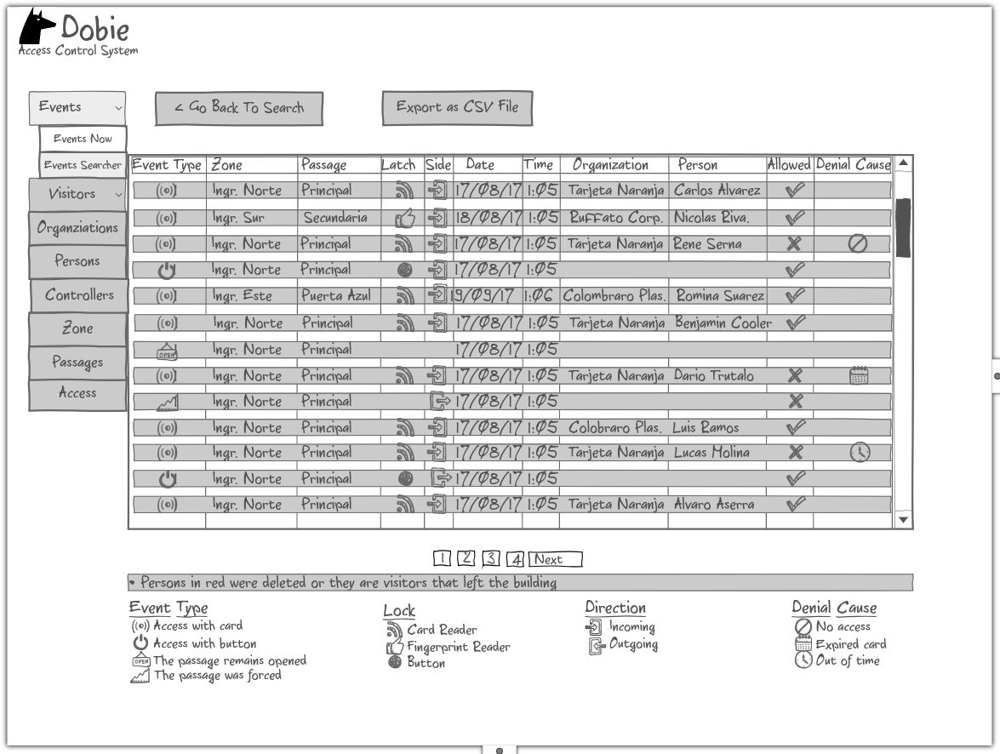

Dobie Front End Specification
=============================

.. contents::

Login Screen
------------

This screen is used to login the user into the system. According to the privilegies of the user,
the system will show different tabs and options.

.. image:: images_front_end_specs/login.png

To validate the username and password, it is necessary to get the following resource.

**Method:** GET

**URI:**

.. code-block::

  http://172.18.0.3:5000/api/v1.0/login

The default username is: ``admin`` and the default password is: ``admin``

A valid login will answer with:

**Response:**

.. code-block::

  HTTP/1.0 200 OK
  Content-Type: application/json
  Content-Length: 89
  Server: Werkzeug/0.12.1 Python/3.6.0
  Date: Wed, 12 Jul 2017 14:31:05 GMT
  
  {
    "description": "Administrator", 
    "id": 1, 
    "roleId": 1, 
    "username": "admin"
  }


An invalid login will answer with:

**Response:**

.. code-block::

  HTTP/1.0 403 FORBIDDEN
  Content-Type: application/json
  WWW-Authenticate: Basic realm="Authentication Required"
  Content-Length: 59
  Server: Werkzeug/0.12.1 Python/3.6.0
  Date: Wed, 12 Jul 2017 14:37:28 GMT
  
  {
    "error": "Unauthorized access", 
    "status": "error"
  }

  

Organization
------------

This screen is used to “add”, “edit” or “delete” organizations in the building.
For the system, an organization is just a name to group a set of persons.

.. image:: images_front_end_specs/organization.png

Get Organizations
~~~~~~~~~~~~~~~~~

To get from the server the current list of organizations, the following REST method should be sent:

**Method:** GET

**URI:**

.. code-block::

  http://172.18.0.3:5000/api/v1.0/organization

**Response:**

.. code-block::

  HTTP/1.0 200 OK
  Content-Type: application/json
  Content-Length: 481
  Server: Werkzeug/0.11.9 Python/3.5.1
  Date: Mon, 20 Mar 2017 14:49:41 GMT

  [
    {
      "id": 2, 
      "name": "Cloud Networks", 
      "resStateId": 3, 
      "uri": "http://172.18.0.3:5000/api/v1.0/organization/2"
    }, 
    {
      "id": 3, 
      "name": "Global Corporate", 
      "resStateId": 3, 
      "uri": "http://172.18.0.3:5000/api/v1.0/organization/3"
    }, 
    {
      "id": 4, 
      "name": "Machado y Asociados", 
      "resStateId": 5, 
      "uri": "http://172.18.0.3:5000/api/v1.0/organization/4"
    }
  ]

  
**resStateId** is a field that indicates the state of the organization into the system

To get all posible states, the following method should be sent to the server:

**Method:** GET

**URI:**

.. code-block::

  http://172.18.0.3:5000/api/v1.0/resstate
  
**Response:**

.. code-block::

  HTTP/1.0 200 OK
  Content-Type: application/json
  Content-Length: 272
  Server: Werkzeug/0.11.9 Python/3.5.1
  Date: Mon, 27 Mar 2017 20:49:28 GMT
  
  [
    {
      "description": "To Add", 
      "id": 1
    }, 
    {
      "description": "To Update", 
      "id": 2
    }, 
    {
      "description": "Committed", 
      "id": 3
    }, 
    {
      "description": "To Delete", 
      "id": 4
    }, 
    {
      "description": "Deleted", 
      "id": 5
    }
  ]

The organizations in state: ``"Deleted"`` should not be shown and the other states should be shown in a different color.


Add Organization
~~~~~~~~~~~~~~~~

When “New” button is pressed the following pop-up will appear:

.. image:: images_front_end_specs/add_organization.png

The following REST method should be sent to the server:

**Method:** POST

**URI:**

.. code-block::

  http://172.18.0.3:5000/api/v1.0/organization
  
**JSON**

.. code-block::

  {"name": "Zipper Corp."}

**Response:**

.. code-block::

  HTTP/1.0 201 CREATED
  Content-Type: application/json
  Content-Length: 133
  Server: Werkzeug/0.11.9 Python/3.5.1
  Date: Tue, 07 Mar 2017 19:52:06 GMT
  
  {
    "code": 201, 
    "message": "Organization added", 
    "status": "OK", 
    "uri": "http://172.18.0.3:5000/api/v1.0/organization/5"
  }
  


Get one organization
~~~~~~~~~~~~~~~~~~~~~

**Method:** GET

**URI:**

.. code-block::

  http://172.18.0.3:5000/api/v1.0/organization/2
  

**Response:**

.. code-block::

  HTTP/1.0 200 OK
  Content-Type: application/json
  Content-Length: 122
  Server: Werkzeug/0.12.2 Python/3.6.2
  Date: Thu, 26 Oct 2017 15:06:01 GMT
  
  {
    "id": 2, 
    "name": "Rufato Corporation", 
    "resStateId": 3, 
    "uri": "http://172.18.0.3:5000/api/v1.0/organization/2"
  }


Update Organization
~~~~~~~~~~~~~~~~~~~

When “Edit” button is pressed the following window will appear:

.. image:: images_front_end_specs/upd_organization.png

The following REST method should be sent to the server:

**Method:** PUT

**URI:**

.. code-block::

  http://172.18.0.3:5000/api/v1.0/organization/5
  
  
**JSON**

.. code-block::

  {"name": "Sipper Corporation"}
  

**Response:**

.. code-block::


  HTTP/1.0 200 OK
  Content-Type: application/json
  Content-Length: 59
  Server: Werkzeug/0.12.1 Python/3.6.0
  Date: Mon, 24 Jul 2017 19:51:48 GMT

  {
    "message": "Organization updated", 
    "status": "OK"
  }


  
Delete Organization
~~~~~~~~~~~~~~~~~~~

When “Delete” button is pressed the following pop-up will appear:

.. image:: images_front_end_specs/del_organization.png

The following REST method should be sent to the server:

**Method:** DELETE

**URI:**

.. code-block::

  http://172.18.0.3:5000/api/v1.0/organization/5
  
**Response:**

.. code-block::

  HTTP/1.0 200 OK
  Content-Type: application/json
  Content-Length: 59
  Server: Werkzeug/0.11.9 Python/3.5.1
  Date: Tue, 07 Mar 2017 20:02:33 GMT
  
  {
    "message": "Organization deleted", 
    "status": "OK"
  }


Persons
-------

This screen is used to “add”, “edit” or “delete” persons. For any of this actions,
an organizations should be selected first.

.. image:: images_front_end_specs/person.png

To get from server the current list of organizations, see `Get Organizations`_ section.

Get Persons
~~~~~~~~~~~

To get from server the current list of persons in each organization, the following REST method should be sent:

**Method:** GET

**URI:**

.. code-block::

  http://172.18.0.3:5000/api/v1.0/organization/2/person
  
  
**Response:**

.. code-block::
  
  
  HTTP/1.0 200 OK
  Content-Type: application/json
  Content-Length: 877
  Server: Werkzeug/0.12.1 Python/3.6.0
  Date: Mon, 24 Jul 2017 19:24:08 GMT
  
  [
    {
      "cardNumber": 4300737, 
      "id": 1, 
      "identNumber": "28063146", 
      "name": "Jorge Kleinerman", 
      "resStateId": 3, 
      "uri": "http://172.18.0.3:5000/api/v1.0/person/1", 
      "visitedOrgId": null
    }, 
    {
      "cardNumber": 9038876, 
      "id": 3, 
      "identNumber": "22063146", 
      "name": "Carlos Gonzalez", 
      "resStateId": 3, 
      "uri": "http://172.18.0.3:5000/api/v1.0/person/3", 
      "visitedOrgId": null
    }, 
    {
      "cardNumber": 4994413, 
      "id": 5, 
      "identNumber": "2463146", 
      "name": "Ernesto Chlima", 
      "resStateId": 3, 
      "uri": "http://172.18.0.3:5000/api/v1.0/person/5", 
      "visitedOrgId": null
    }, 
    {
      "cardNumber": 4300757, 
      "id": 7, 
      "identNumber": "26063146", 
      "name": "Carlos Vazquez", 
      "resStateId": 5, 
      "uri": "http://172.18.0.3:5000/api/v1.0/person/7", 
      "visitedOrgId": null
    }
  ]

    
**resStateId** is a field that indicates the state of the person into the system

To get all posible state the following method should be sent to the server:

**Method:** GET

**URI:**

.. code-block::

  http://172.18.0.3:5000/api/v1.0/resstate
  
**Response:**

.. code-block::

  HTTP/1.0 200 OK
  Content-Type: application/json
  Content-Length: 272
  Server: Werkzeug/0.11.9 Python/3.5.1
  Date: Mon, 27 Mar 2017 20:49:28 GMT
  
  [
    {
      "description": "To Add", 
      "id": 1
    }, 
    {
      "description": "To Update", 
      "id": 2
    }, 
    {
      "description": "Committed", 
      "id": 3
    }, 
    {
      "description": "To Delete", 
      "id": 4
    }, 
    {
      "description": "Deleted", 
      "id": 5
    }
  ]

The persons in state: "Deleted" should not be shown and the other states should be shown in a different color. 

 
Add Person
~~~~~~~~~~

When “New” button is pressed the following pop-up will appear:

.. image:: images_front_end_specs/add_person.png

The following REST method should be sent to the server:

**Method:** POST

**URI:**

.. code-block::

  http://172.18.0.3:5000/api/v1.0/person

**JSON**

.. code-block::

  {"name": "Ruben Juearez", "identNumber": "27063146", "cardNumber": 5300768, "orgId": 3, "visitedOrgId": null}
  
  
**Response:**

.. code-block::

  HTTP/1.0 201 CREATED
  Content-Type: application/json
  Content-Length: 121
  Server: Werkzeug/0.12.1 Python/3.6.0
  Date: Thu, 13 Jul 2017 13:40:56 GMT

  {
    "code": 201, 
    "message": "Person added", 
    "status": "OK", 
    "uri": "http://172.18.0.3:5000/api/v1.0/person/9"
  }


If "cardNumber" or "identNumber" is in use, the following response will arrive:

**Response:**

.. code-block::

  HTTP/1.0 409 CONFLICT
  Content-Type: application/json
  Content-Length: 250
  Server: Werkzeug/0.12.1 Python/3.6.0
  Date: Thu, 13 Jul 2017 18:46:52 GMT
  
  {
    "code": 409, 
    "error": "The request could not be completed due to a conflict with the current state of the target resource", 
    "message": "Can't add this person. Card number or Identification number already exists.", 
    "status": "conflict"
  }


Get one Person
~~~~~~~~~~~~~~

**Method:** POST

**URI:**

.. code-block::

  http://172.18.0.3:5000/api/v1.0/person/2

 
**Response:**

.. code-block::

  HTTP/1.0 200 OK
  Content-Type: application/json
  Content-Length: 119
  Server: Werkzeug/0.12.2 Python/3.6.2
  Date: Thu, 26 Oct 2017 15:08:39 GMT
  
  {
    "cardNumber": 5326224, 
    "id": 2, 
    "name": "Carlos Alvarez", 
    "uri": "http://172.18.0.3:5000/api/v1.0/person/2"
  }


Edit a Person
~~~~~~~~~~~~~

When “Edit” button is pressed the following pop-up will appear:

.. image:: images_front_end_specs/upd_person.png

The following REST method should be sent to the server:

**Method:** PUT

**URI:**

.. code-block::

  http://172.18.0.3:5000/api/v1.0/person/7

**JSON**

.. code-block::

  {"name": "Lucas Suarez", "identNumber": "23063146", "cardNumber": 9136307, "orgId": 3, "visitedOrgId": null}
  
  
  
  
**Response:**

.. code-block::

  HTTP/1.0 200 OK
  Content-Type: application/json
  Content-Length: 53
  Server: Werkzeug/0.12.1 Python/3.6.0
  Date: Thu, 13 Jul 2017 18:57:29 GMT

  {
    "message": "Person updated.", 
    "status": "OK"
  }


If "cardNumber" or "identNumber" is in use, the following response will arrive:


**Response:**

.. code-block::

  HTTP/1.0 409 CONFLICT
  Content-Type: application/json
  Content-Length: 253
  Server: Werkzeug/0.12.1 Python/3.6.0
  Date: Thu, 13 Jul 2017 18:54:53 GMT
  
  {
    "code": 409, 
    "error": "The request could not be completed due to a conflict with the current state of the target resource", 
    "message": "Can't update this person. Card number or Identification number already exists.", 
    "status": "conflict"
  }


Delete Person
~~~~~~~~~~~~~

When “Delete” button is pressed a pop-up will appear asking if the user is sure of this operation.

The following REST method should be sent to the server:

**Method:** DELETE

**URI:**

.. code-block::

  http://172.18.0.3:5000/api/v1.0/person/7

If the person was deleted successfully, the server will answer with the following response:

**Response:**

.. code-block::

  Response:
  HTTP/1.0 200 OK
  Content-Type: application/json
  Content-Length: 53
  Server: Werkzeug/0.11.9 Python/3.5.1
  Date: Wed, 08 Mar 2017 15:12:55 GMT
  
  {
    "message": "Person deleted", 
    "status": "OK"
  }
  
If the person is not present in the system, the following message will be received:

**Response:**

.. code-block::
  
  HTTP/1.0 404 NOT FOUND
  Content-Type: application/json
  Content-Length: 107
  Server: Werkzeug/0.12.2 Python/3.6.0
  Date: Mon, 17 Jul 2017 00:09:43 GMT
  
  {
   "code": 404, 
    "error": "request not found", 
    "message": "Person not found", 
    "status": "error"
  }

A pop up should inform the success or unsuccess of the operation


Accesses
--------

In access section there are two screens. One of them lets view, add, modify and delete accesses selecting the person and seeing the accesses of this person with the name of the door and its corresponding zone.

.. image:: images_front_end_specs/access_per_pas.png

The second screen, lets view, add, modify and delete accesses selecting the door and seeing the accesses on this door
with the person name and its corresponding organization allowed to pass trough this door.


For the first screen **(Person -> Door)**, the user should select the organization and the person which its accesses will be added, edited or removed.
In the right side of the screen, the accesses of the person will be shown with the description of the door, its corresponding zone and a checkbox wich will show if the access is for all days of weeks.
For this screen, to get all accesses of an specific person to show them in the right side the following method should be sent to the server:

**Method:** GET

**URI:**

.. code-block::

  http://172.18.0.3:5000/api/v1.0/person/6/access

**Response:**

.. code-block::

  HTTP/1.0 200 OK
  Content-Type: application/json
  Content-Length: 2390
  Server: Werkzeug/0.12.1 Python/3.6.0
  Date: Fri, 04 Aug 2017 19:30:25 GMT
  
  [
    {
      "allWeek": 1, 
      "endTime": "23:59:00", 
      "expireDate": "2018-12-12 00:00", 
      "iSide": 1, 
      "id": 21, 
      "oSide": 1, 
      "doorDescription": "Puerta 2", 
      "doorId": 2, 
      "resStateId": 1, 
      "startTime": "0:00:00", 
      "uri": "http://172.18.0.3:5000/api/v1.0/access/21", 
      "zoneName": "Ingreso Sur"
    }, 
    {
      "allWeek": 1, 
      "endTime": "23:59:00", 
      "expireDate": "2018-12-12 00:00", 
      "iSide": 1, 
      "id": 20, 
      "oSide": 1, 
      "doorDescription": "Barrera 5", 
      "doorId": 3, 
      "resStateId": 1, 
      "startTime": "0:00:00", 
      "uri": "http://172.18.0.3:5000/api/v1.0/access/20", 
      "zoneName": "Ingreso Sur"
    }, 
    {
      "allWeek": 1, 
      "endTime": "22:31:00", 
      "expireDate": "2018-11-12 00:00", 
      "iSide": 1, 
      "id": 3, 
      "oSide": 1, 
      "doorDescription": "Ba\u00f1o 3", 
      "doorId": 4, 
      "resStateId": 1, 
      "startTime": "1:01:00", 
      "uri": "http://172.18.0.3:5000/api/v1.0/access/3", 
      "zoneName": "Ingreso Sur"
    }, 
    {
      "allWeek": 1, 
      "endTime": "23:35:00", 
      "expireDate": "2019-09-09 00:00", 
      "iSide": 0, 
      "id": 7, 
      "oSide": 1, 
      "doorDescription": "Molinte 5", 
      "doorId": 5, 
      "resStateId": 2, 
      "startTime": "21:01:00", 
      "uri": "http://172.18.0.3:5000/api/v1.0/access/7", 
      "zoneName": "Ingreso Sur"
    }, 
    {
      "allWeek": 0, 
      "expireDate": "2019-09-09 00:00", 
      "id": 27, 
      "liAccesses": [
        {
          "endTime": "21:37:00", 
          "iSide": 1, 
          "id": 19, 
          "oSide": 1, 
          "resStateId": 1, 
          "startTime": "20:37:00", 
          "uri": "http://172.18.0.3:5000/api/v1.0/liaccess/19", 
          "weekDay": 4
        }, 
        {
          "endTime": "23:35:00", 
          "iSide": 0, 
          "id": 20, 
          "oSide": 1, 
          "resStateId": 2, 
          "startTime": "21:01:00", 
          "uri": "http://172.18.0.3:5000/api/v1.0/liaccess/20", 
          "weekDay": 2
        }, 
        {
          "endTime": "21:37:00", 
          "iSide": 1, 
          "id": 21, 
          "oSide": 1, 
          "resStateId": 1, 
          "startTime": "20:37:00", 
          "uri": "http://172.18.0.3:5000/api/v1.0/liaccess/21", 
          "weekDay": 3
        }
      ], 
      "doorDescription": "Ingreso 2", 
      "doorId": 6, 
      "resStateId": 3, 
      "uri": "http://172.18.0.3:5000/api/v1.0/access/27", 
      "zoneName": "Ingreso Sur"
    }
  ]
  
When the access has "allWeek" field set to 1, the check icon in "all week" column should be set.
When a the access has "allWeek" field set to 0, the check icon in "all week" column should not be set.
In the last case, the access will have a field called "liAccesses" which will have a list with all the accesses for each day of the week.


For the second screen **(Door -> Person)**, the user should select the zone and the door which its accesses will be added, edited or removed.
In the right side of the screen, the accesses of the door will be shown with the name of the person, its corresponding organization and a checkbox wich will shows if the access is for all days of weeks.
For this screen, to get all accesses of an specific door to show them in the right side the following method should be sent to the server:

**Method:** GET

**URI:**

.. code-block::

  http://172.18.0.3:5000/api/v1.0/door/4/access

**Response:**

.. code-block::

  HTTP/1.0 200 OK
  Content-Type: application/json
  Content-Length: 1248
  Server: Werkzeug/0.12.1 Python/3.6.0
  Date: Fri, 04 Aug 2017 20:20:34 GMT
  
  [
    {
      "allWeek": 1, 
      "endTime": "23:59:00", 
      "expireDate": "2018-12-12 00:00", 
      "iSide": 1, 
      "id": 1, 
      "oSide": 1, 
      "organizationName": "Kleinernet Corp.", 
      "personId": 1, 
      "personName": "Jorge Kleinerman", 
      "resStateId": 1, 
      "startTime": "0:00:00", 
      "uri": "http://172.18.0.3:5000/api/v1.0/access/1"
    }, 
    {
      "allWeek": 0, 
      "expireDate": "2016-01-02 00:00", 
      "id": 2, 
      "liAccesses": [
        {
          "endTime": "21:37:00", 
          "iSide": 1, 
          "id": 1, 
          "oSide": 1, 
          "resStateId": 1, 
          "startTime": "20:37:00", 
          "uri": "http://172.18.0.3:5000/api/v1.0/liaccess/1", 
          "weekDay": 2
        }
      ], 
      "organizationName": "Sipper Corporation", 
      "personId": 2, 
      "personName": "Ary Kleinerman", 
      "resStateId": 3, 
      "uri": "http://172.18.0.3:5000/api/v1.0/access/2"
    }, 
    {
      "allWeek": 1, 
      "endTime": "22:31:00", 
      "expireDate": "2018-11-12 00:00", 
      "iSide": 1, 
      "id": 3, 
      "oSide": 1, 
      "organizationName": "Sipper Corporation", 
      "personId": 6, 
      "personName": "Juan Alvarez", 
      "resStateId": 1, 
      "startTime": "1:01:00", 
      "uri": "http://172.18.0.3:5000/api/v1.0/access/3"
    }
  ]

  
When the access has "allWeek" field set to 1, the check icon in "all week" column should be set.
When a the access has "allWeek" field set to 0, the check icon in "all week" column should not be set.
In the last case, the access will have a field called "liAccesses" which will have a list with all the accesses for each day of the week.


Add Access
~~~~~~~~~~

For the first screen **(Person -> Door)**, before pressing **"add"** button an specific person or an entire organization should be selected and the following window will appear:

.. image:: images_front_end_specs/add_access_per_pas.png

In this window a **"Zone"** should be selected.
To get all the zones the following REST method should be sent to the server:

**Method:** GET

**URI:**

.. code-block::

  http://172.18.0.3:5000/api/v1.0/zone

 
**Response:**

.. code-block::

  HTTP/1.0 200 OK
  Content-Type: application/json
  Content-Length: 184
  Server: Werkzeug/0.12.1 Python/3.6.0
  Date: Fri, 21 Jul 2017 20:46:51 GMT
  
  [
    {
      "name": "Ingreso Sur", 
      "uri": "http://172.18.0.3:5000/api/v1.0/zone/1"
    }, 
    {
      "name": "Ingreso Norte", 
      "uri": "http://172.18.0.3:5000/api/v1.0/zone/2"
    }
  ]


Getting doors from a zone
++++++++++++++++++++++++++++

To get all doors from a zone, the following REST method should be sent to the server:

**URI:**

.. code-block::


  http://172.18.0.3:5000/api/v1.0/zone/1/door

 
**Response:**

.. code-block::

  HTTP/1.0 200 OK
  Content-Type: application/json
  Content-Length: 1432
  Server: Werkzeug/0.12.1 Python/3.6.0
  Date: Mon, 24 Jul 2017 15:06:13 GMT
  
  [
    {
      "alrmTime": 10, 
      "bzzrTime": 3, 
      "controllerId": 2, 
      "description": "Molinete 1", 
      "id": 1, 
      "doorNum": 1, 
      "rlseTime": 7, 
      "resStateId": 1, 
      "uri": "http://172.18.0.3:5000/api/v1.0/door/1"
    }, 
    {
      "alrmTime": 10, 
      "bzzrTime": 3, 
      "controllerId": 2, 
      "description": "Puerta 2", 
      "id": 2, 
      "doorNum": 2, 
      "rlseTime": 7, 
      "resStateId": 1, 
      "uri": "http://172.18.0.3:5000/api/v1.0/door/2"
    }, 
    {
      "alrmTime": 10, 
      "bzzrTime": 3, 
      "controllerId": 2, 
      "description": "Barrera 5", 
      "id": 3, 
      "doorNum": 3, 
      "rlseTime": 7, 
      "resStateId": 1, 
      "uri": "http://172.18.0.3:5000/api/v1.0/door/3"
    }, 
    {
      "alrmTime": 10, 
      "bzzrTime": 3, 
      "controllerId": 1, 
      "description": "Ba\u00f1o 3", 
      "id": 4, 
      "doorNum": 1, 
      "rlseTime": 7, 
      "resStateId": 1, 
      "uri": "http://172.18.0.3:5000/api/v1.0/door/4"
    }, 
    {
      "alrmTime": 10, 
      "bzzrTime": 3, 
      "controllerId": 1, 
      "description": "Molinte 5", 
      "id": 5, 
      "doorNum": 2, 
      "rlseTime": 7, 
      "resStateId": 1, 
      "uri": "http://172.18.0.3:5000/api/v1.0/door/5"
    }, 
    {
      "alrmTime": 10, 
      "bzzrTime": 3, 
      "controllerId": 1, 
      "description": "Ingreso 2", 
      "id": 6, 
      "doorNum": 3, 
      "rlseTime": 7, 
      "resStateId": 1, 
      "uri": "http://172.18.0.3:5000/api/v1.0/door/6"
    }
  ]


For the second screen **(Door -> Person)**, before pressing **"add"** button an specific door or an entire zone should be selected and the following window will appear:

.. image:: images_front_end_specs/add_access_pas_per.png

In this window an **"Organization"** should be selected.
To get all the organizations the following REST method should be sent to the server:

**Method:** GET

**URI:**

.. code-block::

  http://172.18.0.3:5000/api/v1.0/organization

 
**Response:**

.. code-block::

  HTTP/1.0 200 OK
  Content-Type: application/json
  Content-Length: 414
  Server: Werkzeug/0.12.1 Python/3.6.0
  Date: Fri, 04 Aug 2017 20:03:28 GMT
  
  [
    {
      "id": 2, 
      "name": "Building Networks", 
      "resStateId": 3, 
      "uri": "http://172.18.0.3:5000/api/v1.0/organization/2"
    }, 
    {
      "id": 3, 
      "name": "Sipper Corporation", 
      "resStateId": 3, 
      "uri": "http://172.18.0.3:5000/api/v1.0/organization/3"
    }, 
    {
      "id": 4, 
      "name": "Movistel", 
      "resStateId": 5, 
      "uri": "http://172.18.0.3:5000/api/v1.0/organization/4"
    }
  ]


To get all persons from an organization, the following REST method should be sent to the server:

**URI:**

.. code-block::


  http://172.18.0.3:5000/api/v1.0/organization/2/person

 
**Response:**

.. code-block::

  HTTP/1.0 200 OK
  Content-Type: application/json
  Content-Length: 877
  Server: Werkzeug/0.12.1 Python/3.6.0
  Date: Fri, 04 Aug 2017 20:05:41 GMT
  
  [
    {
      "cardNumber": 4300737, 
      "id": 1, 
      "identNumber": "28063146", 
      "name": "Jorge Kleinerman", 
      "resStateId": 3, 
      "uri": "http://172.18.0.3:5000/api/v1.0/person/1", 
      "visitedOrgId": null
    }, 
    {
      "cardNumber": 9038876, 
      "id": 3, 
      "identNumber": "22063146", 
      "name": "Maria Bedolla", 
      "resStateId": 3, 
      "uri": "http://172.18.0.3:5000/api/v1.0/person/3", 
      "visitedOrgId": null
    }, 
    {
      "cardNumber": 4994413, 
      "id": 5, 
      "identNumber": "2463146", 
      "name": "Paola Trujillo", 
      "resStateId": 3, 
      "uri": "http://172.18.0.3:5000/api/v1.0/person/5", 
      "visitedOrgId": null
    }, 
    {
      "cardNumber": 4300757, 
      "id": 7, 
      "identNumber": "26063146", 
      "name": "Carlos Vazquez", 
      "resStateId": 5, 
      "uri": "http://172.18.0.3:5000/api/v1.0/person/7", 
      "visitedOrgId": null
    }
  ]


Knowing the door id and person id, it is possible to create the new **"All Week"** access or a **"Day"** access sending the following POST method to the server:

Add All Week Access
~~~~~~~~~~~~~~~~~~~

**Method:** POST

**URI:**

.. code-block::

  http://172.18.0.3:5000/api/v1.0/access


**JSON**

.. code-block::

  {"doorId": 4, "personId": 6, "iSide": 1, "oSide": 1, "startTime": "01:01", "endTime": "22:31", "expireDate": "2018-11-12"}
 
  
**Response:**

.. code-block::

  HTTP/1.0 201 CREATED
  Content-Type: application/json
  Content-Length: 121
  Server: Werkzeug/0.12.1 Python/3.6.0
  Date: Mon, 24 Jul 2017 20:09:18 GMT
  
  {
    "code": 201, 
    "message": "Access added", 
    "status": "OK", 
    "uri": "http://172.18.0.3:5000/api/v1.0/access/3"
  }


Add Day Access (Limited Access)
~~~~~~~~~~~~~~~~~~~~~~~~~~~~~~~

**Method:** POST

**URI:**

.. code-block::

  http://172.18.0.3:5000/api/v1.0/liaccess


**JSON**

.. code-block::

  {"doorId": 6, "personId": 7, "weekDay": 4, "iSide": 1, "oSide": 1, "startTime": "20:37", "endTime": "21:37", "expireDate": "2016-01-02"}
 
  
**Response:**

.. code-block::

  HTTP/1.0 201 CREATED
  Content-Type: application/json
  Content-Length: 124
  Server: Werkzeug/0.12.1 Python/3.6.0
  Date: Mon, 24 Jul 2017 20:17:48 GMT
  
  {
    "code": 201, 
    "message": "Access added", 
    "status": "OK", 
    "uri": "http://172.18.0.3:5000/api/v1.0/liaccess/17"
  }


For the first screen **(Person -> Door)**, if all the doors of a zone is selected, an "access" or the necessary "limited access" should be sent to the server for each door of the zone.
If an entire organization is selected, all the above should be repeated for each person of the organization. 

For the second screen **(Door -> Person)**, if all the persons of an organization is selected, an "access" or the necessary "limited access" should be sent to the server for each person of the organization.
If an entire zone is selected, all the above should be repeated for each door of the zone. 

An entire organization can be selected and an entire zone too.


Edit an Access
--------------

To edit and modify an access, an access should be selected. This can be done using the first access screen (Person -> Door) or the second screen (Door -> Person). When an access is selected and "edit" button is pressed the following  window should appear.

.. image:: images_front_end_specs/upd_access.png

All the information of the access shown in the above window should be retrieved with the ID of the access, sending a GET metod.

**Method:** GET

**URI:**

.. code-block::

  http://172.18.0.5:5000/api/v1.0/access/2

**Response:**

.. code-block::

  HTTP/1.0 200 OK
  Content-Type: application/json
  Content-Length: 798
  Server: Werkzeug/0.13 Python/3.6.2
  Date: Mon, 18 Dec 2017 14:26:03 GMT
  
  {
    "allWeek": 0, 
    "doorId": 4, 
    "doorName": "Ba\u00f1o 3", 
    "expireDate": "2016-01-02 00:00", 
    "id": 2, 
    "liAccesses": [
      {
        "endTime": "21:37:00", 
        "iSide": 1, 
        "id": 1, 
        "oSide": 1, 
        "resStateId": 1, 
        "startTime": "20:37:00", 
        "uri": "http://172.18.0.5:5000/api/v1.0/liaccess/1", 
        "weekDay": 2
      }, 
      {
        "endTime": "21:37:00", 
        "iSide": 1, 
        "id": 11, 
        "oSide": 1, 
        "resStateId": 1, 
        "startTime": "20:37:00", 
        "uri": "http://172.18.0.5:5000/api/v1.0/liaccess/11", 
        "weekDay": 7
      }
    ], 
    "organizationName": "Larriquin Corp.", 
    "personId": 2, 
    "personName": "Carlos Sanchez", 
    "resStateId": 3, 
    "uri": "http://172.18.0.5:5000/api/v1.0/access/2", 
    "zoneName": "Ingreso Sur"
  }


The above response is a Limited Access with two days of a week. An example of a response with full access could be:

.. code-block::

  HTTP/1.0 200 OK
  Content-Type: application/json
  Content-Length: 398
  Server: Werkzeug/0.13 Python/3.6.2
  Date: Mon, 18 Dec 2017 15:05:32 GMT
  
  {
    "allWeek": 1, 
    "doorId": 6, 
    "doorName": "Ingreso 2", 
    "endTime": "23:59:00", 
    "expireDate": "2018-12-12 00:00", 
    "iSide": 1, 
    "id": 9, 
    "oSide": 1, 
    "organizationName": "Building Networks", 
    "personId": 3, 
    "personName": "Manuel Bobadilla", 
    "resStateId": 1, 
    "startTime": "0:00:00", 
    "uri": "http://172.18.0.5:5000/api/v1.0/access/9", 
    "zoneName": "Ingreso Sur"
  }


Modify a Day Access (Limited Access)
~~~~~~~~~~~~~~~~~~~~~~~~~~~~~~~~~~~~

To modify a Day Access (Limited Access) the following PUT method should be send to the server:


**Method:** PUT

**URI:**

.. code-block::

  http://172.18.0.3:5000/api/v1.0/liaccess/20


**JSON**

.. code-block::

  {"weekDay": 2, "iSide": 0, "oSide": 1, "startTime": "21:01:00", "endTime": "23:35:00", "expireDate": "2019-09-09 00:00"}

    
**Response:**

.. code-block::

  HTTP/1.0 200 OK
  Content-Type: application/json
  Content-Length: 61
  Server: Werkzeug/0.12.1 Python/3.6.0
  Date: Thu, 27 Jul 2017 15:03:19 GMT
  
  {
    "message": "Limited Access updated", 
    "status": "OK"
  }

Modify a "Day Accesses" of a person could imply add a new "Limited Access",  when adding a new day of access for the person, or delete a "Limited Access", when removing a day of access for the person


Modify a Week Access (Full Access)
~~~~~~~~~~~~~~~~~~~~~~~~~~~~~~~~~~

To modify a Week Access (Full Access) the following PUT method should be sent to the server:


**Method:** PUT

**URI:**

.. code-block::

  http://172.18.0.3:5000/api/v1.0/access/7 


**JSON**

.. code-block::

  {"iSide": 0, "oSide": 1, "startTime": "21:01:00", "endTime": "23:35:00", "expireDate": "2019-09-09 00:00"}


**Response:**

.. code-block::

  HTTP/1.0 200 OK
  Content-Type: application/json
  Content-Length: 53
  Server: Werkzeug/0.12.1 Python/3.6.0
  Date: Thu, 27 Jul 2017 18:28:08 GMT
  
  {
    "message": "Access updated", 
    "status": "OK"
  }


Changing Full Access by Limited Access and vice versa
~~~~~~~~~~~~~~~~~~~~~~~~~~~~~~~~~~~~~~~~~~~~~~~~~~~~~


If a person has a "Limited Access" on a door and the user modifies it giving a "Full Access", a POST method with the "Full Access" should be sent to the server. This will automatically remove all the "Limited Accesses" who this person had on this door.

In the same way, if the person had a "Full Access" and the user modifies it giving a "Limited Access", a POST method with "Limited Access" should be sent to the server and this will automatically remove the previous "Full Access" 


Delete a Full Access
~~~~~~~~~~~~~~~~~~~~

To delete a Full Access, a DELETE method should be sent to the server:

**Method:** DELETE

**URI:**

.. code-block::

  http://172.18.0.3:5000/api/v1.0/access/7


**Response:**

.. code-block::

  HTTP/1.0 200 OK
  Content-Type: application/json
  Content-Length: 53
  Server: Werkzeug/0.13 Python/3.6.2
  Date: Tue, 19 Dec 2017 23:46:05 GMT
  
  {
    "message": "Access deleted", 
    "status": "OK"
  }


Delete a Limited Access
~~~~~~~~~~~~~~~~~~~~~~~

To delete a "Limited Access" (when removing a day of access of a person) a DELETE method should be sent to the server:

**Method:** DELETE

**URI:**

.. code-block::

  http://172.18.0.3:5000/api/v1.0/liaccess/11

**Response:**

.. code-block::

  HTTP/1.0 200 OK
  Content-Type: application/json
  Content-Length: 53
  Server: Werkzeug/0.13 Python/3.6.2
  Date: Tue, 19 Dec 2017 23:46:05 GMT
  
  {
    "message": "Access deleted", 
    "status": "OK"
  }


Delete all Limited Accesses** of a person in a door
~~~~~~~~~~~~~~~~~~~~~~~~~~~~~~~~~~~~~~~~~~~~~~~~~~~


To delete all Limited Accesses of a person in a door, it should be done in the same way a Full Access is deleted pointing to the corresponding ID.

**Method:** DELETE

**URI:**

.. code-block::

  http://172.18.0.3:5000/api/v1.0/access/2


**Response:**

.. code-block::

  HTTP/1.0 200 OK
  Content-Type: application/json
  Content-Length: 53
  Server: Werkzeug/0.13 Python/3.6.2
  Date: Tue, 19 Dec 2017 23:46:05 GMT
  
  {
    "message": "Access deleted", 
    "status": "OK"
  }


Events
------

In event section, there are two screens. One of them lets view the events in real time. The second one, lets search historical events saved.

In the second screen screen organization, person, zone, door, direction, start date and time and end date and time can be selected to retrieve events.

.. image:: images_front_end_specs/events_searcher.png

If an organization is selected, the person combobox should show all the persons of this organization and one of them should be selected by the user.
To get from server the current list of persons of an organization, see `Get Persons`_ section.

The following REST method should be sent to the server.

**Method:** GET

**URI:**

.. code-block::

  http://172.18.0.3:5000/api/v1.0/events?personId=3&startDateTime=2017-08-16+20:21&endDateTime=2017-10-16+20:27&startEvt=1&evtsQtty=10

``startEvt`` variable should be the first event that the server will return.

``evtsQtty`` variable should be the quantity of events returned from server starting from ``startEvt``

  
If all the events from an entire organization is need, an organization should be selected in the organization combobox and the word "ALL" in the person combobox too. The following REST method shoud be sent to the server:

**Method:** GET

**URI:**

.. code-block::

  http://172.18.0.3:5000/api/v1.0/events?orgId=3&startDateTime=2017-08-16+20:21&endDateTime=2017-10-16+20:27&side=1&startEvt=1&evtsQtty=10


If the word "ALL" in organization combobox is selected, events from all organizations will be retrieved. Also events corresponding to "UNKNOWN" persons will be retrieved in this way. They are events corresponding to persons opening the doors with buttons, doors forced or doors left opened.


**Method:** GET

**URI:**

.. code-block::

  http://172.18.0.3:5000/api/v1.0/events?startDateTime=2017-08-16+20:21&endDateTime=2017-10-16+20:27&side=1&startEvt=1&evtsQtty=10
  
  

If a zone is selected, the door combobox should show all the doors of this zone and one of them should be slected by the user.
To get from server the current list of doors of a zone, see `Getting doors from a zone`_ section.

The following REST method should be sent to the server.

**Method:** GET

**URI:**

.. code-block::

  http://172.18.0.3:5000/api/v1.0/events?doorId=2&startDateTime=2017-08-16+20:21&endDateTime=2017-10-16+20:27&side=1&startEvt=1&evtsQtty=10


If all the events from an entire zone is need, a zone should be selected in the zone combobox and the word "ALL" in the door combobox too. The following REST method shoud be sent to the server:

**Method:** GET

**URI:**

.. code-block::

  http://172.18.0.3:5000/api/v1.0/events?zoneId=1&startDateTime=2017-08-16+20:21&endDateTime=2017-10-16+20:27&side=1&startEvt=1&evtsQtty=10

If events corresponding to incomings are need, ``side`` variable should be ``1``.

**Method:** GET

**URI:**

.. code-block::

  http://172.18.0.3:5000/api/v1.0/events?zoneId=1&startDateTime=2017-08-16+20:21&endDateTime=2017-10-16+20:27&side=1&startEvt=1&evtsQtty=10

If events corresponding to outgoings are need, ``side`` variable should be ``0``.

**Method:** GET

**URI:**

.. code-block::

  http://172.18.0.3:5000/api/v1.0/events?zoneId=1&startDateTime=2017-08-16+20:21&endDateTime=2017-10-16+20:27&side=0&startEvt=1&evtsQtty=10

If events corresponding to incomings and outgoings at the same time are need, the ``side`` variable should be removed from the URI.

**Method:** GET

**URI:**

.. code-block::

  http://172.18.0.3:5000/api/v1.0/events?startDateTime=2017-08-16+20:21&endDateTime=2017-10-16+20:27&startEvt=1&evtsQtty=10
  
As can be noticed, if a variable is removed from the URI, the server will return all the events which this variable could filter. The only variables which couldn't be omitted are ``startDateTime``, ``endDateTime``, ``startEvt`` and ``evtsQtty``


Of course, all combinations would be possible:

.. code-block::

  http://172.18.0.3:5000/api/v1.0/events?orgId=3&doorId=2&startDateTime=2017-08-16+20:21&endDateTime=2017-10-16+20:27&side=1&startEvt=80&evtsQtty=10


An the tipical response would be:

**Response:**

.. code-block::
  
  
  HTTP/1.0 200 OK
  Content-Type: application/json
  Content-Length: 3709
  Server: Werkzeug/0.12.2 Python/3.6.2
  Date: Mon, 16 Oct 2017 20:46:26 GMT
  
  {
    "events": [
      {
        "allowed": 0, 
        "dateTime": "Thu, 12 Oct 2017 17:19:00 GMT", 
        "eventTypeId": 4, 
        "id": 1542, 
        "doorLockId": null, 
        "denialCauseId": null, 
        "orgName": null, 
        "personName": null, 
        "doorName": "Ingreso F66", 
        "side": null, 
        "zoneName": "Ingreso Oficina"
      }, 
      {
        "allowed": 1, 
        "dateTime": "Thu, 12 Oct 2017 17:19:00 GMT", 
        "eventTypeId": 1, 
        "id": 1543, 
        "doorLockId": 1, 
        "denialCauseId": null, 
        "orgName": "Datacenter Capitalinas", 
        "personName": "Jorge Kleinerman", 
        "doorName": "Ingreso F66", 
        "side": 1, 
        "zoneName": "Ingreso Oficina"
      }, 
      {
        "allowed": 1, 
        "dateTime": "Thu, 12 Oct 2017 17:20:00 GMT", 
        "eventTypeId": 2, 
        "id": 1544, 
        "doorLockId": 3, 
        "denialCauseId": null, 
        "orgName": null, 
        "personName": null, 
        "doorName": "Ingreso F66", 
        "side": 0, 
        "zoneName": "Ingreso Oficina"
      }, 
      {
        "allowed": 0, 
        "dateTime": "Thu, 12 Oct 2017 17:21:00 GMT", 
        "eventTypeId": 3, 
        "id": 1545, 
        "doorLockId": null, 
        "denialCauseId": null, 
        "orgName": "null", 
        "personName": "null", 
        "doorName": "Ingreso F66", 
        "side": null, 
        "zoneName": "Ingreso Oficina"
      }, 
      {
        "allowed": 1, 
        "dateTime": "Thu, 12 Oct 2017 17:22:00 GMT", 
        "eventTypeId": 2, 
        "id": 1546, 
        "doorLockId": 3, 
        "denialCauseId": null, 
        "orgName": null, 
        "personName": null, 
        "doorName": "Ingreso F66", 
        "side": 0, 
        "zoneName": "Ingreso Oficina"
      }, 
      {
        "allowed": 1, 
        "dateTime": "Thu, 12 Oct 2017 17:56:00 GMT", 
        "eventTypeId": 2, 
        "id": 1547, 
        "doorLockId": 3, 
        "denialCauseId": null, 
        "orgName": null, 
        "personName": null, 
        "doorName": "Ingreso F66", 
        "side": 0, 
        "zoneName": "Ingreso Oficina"
      }, 
      {
        "allowed": 1, 
        "dateTime": "Thu, 12 Oct 2017 18:01:00 GMT", 
        "eventTypeId": 2, 
        "id": 1548, 
        "doorLockId": 3, 
        "denialCauseId": null, 
        "orgName": null, 
        "personName": null, 
        "doorName": "Ingreso F66", 
        "side": 0, 
        "zoneName": "Ingreso Oficina"
      }, 
      {
        "allowed": 1, 
        "dateTime": "Thu, 12 Oct 2017 18:01:00 GMT", 
        "eventTypeId": 1, 
        "id": 1549, 
        "doorLockId": 1, 
        "denialCauseId": null, 
        "orgName": "Datacenter Capitalinas", 
        "personName": "Jorge Kleinerman", 
        "doorName": "Ingreso F66", 
        "side": 1, 
        "zoneName": "Ingreso Oficina"
      }, 
      {
        "allowed": 1, 
        "dateTime": "Thu, 12 Oct 2017 18:02:00 GMT", 
        "eventTypeId": 1, 
        "id": 1550, 
        "doorLockId": 1, 
        "denialCauseId": null, 
        "orgName": "Datacenter Capitalinas", 
        "personName": "Jorge Kleinerman", 
        "doorName": "Ingreso F65", 
        "side": 1, 
        "zoneName": "Ingreso Oficina"
      }, 
      {
        "allowed": 1, 
        "dateTime": "Thu, 12 Oct 2017 18:02:00 GMT", 
        "eventTypeId": 2, 
        "id": 1551, 
        "doorLockId": 3, 
        "denialCauseId": null, 
        "orgName": null, 
        "personName": null, 
        "doorName": "Ingreso F66", 
        "side": 0, 
        "zoneName": "Ingreso Oficina"
      }
    ], 
    "evtsQtty": 10, 
    "nextURL": "http://172.18.0.3:5000/api/v1.0/events?startDateTime=2017-08-16+20:21&endDateTime=2017-10-16+20:27&startEvt=1552&evtsQtty=10", 
    "prevURL": "http://172.18.0.3:5000/api/v1.0/events?startDateTime=2017-08-16+20:21&endDateTime=2017-10-16+20:27&startEvt=1532&evtsQtty=10", 
    "startEvt": 1542, 
    "totalEvtsCount": 1612
  }


A JSON object is returned with the following keys:

- ``events``: Is a list with al the events.
- ``evtsQtty``: Is the amount of events returned in this call starting
- ``startEvt``: The index of the first event returned.
- ``totalEvtsCount``: Total events in server.
- ``nextURL``: Is the URI of the next page.
- ``prevURL``: Is the URI of the previous page.

Each event has the following fields:

- ``id``: The ID of the event.
- ``eventTypeId``: ID of type of event.
- ``dateTime``: Date and time of the event.
- ``doorLockId``: ID of doorLock used. (Could be NULL when the access was not allowed)
- ``side``: 1 for incoming and 0 for outgoing. (Could be NULL when the access was not allowed)
- ``zoneName``: Name of the zone.
- ``doorName```: Name of the door.
- ``orgName``: Name of the organization that person belong to. (Could be NULL when person is UNKNOWN)
- ``personName``: Name of the person. (Could be NULL when person is UNKNOWN)
- ``denialCauseId``: When the access is not allowed, this is the ID of denialCause. (Could be NULL when the access was allowed)
- ``allowed``: If the access was allowed it will be ``1``, if not, it will ``0``.


To show **Event Types** descriptions with the ``eventTypeId`` received in the event, the following method should be sent to the server:

**Method:** GET

**URI:**

.. code-block::

  http://172.18.0.3:5000/api/v1.0/eventtype


**Response:**

.. code-block::

  HTTP/1.0 200 OK
  Content-Type: application/json
  Content-Length: 268
  Server: Werkzeug/0.12.1 Python/3.6.0
  Date: Thu, 12 Oct 2017 15:14:45 GMT
  
  [
    {
      "description": "Access with card", 
      "id": 1
    }, 
    {
      "description": "Access with button", 
      "id": 2
    }, 
    {
      "description": "The door remains opened", 
      "id": 3
    }, 
    {
      "description": "The door was forced", 
      "id": 4
    }
  ]


To show **DoorLocks** descriptions with the ``doorLockId`` received in the event, the following method should be sent to the server:

**Method:** GET

**URI:**

.. code-block::

  http://172.18.0.3:5000/api/v1.0/doorlock


**Response:**

.. code-block::

  HTTP/1.0 200 OK
  Content-Type: application/json
  Content-Length: 175
  Server: Werkzeug/0.12.1 Python/3.6.0
  Date: Thu, 12 Oct 2017 15:33:48 GMT
  
  [
    {
      "description": "Card Reader", 
      "id": 1
    }, 
    {
      "description": "Fingerprint Reader", 
      "id": 2
    }, 
    {
      "description": "Button", 
      "id": 3
    }
  ]


To show **Denial Causes** descriptions with the ``denialCauseId`` received in the event, the following method should be sent to the server:

**Method:** GET

**URI:**

.. code-block::

  http://172.18.0.3:5000/api/v1.0/denialcause


**Response:**

.. code-block::

  HTTP/1.0 200 OK
  Content-Type: application/json
  Content-Length: 172
  Server: Werkzeug/0.12.1 Python/3.6.0
  Date: Thu, 12 Oct 2017 17:46:47 GMT
  
  [
    {
      "description": "No access", 
      "id": 1
    }, 
    {
      "description": "Expired card", 
      "id": 2
    }, 
    {
      "description": "Out of time", 
      "id": 3
    }
  ]


Event Reports
~~~~~~~~~~~~~

When all the filters are applied and search button is pressed a pop up window will appear with the report:


