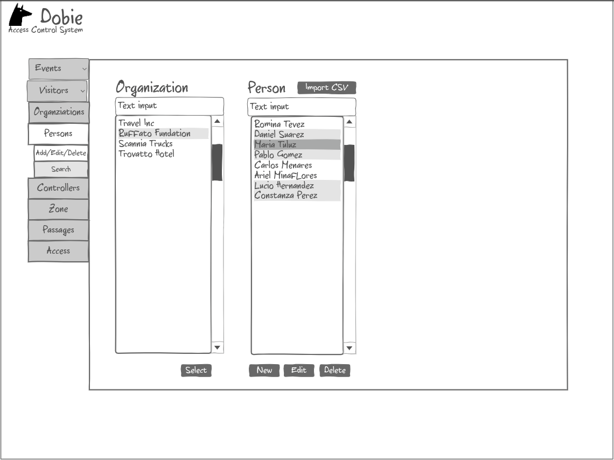
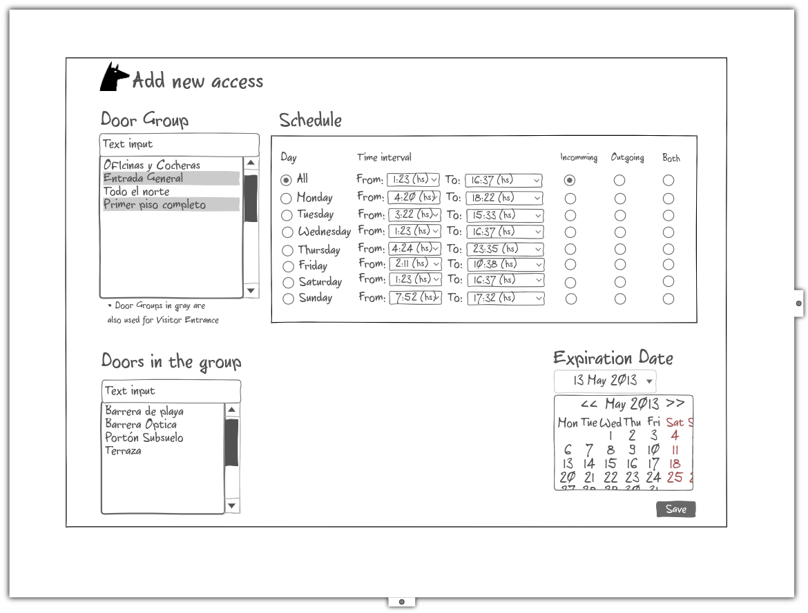
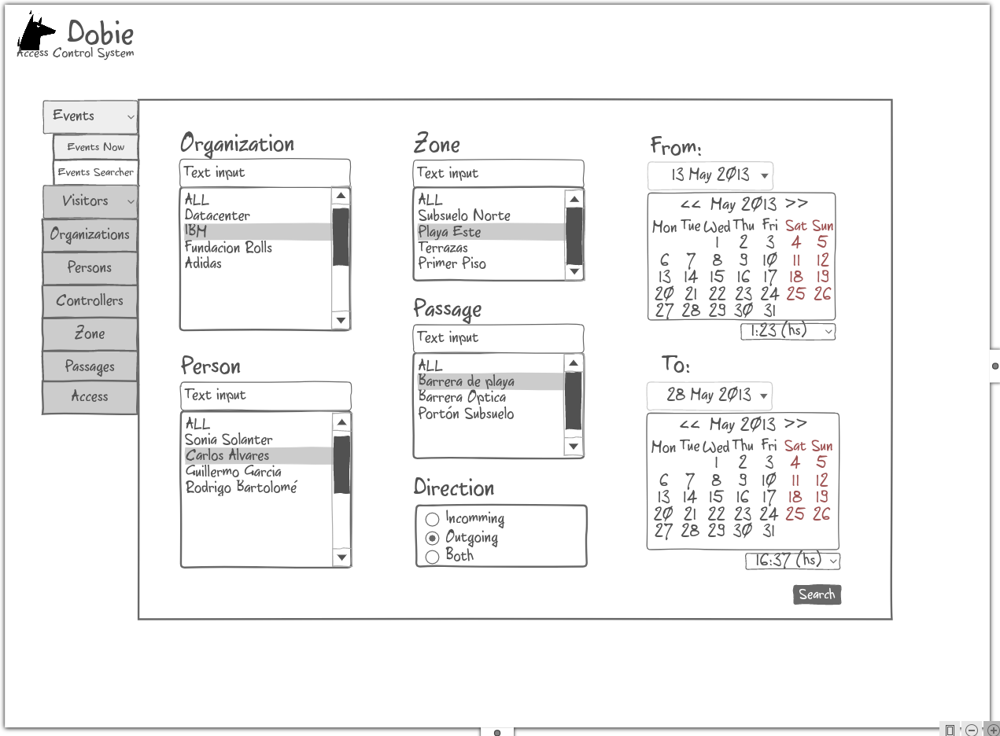
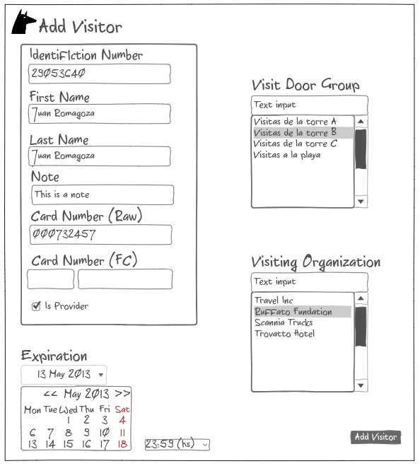
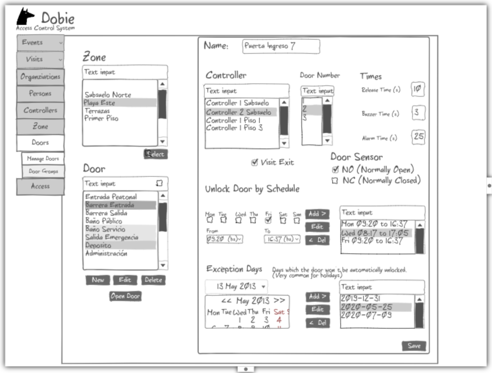
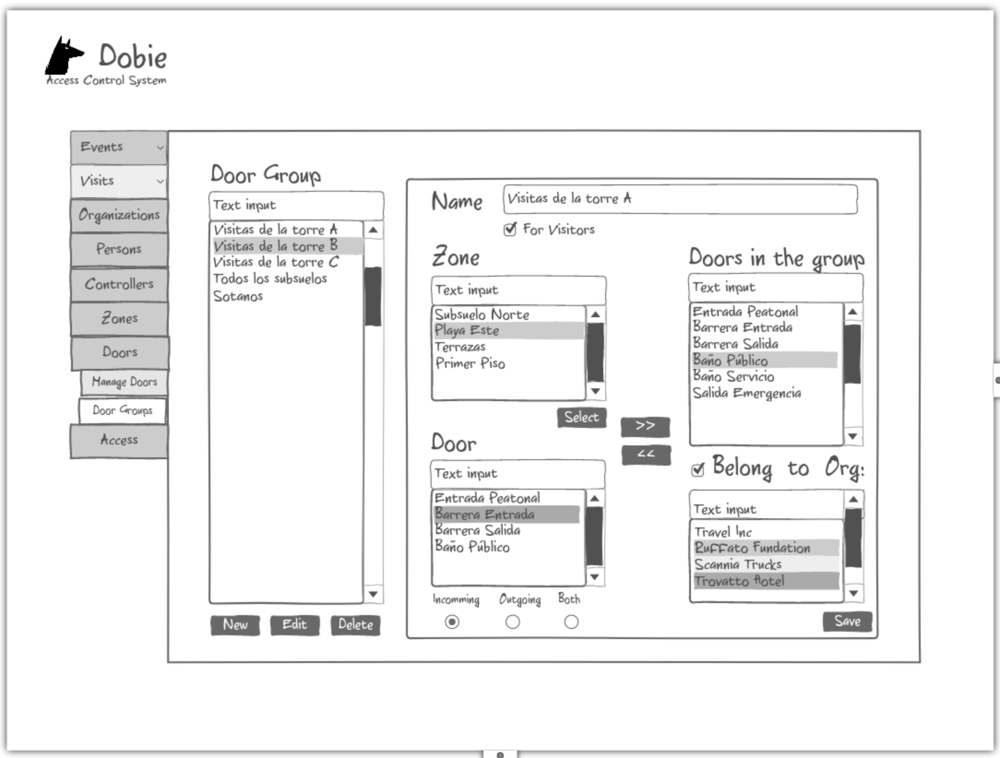
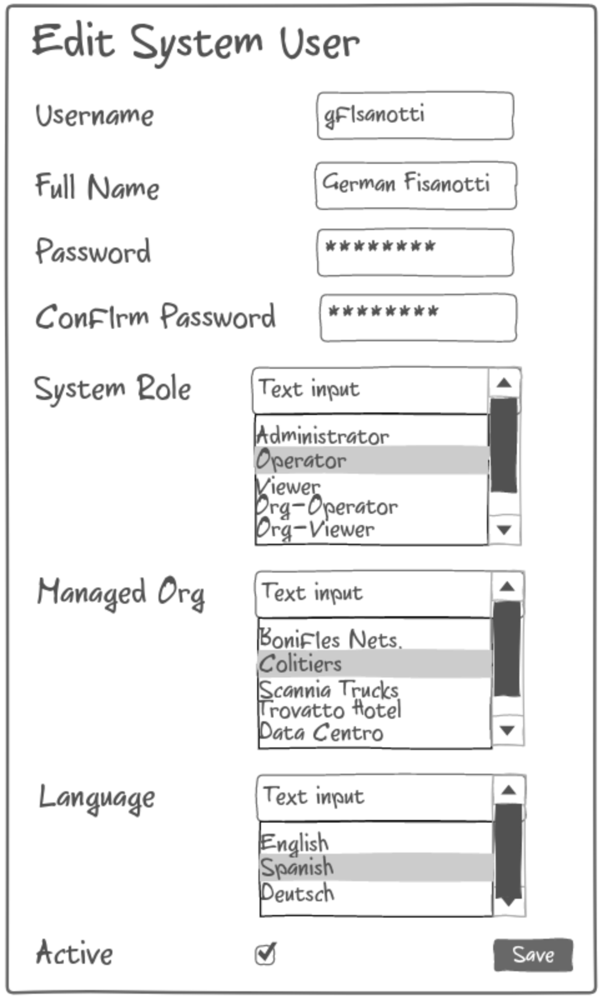

Dobie Front End Specification
=============================

.. contents::

Login Screen
------------

This screen is used to login the user into the system. According to the privilegies of the user,
the system will show different tabs and options.

.. image:: images_front_end_specs/login.png

To validate the username and password, it is necessary to get the following resource.

**Method:** GET

**URI:**

.. code-block::

  http://172.18.0.3:5000/api/v1.0/login

The default username is: ``admin`` and the default password is: ``admin``

A valid login will answer with:

**Response:**

.. code-block::

  HTTP/1.0 200 OK
  Content-Type: application/json
  Content-Length: 89
  Server: Werkzeug/0.12.1 Python/3.6.0
  Date: Wed, 12 Jul 2017 14:31:05 GMT
  
  {
    "fullName": "Administrator", 
    "id": 1, 
    "roleId": 1, 
    "username": "admin"
    "active": 1
  }

If the field ``active`` is ``0``, the user shouldn't be able to log into the application and this situation should be informed in a popup with a message: **This user is disabled. Contact the administrator.**


| Users with ``roleId = 1`` (Administrator) will be able to access all the sections of the application.
| Users with ``roleId = 2`` (Operator) will be able to access all the sections except System Users Section.
| Users with ``roleId = 3`` (Viewer) will be able to access all "Event" subsections and only "Manage Visitors" subsection of "Visitors".
|


An invalid login will answer with:

**Response:**

.. code-block::

  HTTP/1.0 403 FORBIDDEN
  Content-Type: application/json
  WWW-Authenticate: Basic realm="Authentication Required"
  Content-Length: 59
  Server: Werkzeug/0.12.1 Python/3.6.0
  Date: Wed, 12 Jul 2017 14:37:28 GMT
  
  {
    "error": "Unauthorized access", 
    "status": "error"
  }

  

Organization
------------

This screen is used to “add”, “edit” or “delete” organizations in the building.
For the system, an organization is just a name to group a set of persons.

.. image:: images_front_end_specs/organization.png

Get Organizations
~~~~~~~~~~~~~~~~~

To get from the server the current list of organizations, the following REST method should be sent:

**Method:** GET

**URI:**

.. code-block::

  http://172.18.0.3:5000/api/v1.0/organization

**Response:**

.. code-block::

  HTTP/1.0 200 OK
  Content-Type: application/json
  Content-Length: 481
  Server: Werkzeug/0.11.9 Python/3.5.1
  Date: Mon, 20 Mar 2017 14:49:41 GMT

  [
    {
      "id": 2, 
      "name": "Cloud Networks", 
      "resStateId": 3, 
      "uri": "http://172.18.0.3:5000/api/v1.0/organization/2"
    }, 
    {
      "id": 3, 
      "name": "Global Corporate", 
      "resStateId": 3, 
      "uri": "http://172.18.0.3:5000/api/v1.0/organization/3"
    }, 
    {
      "id": 4, 
      "name": "Machado y Asociados", 
      "resStateId": 5, 
      "uri": "http://172.18.0.3:5000/api/v1.0/organization/4"
    }
  ]

  
**resStateId** is a field that indicates the state of the organization into the system

To get all posible states, the following method should be sent to the server:

**Method:** GET

**URI:**

.. code-block::

  http://172.18.0.3:5000/api/v1.0/resstate
  
**Response:**

.. code-block::

  HTTP/1.0 200 OK
  Content-Type: application/json
  Content-Length: 272
  Server: Werkzeug/0.11.9 Python/3.5.1
  Date: Mon, 27 Mar 2017 20:49:28 GMT
  
  [
    {
      "description": "To Add", 
      "id": 1
    }, 
    {
      "description": "To Update", 
      "id": 2
    }, 
    {
      "description": "Committed", 
      "id": 3
    }, 
    {
      "description": "To Delete", 
      "id": 4
    }, 
    {
      "description": "Deleted", 
      "id": 5
    }
  ]

The organizations in state: ``"Deleted"`` should not be shown and the other states should be shown in a different color.


Add Organization
~~~~~~~~~~~~~~~~

When “New” button is pressed the following pop-up will appear:

.. image:: images_front_end_specs/add_organization.png

The following REST method should be sent to the server:

**Method:** POST

**URI:**

.. code-block::

  http://172.18.0.3:5000/api/v1.0/organization
  
**JSON**

.. code-block::

  {"name": "Zipper Corp."}

**Response:**

.. code-block::

  HTTP/1.0 201 CREATED
  Content-Type: application/json
  Content-Length: 133
  Server: Werkzeug/0.11.9 Python/3.5.1
  Date: Tue, 07 Mar 2017 19:52:06 GMT
  
  {
    "code": 201, 
    "message": "Organization added", 
    "status": "OK", 
    "uri": "http://172.18.0.3:5000/api/v1.0/organization/5"
  }
  


Get one organization
~~~~~~~~~~~~~~~~~~~~~

**Method:** GET

**URI:**

.. code-block::

  http://172.18.0.3:5000/api/v1.0/organization/2
  

**Response:**

.. code-block::

  HTTP/1.0 200 OK
  Content-Type: application/json
  Content-Length: 122
  Server: Werkzeug/0.12.2 Python/3.6.2
  Date: Thu, 26 Oct 2017 15:06:01 GMT
  
  {
    "id": 2, 
    "name": "Rufato Corporation", 
    "resStateId": 3, 
    "uri": "http://172.18.0.3:5000/api/v1.0/organization/2"
  }


Update Organization
~~~~~~~~~~~~~~~~~~~

When “Edit” button is pressed the following window will appear:


The following REST method should be sent to the server:

**Method:** PUT

**URI:**

.. code-block::

  http://172.18.0.3:5000/api/v1.0/organization/5
  
  
**JSON**

.. code-block::

  {"name": "Sipper Corporation"}
  

**Response:**

.. code-block::


  HTTP/1.0 200 OK
  Content-Type: application/json
  Content-Length: 59
  Server: Werkzeug/0.12.1 Python/3.6.0
  Date: Mon, 24 Jul 2017 19:51:48 GMT

  {
    "message": "Organization updated", 
    "status": "OK"
  }


  
Delete Organization
~~~~~~~~~~~~~~~~~~~

When “Delete” button is pressed the following pop-up will appear:

.. image:: images_front_end_specs/del_organization.png

The following REST method should be sent to the server:

**Method:** DELETE

**URI:**

.. code-block::

  http://172.18.0.3:5000/api/v1.0/organization/5
  
**Response:**

.. code-block::

  HTTP/1.0 200 OK
  Content-Type: application/json
  Content-Length: 59
  Server: Werkzeug/0.11.9 Python/3.5.1
  Date: Tue, 07 Mar 2017 20:02:33 GMT
  
  {
    "message": "Organization deleted", 
    "status": "OK"
  }


Persons
-------


In this section there are two screens. One of them lets “add”, “edit” or “delete” persons. For any of this actions,
an organizations should be selected first.
The second screen, lets search persons using a part of the name or/and a part of the last name or/and the identification number or/and the card number. 



For the first screen, to get from server the current list of organizations, see `Get Organizations`_ section.

Get Persons
~~~~~~~~~~~

To get from server the current list of persons in each organization, the following REST method should be sent:

**Method:** GET

**URI:**

.. code-block::

  http://172.18.0.3:5000/api/v1.0/organization/2/person
  
  
**Response:**

.. code-block::
  
  
  HTTP/1.0 200 OK
  Content-Type: application/json
  Content-Length: 877
  Server: Werkzeug/0.12.1 Python/3.6.0
  Date: Mon, 24 Jul 2017 19:24:08 GMT
  
  [
    {
      "cardNumber": 4300737, 
      "id": 1, 
      "identNumber": "28063146", 
      "name": "Jorge Kleinerman", 
      "resStateId": 3, 
      "uri": "http://172.18.0.3:5000/api/v1.0/person/1", 
      "visitedOrgId": null
    }, 
    {
      "cardNumber": 9038876, 
      "id": 3, 
      "identNumber": "22063146", 
      "name": "Carlos Gonzalez", 
      "resStateId": 3, 
      "uri": "http://172.18.0.3:5000/api/v1.0/person/3", 
      "visitedOrgId": null
    }, 
    {
      "cardNumber": 4994413, 
      "id": 5, 
      "identNumber": "2463146", 
      "name": "Ernesto Chlima", 
      "resStateId": 3, 
      "uri": "http://172.18.0.3:5000/api/v1.0/person/5", 
      "visitedOrgId": null
    }, 
    {
      "cardNumber": 4300757, 
      "id": 7, 
      "identNumber": "26063146", 
      "name": "Carlos Vazquez", 
      "resStateId": 5, 
      "uri": "http://172.18.0.3:5000/api/v1.0/person/7", 
      "visitedOrgId": null
    }
  ]

    
**resStateId** is a field that indicates the state of the person into the system

To get all posible state the following method should be sent to the server:

**Method:** GET

**URI:**

.. code-block::

  http://172.18.0.3:5000/api/v1.0/resstate
  
**Response:**

.. code-block::

  HTTP/1.0 200 OK
  Content-Type: application/json
  Content-Length: 272
  Server: Werkzeug/0.11.9 Python/3.5.1
  Date: Mon, 27 Mar 2017 20:49:28 GMT
  
  [
    {
      "description": "To Add", 
      "id": 1
    }, 
    {
      "description": "To Update", 
      "id": 2
    }, 
    {
      "description": "Committed", 
      "id": 3
    }, 
    {
      "description": "To Delete", 
      "id": 4
    }, 
    {
      "description": "Deleted", 
      "id": 5
    }
  ]

The persons in state: "Deleted" should not be shown and the other states should be shown in a different color. 

 
Add Person
~~~~~~~~~~

When “New” button is pressed the following pop-up will appear:


The following REST method should be sent to the server:

**Method:** POST

**URI:**

.. code-block::

  http://172.18.0.3:5000/api/v1.0/person

**JSON**

.. code-block::

  {"names": "Carlos Ruben", "lastName": "Alvarez", "identNumber": "27063146", "note": "This person has a blue car", "cardNumber": 5300768, "orgId": 3, "visitedOrgId": null}
  
  
**Response:**

.. code-block::

  HTTP/1.0 201 CREATED
  Content-Type: application/json
  Content-Length: 121
  Server: Werkzeug/0.12.1 Python/3.6.0
  Date: Thu, 13 Jul 2017 13:40:56 GMT

  {
    "code": 201, 
    "message": "Person added", 
    "status": "OK", 
    "uri": "http://172.18.0.3:5000/api/v1.0/person/9"
  }


If "cardNumber" or "identNumber" is in use, the following response will arrive:

**Response:**

.. code-block::

  HTTP/1.0 409 CONFLICT
  Content-Type: application/json
  Content-Length: 250
  Server: Werkzeug/0.12.1 Python/3.6.0
  Date: Thu, 13 Jul 2017 18:46:52 GMT
  
  {
    "code": 409, 
    "error": "The request could not be completed due to a conflict with the current state of the target resource", 
    "message": "Can't add this person. Card number or Identification number already exists.", 
    "status": "conflict"
  }


Get one Person
~~~~~~~~~~~~~~

**Method:** GET

**URI:**

.. code-block::

  http://172.18.0.3:5000/api/v1.0/person/2

 
**Response:**

.. code-block::

  HTTP/1.0 200 OK
  Content-Type: application/json
  Content-Length: 119
  Server: Werkzeug/0.12.2 Python/3.6.2
  Date: Thu, 26 Oct 2017 15:08:39 GMT
  
  {
    "cardNumber": 5326224, 
    "id": 2, 
    "names": "Carlos Ruben",
    "lastName": "Alaverez", 
    "uri": "http://172.18.0.3:5000/api/v1.0/person/2"
  }


Edit a Person
~~~~~~~~~~~~~

When “Edit” button is pressed the following pop-up will appear:


The following REST method should be sent to the server:

**Method:** PUT

**URI:**

.. code-block::

  http://172.18.0.3:5000/api/v1.0/person/7

**JSON**

.. code-block::

  {"names": "Lucas Camilo", "lastName": "Sorin", "identNumber": "23063146", "note": "He has a blue car", "cardNumber": 9136307, "orgId": 3, "visitedOrgId": null}
  
  
  
  
**Response:**

.. code-block::

  HTTP/1.0 200 OK
  Content-Type: application/json
  Content-Length: 53
  Server: Werkzeug/0.12.1 Python/3.6.0
  Date: Thu, 13 Jul 2017 18:57:29 GMT

  {
    "message": "Person updated.", 
    "status": "OK"
  }


If "cardNumber" or "identNumber" is in use, the following response will arrive:


**Response:**

.. code-block::

  HTTP/1.0 409 CONFLICT
  Content-Type: application/json
  Content-Length: 253
  Server: Werkzeug/0.12.1 Python/3.6.0
  Date: Thu, 13 Jul 2017 18:54:53 GMT
  
  {
    "code": 409, 
    "error": "The request could not be completed due to a conflict with the current state of the target resource", 
    "message": "Can't update this person. Card number or Identification number already exists.", 
    "status": "conflict"
  }


Delete Person
~~~~~~~~~~~~~

When “Delete” button is pressed a pop-up will appear asking if the user is sure of this operation.

The following REST method should be sent to the server:

**Method:** DELETE

**URI:**

.. code-block::

  http://172.18.0.3:5000/api/v1.0/person/7

If the person was deleted successfully, the server will answer with the following response:

**Response:**

.. code-block::

  Response:
  HTTP/1.0 200 OK
  Content-Type: application/json
  Content-Length: 53
  Server: Werkzeug/0.11.9 Python/3.5.1
  Date: Wed, 08 Mar 2017 15:12:55 GMT
  
  {
    "message": "Person deleted", 
    "status": "OK"
  }
  
If the person is not present in the system, the following message will be received:

**Response:**

.. code-block::

  HTTP/1.0 404 NOT FOUND
  Content-Type: application/json
  Content-Length: 107
  Server: Werkzeug/0.12.2 Python/3.6.0
  Date: Mon, 17 Jul 2017 00:09:43 GMT
  
  {
   "code": 404, 
    "error": "request not found", 
    "message": "Person not found", 
    "status": "error"
  }

A pop up should inform the success or unsuccess of the operation


Import Persons from a CSV file
~~~~~~~~~~~~~~~~~~~~~~~~~~~~~~

When "import CSV" button is pressed in the main person screen, the following popup should appear:


The frontend should send a POST method for each line, in the same way it sends the POST when adding one person. See `Add Person`_


Search Persons
~~~~~~~~~~~~~~

The second screen of persons section lets search persons using a part of the name or/and a part of the last name or/and the identification number or/and the card number.


**Method:** GET

**URI:**

.. code-block::

  http://localhost:5000/api/v1.0/person?namesPattern=or&lastNamePattern=kleiner&cardNumber=5379295&identNumber=28063146"


**Response:**

.. code-block::

  HTTP/1.1 200 OK
  Content-Type: application/json
  Content-Length: 149
  Date: Thu, 02 May 2019 17:55:23 GMT

  [{"cardNumber":5379295,"identNumber":"28063146","lastName":"Kleinerman","orgName":"Bonifies Networks","names":"Jorge Emanuel","note":"nota de prueba"}]

Any of the variables to search the persons can be omitted but not all off them


**Method:** GET

**URI:**

.. code-block::

  http://localhost:5000/api/v1.0/person?lastNamePattern=kleiner


**Response:**

.. code-block::

  HTTP/1.1 200 OK
  Content-Type: application/json
  Content-Length: 289
  Date: Thu, 02 May 2019 17:58:34 GMT

  [{"cardNumber":5379295,"identNumber":"28063146","lastName":"Kleinerman","orgName":"Bonifies Networks","names":"Jorge Emanuel","note":"nota de prueba"},{"cardNumber":5300738,"identNumber":"21063146","lastName":"Kleinerman","orgName":"Bonifies Networks","names":"Ary D.","note":"nota de prueba"}]


Persons found should be shown in the following way


Accesses
--------

In access section there are two screens. One of them lets view, add, modify and delete accesses selecting the person and seeing the accesses of this person with the name of the door and its corresponding zone.


The second screen, lets view, add, modify and delete accesses selecting the door and seeing the accesses on this door
with the person name and its corresponding organization allowed to pass trough this door.

.. image:: images_front_end_specs/access_pas_per.png


For the first screen **(Person -> Door)**, the user should select the organization and the person which its accesses will be added, edited or removed.
In the right side of the screen, the accesses of the person will be shown with the description of the door, its corresponding zone and a checkbox wich will show if the access is for all days of weeks.
For this screen, to get all accesses of an specific person to show them in the right side the following method should be sent to the server:

**Method:** GET

**URI:**

.. code-block::

  http://172.18.0.3:5000/api/v1.0/person/6/access

**Response:**

.. code-block::

  HTTP/1.0 200 OK
  Content-Type: application/json
  Content-Length: 2390
  Server: Werkzeug/0.12.1 Python/3.6.0
  Date: Fri, 04 Aug 2017 19:30:25 GMT
  
  [
    {
      "allWeek": 1, 
      "endTime": "23:59:00", 
      "expireDate": "2018-12-12 00:00", 
      "iSide": 1, 
      "id": 21, 
      "oSide": 1, 
      "doorDescription": "Puerta 2", 
      "doorId": 2, 
      "resStateId": 1, 
      "startTime": "0:00:00", 
      "uri": "http://172.18.0.3:5000/api/v1.0/access/21", 
      "zoneName": "Ingreso Sur"
    }, 
    {
      "allWeek": 1, 
      "endTime": "23:59:00", 
      "expireDate": "2018-12-12 00:00", 
      "iSide": 1, 
      "id": 20, 
      "oSide": 1, 
      "doorDescription": "Barrera 5", 
      "doorId": 3, 
      "resStateId": 1, 
      "startTime": "0:00:00", 
      "uri": "http://172.18.0.3:5000/api/v1.0/access/20", 
      "zoneName": "Ingreso Sur"
    }, 
    {
      "allWeek": 1, 
      "endTime": "22:31:00", 
      "expireDate": "2018-11-12 00:00", 
      "iSide": 1, 
      "id": 3, 
      "oSide": 1, 
      "doorDescription": "Ba\u00f1o 3", 
      "doorId": 4, 
      "resStateId": 1, 
      "startTime": "1:01:00", 
      "uri": "http://172.18.0.3:5000/api/v1.0/access/3", 
      "zoneName": "Ingreso Sur"
    }, 
    {
      "allWeek": 1, 
      "endTime": "23:35:00", 
      "expireDate": "2019-09-09 00:00", 
      "iSide": 0, 
      "id": 7, 
      "oSide": 1, 
      "doorDescription": "Molinte 5", 
      "doorId": 5, 
      "resStateId": 2, 
      "startTime": "21:01:00", 
      "uri": "http://172.18.0.3:5000/api/v1.0/access/7", 
      "zoneName": "Ingreso Sur"
    }, 
    {
      "allWeek": 0, 
      "expireDate": "2019-09-09 00:00", 
      "id": 27, 
      "liAccesses": [
        {
          "endTime": "21:37:00", 
          "iSide": 1, 
          "id": 19, 
          "oSide": 1, 
          "resStateId": 1, 
          "startTime": "20:37:00", 
          "uri": "http://172.18.0.3:5000/api/v1.0/liaccess/19", 
          "weekDay": 4
        }, 
        {
          "endTime": "23:35:00", 
          "iSide": 0, 
          "id": 20, 
          "oSide": 1, 
          "resStateId": 2, 
          "startTime": "21:01:00", 
          "uri": "http://172.18.0.3:5000/api/v1.0/liaccess/20", 
          "weekDay": 2
        }, 
        {
          "endTime": "21:37:00", 
          "iSide": 1, 
          "id": 21, 
          "oSide": 1, 
          "resStateId": 1, 
          "startTime": "20:37:00", 
          "uri": "http://172.18.0.3:5000/api/v1.0/liaccess/21", 
          "weekDay": 3
        }
      ], 
      "doorDescription": "Ingreso 2", 
      "doorId": 6, 
      "resStateId": 3, 
      "uri": "http://172.18.0.3:5000/api/v1.0/access/27", 
      "zoneName": "Ingreso Sur"
    }
  ]
  
When the access has "allWeek" field set to 1, the check icon in "all week" column should be set.
When a the access has "allWeek" field set to 0, the check icon in "all week" column should not be set.
In the last case, the access will have a field called "liAccesses" which will have a list with all the accesses for each day of the week.


For the second screen **(Door -> Person)**, the user should select the zone and the door which its accesses will be added, edited or removed.
In the right side of the screen, the accesses of the door will be shown with the name of the person, its corresponding organization and a checkbox wich will shows if the access is for all days of weeks.
For this screen, to get all accesses of an specific door to show them in the right side the following method should be sent to the server:

**Method:** GET

**URI:**

.. code-block::

  http://172.18.0.3:5000/api/v1.0/door/4/access

**Response:**

.. code-block::

  HTTP/1.0 200 OK
  Content-Type: application/json
  Content-Length: 1248
  Server: Werkzeug/0.12.1 Python/3.6.0
  Date: Fri, 04 Aug 2017 20:20:34 GMT
  
  [
    {
      "allWeek": 1, 
      "endTime": "23:59:00", 
      "expireDate": "2018-12-12 00:00", 
      "iSide": 1, 
      "id": 1, 
      "oSide": 1, 
      "organizationName": "Kleinernet Corp.", 
      "personId": 1, 
      "personName": "Jorge Kleinerman", 
      "resStateId": 1, 
      "startTime": "0:00:00", 
      "uri": "http://172.18.0.3:5000/api/v1.0/access/1"
    }, 
    {
      "allWeek": 0, 
      "expireDate": "2016-01-02 00:00", 
      "id": 2, 
      "liAccesses": [
        {
          "endTime": "21:37:00", 
          "iSide": 1, 
          "id": 1, 
          "oSide": 1, 
          "resStateId": 1, 
          "startTime": "20:37:00", 
          "uri": "http://172.18.0.3:5000/api/v1.0/liaccess/1", 
          "weekDay": 2
        }
      ], 
      "organizationName": "Sipper Corporation", 
      "personId": 2, 
      "personName": "Ary Kleinerman", 
      "resStateId": 3, 
      "uri": "http://172.18.0.3:5000/api/v1.0/access/2"
    }, 
    {
      "allWeek": 1, 
      "endTime": "22:31:00", 
      "expireDate": "2018-11-12 00:00", 
      "iSide": 1, 
      "id": 3, 
      "oSide": 1, 
      "organizationName": "Sipper Corporation", 
      "personId": 6, 
      "personName": "Juan Alvarez", 
      "resStateId": 1, 
      "startTime": "1:01:00", 
      "uri": "http://172.18.0.3:5000/api/v1.0/access/3"
    }
  ]

  
When the access has "allWeek" field set to 1, the check icon in "all week" column should be set.
When a the access has "allWeek" field set to 0, the check icon in "all week" column should not be set.
In the last case, the access will have a field called "liAccesses" which will have a list with all the accesses for each day of the week.


Add Access
~~~~~~~~~~

For the first screen **(Person -> Door)**, before pressing **"add"** button an specific person or an entire organization should be selected and the following buttons will appear:


The user can select the way to add the acceess to the person. It could be selecting a **Zone** or a **Door Group**

If the user select **Zone** button, the following screen will appear:


In this window a **"Zone"** should be selected.
To get all the zones the following REST method should be sent to the server:

**Method:** GET

**URI:**

.. code-block::

  http://172.18.0.3:5000/api/v1.0/zone

 
**Response:**

.. code-block::

  HTTP/1.0 200 OK
  Content-Type: application/json
  Content-Length: 184
  Server: Werkzeug/0.12.1 Python/3.6.0
  Date: Fri, 21 Jul 2017 20:46:51 GMT
  
  [
    {
      "name": "Ingreso Sur", 
      "uri": "http://172.18.0.3:5000/api/v1.0/zone/1"
    }, 
    {
      "name": "Ingreso Norte", 
      "uri": "http://172.18.0.3:5000/api/v1.0/zone/2"
    }
  ]


Getting doors from a zone
++++++++++++++++++++++++++++

To get all doors from a zone, the following REST method should be sent to the server:

**URI:**

.. code-block::


  http://172.18.0.3:5000/api/v1.0/zone/1/door

 
**Response:**

.. code-block::

  HTTP/1.0 200 OK
  Content-Type: application/json
  Content-Length: 1432
  Server: Werkzeug/0.12.1 Python/3.6.0
  Date: Mon, 24 Jul 2017 15:06:13 GMT
  
  [
    {
      "alrmTime": 10, 
      "bzzrTime": 3, 
      "controllerId": 2, 
      "description": "Molinete 1", 
      "id": 1, 
      "doorNum": 1, 
      "rlseTime": 7, 
      "resStateId": 1, 
      "uri": "http://172.18.0.3:5000/api/v1.0/door/1"
    }, 
    {
      "alrmTime": 10, 
      "bzzrTime": 3, 
      "controllerId": 2, 
      "description": "Puerta 2", 
      "id": 2, 
      "doorNum": 2, 
      "rlseTime": 7, 
      "resStateId": 1, 
      "uri": "http://172.18.0.3:5000/api/v1.0/door/2"
    }, 
    {
      "alrmTime": 10, 
      "bzzrTime": 3, 
      "controllerId": 2, 
      "description": "Barrera 5", 
      "id": 3, 
      "doorNum": 3, 
      "rlseTime": 7, 
      "resStateId": 1, 
      "uri": "http://172.18.0.3:5000/api/v1.0/door/3"
    }, 
    {
      "alrmTime": 10, 
      "bzzrTime": 3, 
      "controllerId": 1, 
      "description": "Ba\u00f1o 3", 
      "id": 4, 
      "doorNum": 1, 
      "rlseTime": 7, 
      "resStateId": 1, 
      "uri": "http://172.18.0.3:5000/api/v1.0/door/4"
    }, 
    {
      "alrmTime": 10, 
      "bzzrTime": 3, 
      "controllerId": 1, 
      "description": "Molinte 5", 
      "id": 5, 
      "doorNum": 2, 
      "rlseTime": 7, 
      "resStateId": 1, 
      "uri": "http://172.18.0.3:5000/api/v1.0/door/5"
    }, 
    {
      "alrmTime": 10, 
      "bzzrTime": 3, 
      "controllerId": 1, 
      "description": "Ingreso 2", 
      "id": 6, 
      "doorNum": 3, 
      "rlseTime": 7, 
      "resStateId": 1, 
      "uri": "http://172.18.0.3:5000/api/v1.0/door/6"
    }
  ]


If the user select **Door Group** button, the following screen will appear:




In this window all Door Groups should be shown.
To get all Door Groups the following REST method should be sent to the server:

**Method:** GET

**URI:**

.. code-block::

  http://172.18.0.3:5000/api/v1.0/doorgroup

 
**Response:**

.. code-block::

  HTTP/1.1 200 OK
  Content-Type: application/json
  Content-Length: 305
  Date: Wed, 15 May 2019 14:38:10 GMT

  [
    {
      "id":1, 
      "isForVisit":1, 
      "name":"Ingreso Visitas Este", 
      "uri":"http://localhost:5000/api/v1.0/doorgroup/1"
    }, 
    {
      "id":3, 
      "isForVisit":1, 
      "name":"Ingreso Visitas Norte", 
      "uri":"http://localhost:5000/api/v1.0/doorgroup/3"
    }, 
    {
      "id":6, 
      "isForVisit":0, 
      "name":"Grupo Total", 
      "uri":"http://localhost:5000/api/v1.0/doorgroup/6"
    }
  ]


The Door Groups which are used for visitors entrance has ``"isForVisit": 1``, and should be shown with gray background. 


When the user select a Door Group, all the doors of this Door Group should be shown below.
To get all the doors from a Door Groups the following REST method should be sent to the server:


**Method:** GET

**URI:**

.. code-block::

  http://172.18.0.3:5000/api/v1.0/doorgroup/2/door

 
**Response:**

.. code-block::

  HTTP/1.1 200 OK
  Content-Type: application/json
  Content-Length: 403
  Date: Wed, 15 May 2019 14:49:35 GMT

  [
    {
      "alrmTime":10,
      "bzzrTime":3,
      "controllerId":1,
      "doorNum":2,
      "id":2,
      "isVisitExit":0,
      "name":"Molinete",
      "resStateId":1,
      "rlseTime":7,
      "snsrType":1,
      "uri":"http://localhost:5000/api/v1.0/door/2",
      "zoneId":1},
    {
      "alrmTime":10,
      "bzzrTime":3,
      "controllerId":1,
      "doorNum":3,
      "id":3,
      "isVisitExit":0,
      "name":
      "Puerta Ascensor",
      "resStateId":1,
      "rlseTime":7,
      "snsrType":0,
      "uri":"http://localhost:5000/api/v1.0/door/3",
      "zoneId":3
    }
  ]


For the second screen **(Door -> Person)**, before pressing **"add"** button an specific door or an entire zone should be selected and the following window will appear:


In this window an **"Organization"** should be selected.
To get all the organizations the following REST method should be sent to the server:

**Method:** GET

**URI:**

.. code-block::

  http://172.18.0.3:5000/api/v1.0/organization

 
**Response:**

.. code-block::

  HTTP/1.0 200 OK
  Content-Type: application/json
  Content-Length: 414
  Server: Werkzeug/0.12.1 Python/3.6.0
  Date: Fri, 04 Aug 2017 20:03:28 GMT
  
  [
    {
      "id": 2, 
      "name": "Building Networks", 
      "resStateId": 3, 
      "uri": "http://172.18.0.3:5000/api/v1.0/organization/2"
    }, 
    {
      "id": 3, 
      "name": "Sipper Corporation", 
      "resStateId": 3, 
      "uri": "http://172.18.0.3:5000/api/v1.0/organization/3"
    }, 
    {
      "id": 4, 
      "name": "Movistel", 
      "resStateId": 5, 
      "uri": "http://172.18.0.3:5000/api/v1.0/organization/4"
    }
  ]


To get all persons from an organization, the following REST method should be sent to the server:

**URI:**

.. code-block::


  http://172.18.0.3:5000/api/v1.0/organization/2/person

 
**Response:**

.. code-block::

  HTTP/1.0 200 OK
  Content-Type: application/json
  Content-Length: 877
  Server: Werkzeug/0.12.1 Python/3.6.0
  Date: Fri, 04 Aug 2017 20:05:41 GMT
  
  [
    {
      "cardNumber": 4300737, 
      "id": 1, 
      "identNumber": "28063146", 
      "name": "Jorge Kleinerman", 
      "resStateId": 3, 
      "uri": "http://172.18.0.3:5000/api/v1.0/person/1", 
      "visitedOrgId": null
    }, 
    {
      "cardNumber": 9038876, 
      "id": 3, 
      "identNumber": "22063146", 
      "name": "Maria Bedolla", 
      "resStateId": 3, 
      "uri": "http://172.18.0.3:5000/api/v1.0/person/3", 
      "visitedOrgId": null
    }, 
    {
      "cardNumber": 4994413, 
      "id": 5, 
      "identNumber": "2463146", 
      "name": "Paola Trujillo", 
      "resStateId": 3, 
      "uri": "http://172.18.0.3:5000/api/v1.0/person/5", 
      "visitedOrgId": null
    }, 
    {
      "cardNumber": 4300757, 
      "id": 7, 
      "identNumber": "26063146", 
      "name": "Carlos Vazquez", 
      "resStateId": 5, 
      "uri": "http://172.18.0.3:5000/api/v1.0/person/7", 
      "visitedOrgId": null
    }
  ]


Knowing the door id and person id, it is possible to create the new **"All Week"** access or a **"Day"** access sending the following POST method to the server:

Add All Week Access
~~~~~~~~~~~~~~~~~~~

**Method:** POST

**URI:**

.. code-block::

  http://172.18.0.3:5000/api/v1.0/access


**JSON**

.. code-block::

  {"doorId": 4, "personId": 6, "iSide": 1, "oSide": 1, "startTime": "01:01", "endTime": "22:31", "expireDate": "2018-11-12"}
 
  
**Response:**

.. code-block::

  HTTP/1.0 201 CREATED
  Content-Type: application/json
  Content-Length: 121
  Server: Werkzeug/0.12.1 Python/3.6.0
  Date: Mon, 24 Jul 2017 20:09:18 GMT
  
  {
    "code": 201, 
    "message": "Access added", 
    "status": "OK", 
    "uri": "http://172.18.0.3:5000/api/v1.0/access/3"
  }


Add Day Access (Limited Access)
~~~~~~~~~~~~~~~~~~~~~~~~~~~~~~~

**Method:** POST

**URI:**

.. code-block::

  http://172.18.0.3:5000/api/v1.0/liaccess


**JSON**

.. code-block::

  {"doorId": 6, "personId": 7, "weekDay": 4, "iSide": 1, "oSide": 1, "startTime": "20:37", "endTime": "21:37", "expireDate": "2016-01-02"}
 
  
**Response:**

.. code-block::

  HTTP/1.0 201 CREATED
  Content-Type: application/json
  Content-Length: 124
  Server: Werkzeug/0.12.1 Python/3.6.0
  Date: Mon, 24 Jul 2017 20:17:48 GMT
  
  {
    "code": 201, 
    "message": "Access added", 
    "status": "OK", 
    "uri": "http://172.18.0.3:5000/api/v1.0/liaccess/17"
  }


For the first screen **(Person -> Door)**, if all the doors of a zone is selected, an "access" or the necessary "limited access" should be sent to the server for each door of the zone.
If an entire organization is selected, all the above should be repeated for each person of the organization. 

For the second screen **(Door -> Person)**, if all the persons of an organization is selected, an "access" or the necessary "limited access" should be sent to the server for each person of the organization.
If an entire zone is selected, all the above should be repeated for each door of the zone. 

An entire organization can be selected and an entire zone too.


Modifying Accesses
~~~~~~~~~~~~~~~~~~~

To edit and modify an access, an access should be selected. This can be done using the first access screen (Person -> Door) or the second screen (Door -> Person). When an access is selected and "edit" button is pressed the following  window should appear.

.. image:: images_front_end_specs/upd_access.png

All the information of the access shown in the above window should be retrieved with the ID of the access, sending a GET metod.

**Method:** GET

**URI:**

.. code-block::

  http://172.18.0.5:5000/api/v1.0/access/2

**Response:**

.. code-block::

  HTTP/1.0 200 OK
  Content-Type: application/json
  Content-Length: 798
  Server: Werkzeug/0.13 Python/3.6.2
  Date: Mon, 18 Dec 2017 14:26:03 GMT
  
  {
    "allWeek": 0, 
    "doorId": 4, 
    "doorName": "Ba\u00f1o 3", 
    "expireDate": "2016-01-02 00:00", 
    "id": 2, 
    "liAccesses": [
      {
        "endTime": "21:37:00", 
        "iSide": 1, 
        "id": 1, 
        "oSide": 1, 
        "resStateId": 1, 
        "startTime": "20:37:00", 
        "uri": "http://172.18.0.5:5000/api/v1.0/liaccess/1", 
        "weekDay": 2
      }, 
      {
        "endTime": "21:37:00", 
        "iSide": 1, 
        "id": 11, 
        "oSide": 1, 
        "resStateId": 1, 
        "startTime": "20:37:00", 
        "uri": "http://172.18.0.5:5000/api/v1.0/liaccess/11", 
        "weekDay": 7
      }
    ], 
    "organizationName": "Larriquin Corp.", 
    "personId": 2, 
    "personName": "Carlos Sanchez", 
    "resStateId": 3, 
    "uri": "http://172.18.0.5:5000/api/v1.0/access/2", 
    "zoneName": "Ingreso Sur"
  }


The above response is a Limited Access with two days of a week. An example of a response with full access could be:

.. code-block::

  HTTP/1.0 200 OK
  Content-Type: application/json
  Content-Length: 398
  Server: Werkzeug/0.13 Python/3.6.2
  Date: Mon, 18 Dec 2017 15:05:32 GMT
  
  {
    "allWeek": 1, 
    "doorId": 6, 
    "doorName": "Ingreso 2", 
    "endTime": "23:59:00", 
    "expireDate": "2018-12-12 00:00", 
    "iSide": 1, 
    "id": 9, 
    "oSide": 1, 
    "organizationName": "Building Networks", 
    "personId": 3, 
    "personName": "Manuel Bobadilla", 
    "resStateId": 1, 
    "startTime": "0:00:00", 
    "uri": "http://172.18.0.5:5000/api/v1.0/access/9", 
    "zoneName": "Ingreso Sur"
  }


Modify a Day Access (Limited Access)
~~~~~~~~~~~~~~~~~~~~~~~~~~~~~~~~~~~~

To modify a Day Access (Limited Access) the following PUT method should be send to the server:


**Method:** PUT

**URI:**

.. code-block::

  http://172.18.0.3:5000/api/v1.0/liaccess/20


**JSON**

.. code-block::

  {"weekDay": 2, "iSide": 0, "oSide": 1, "startTime": "21:01:00", "endTime": "23:35:00", "expireDate": "2019-09-09 00:00"}

    
**Response:**

.. code-block::

  HTTP/1.0 200 OK
  Content-Type: application/json
  Content-Length: 61
  Server: Werkzeug/0.12.1 Python/3.6.0
  Date: Thu, 27 Jul 2017 15:03:19 GMT
  
  {
    "message": "Limited Access updated", 
    "status": "OK"
  }

Modify a "Day Accesses" of a person could imply add a new "Limited Access",  when adding a new day of access for the person, or delete a "Limited Access", when removing a day of access for the person


Modify a Week Access (Full Access)
~~~~~~~~~~~~~~~~~~~~~~~~~~~~~~~~~~

To modify a Week Access (Full Access) the following PUT method should be sent to the server:


**Method:** PUT

**URI:**

.. code-block::

  http://172.18.0.3:5000/api/v1.0/access/7 


**JSON**

.. code-block::

  {"iSide": 0, "oSide": 1, "startTime": "21:01:00", "endTime": "23:35:00", "expireDate": "2019-09-09 00:00"}


**Response:**

.. code-block::

  HTTP/1.0 200 OK
  Content-Type: application/json
  Content-Length: 53
  Server: Werkzeug/0.12.1 Python/3.6.0
  Date: Thu, 27 Jul 2017 18:28:08 GMT
  
  {
    "message": "Access updated", 
    "status": "OK"
  }


Changing Full Access by Limited Access and vice versa
~~~~~~~~~~~~~~~~~~~~~~~~~~~~~~~~~~~~~~~~~~~~~~~~~~~~~


If a person has a "Limited Access" on a door and the user modifies it giving a "Full Access", a POST method with the "Full Access" should be sent to the server. This will automatically remove all the "Limited Accesses" who this person had on this door.

In the same way, if the person had a "Full Access" and the user modifies it giving a "Limited Access", a POST method with "Limited Access" should be sent to the server and this will automatically remove the previous "Full Access" 


Delete a Full Access
~~~~~~~~~~~~~~~~~~~~

To delete a Full Access, a DELETE method should be sent to the server:

**Method:** DELETE

**URI:**

.. code-block::

  http://172.18.0.3:5000/api/v1.0/access/7


**Response:**

.. code-block::

  HTTP/1.0 200 OK
  Content-Type: application/json
  Content-Length: 53
  Server: Werkzeug/0.13 Python/3.6.2
  Date: Tue, 19 Dec 2017 23:46:05 GMT
  
  {
    "message": "Access deleted", 
    "status": "OK"
  }


Delete a Limited Access
~~~~~~~~~~~~~~~~~~~~~~~

To delete a "Limited Access" (when removing a day of access of a person) a DELETE method should be sent to the server:

**Method:** DELETE

**URI:**

.. code-block::

  http://172.18.0.3:5000/api/v1.0/liaccess/11

**Response:**

.. code-block::

  HTTP/1.0 200 OK
  Content-Type: application/json
  Content-Length: 53
  Server: Werkzeug/0.13 Python/3.6.2
  Date: Tue, 19 Dec 2017 23:46:05 GMT
  
  {
    "message": "Access deleted", 
    "status": "OK"
  }


Delete all Limited Accesses of a person in a door
~~~~~~~~~~~~~~~~~~~~~~~~~~~~~~~~~~~~~~~~~~~~~~~~~~~


To delete all Limited Accesses of a person in a door, it should be done in the same way a Full Access is deleted pointing to the corresponding ID.

**Method:** DELETE

**URI:**

.. code-block::

  http://172.18.0.3:5000/api/v1.0/access/2


**Response:**

.. code-block::

  HTTP/1.0 200 OK
  Content-Type: application/json
  Content-Length: 53
  Server: Werkzeug/0.13 Python/3.6.2
  Date: Tue, 19 Dec 2017 23:46:05 GMT
  
  {
    "message": "Access deleted", 
    "status": "OK"
  }


Events
------

In event section, there are two screens. One of them lets view the events in real time. The second one, lets search historical events saved.

In the second screen screen organization, person, zone, door, direction, start date and time and end date and time can be selected to retrieve events.



If an organization is selected, the person combobox should show all the persons of this organization and one of them should be selected by the user.
To get from server the current list of persons of an organization, see `Get Persons`_ section.

The following REST method should be sent to the server.

**Method:** GET

**URI:**

.. code-block::

  http://172.18.0.3:5000/api/v1.0/events?personId=3&startDateTime=2017-08-16+20:21&endDateTime=2017-10-16+20:27&startEvt=1&evtsQtty=10

``startEvt`` variable should be the first event that the server will return.

``evtsQtty`` variable should be the quantity of events returned from server starting from ``startEvt``

  
If all the events from an entire organization is need, an organization should be selected in the organization combobox and the word "ALL" in the person combobox too. The following REST method shoud be sent to the server:

**Method:** GET

**URI:**

.. code-block::

  http://172.18.0.3:5000/api/v1.0/events?orgId=3&startDateTime=2017-08-16+20:21&endDateTime=2017-10-16+20:27&side=1&startEvt=1&evtsQtty=10


If the word "ALL" in organization combobox is selected, events from all organizations will be retrieved. Also events corresponding to "UNKNOWN" persons will be retrieved in this way. They are events corresponding to persons opening the doors with buttons, doors forced or doors left opened.


**Method:** GET

**URI:**

.. code-block::

  http://172.18.0.3:5000/api/v1.0/events?startDateTime=2017-08-16+20:21&endDateTime=2017-10-16+20:27&side=1&startEvt=1&evtsQtty=10
  
  

If a zone is selected, the door combobox should show all the doors of this zone and one of them should be slected by the user.
To get from server the current list of doors of a zone, see `Getting doors from a zone`_ section.

The following REST method should be sent to the server.

**Method:** GET

**URI:**

.. code-block::

  http://172.18.0.3:5000/api/v1.0/events?doorId=2&startDateTime=2017-08-16+20:21&endDateTime=2017-10-16+20:27&side=1&startEvt=1&evtsQtty=10


If all the events from an entire zone is need, a zone should be selected in the zone combobox and the word "ALL" in the door combobox too. The following REST method shoud be sent to the server:

**Method:** GET

**URI:**

.. code-block::

  http://172.18.0.3:5000/api/v1.0/events?zoneId=1&startDateTime=2017-08-16+20:21&endDateTime=2017-10-16+20:27&side=1&startEvt=1&evtsQtty=10

If events corresponding to incomings are need, ``side`` variable should be ``1``.

**Method:** GET

**URI:**

.. code-block::

  http://172.18.0.3:5000/api/v1.0/events?zoneId=1&startDateTime=2017-08-16+20:21&endDateTime=2017-10-16+20:27&side=1&startEvt=1&evtsQtty=10

If events corresponding to outgoings are need, ``side`` variable should be ``0``.

**Method:** GET

**URI:**

.. code-block::

  http://172.18.0.3:5000/api/v1.0/events?zoneId=1&startDateTime=2017-08-16+20:21&endDateTime=2017-10-16+20:27&side=0&startEvt=1&evtsQtty=10

If events corresponding to incomings and outgoings at the same time are need, the ``side`` variable should be removed from the URI.

**Method:** GET

**URI:**

.. code-block::

  http://172.18.0.3:5000/api/v1.0/events?startDateTime=2017-08-16+20:21&endDateTime=2017-10-16+20:27&startEvt=1&evtsQtty=10
  
As can be noticed, if a variable is removed from the URI, the server will return all the events which this variable could filter. The only variables which couldn't be omitted are ``startDateTime``, ``endDateTime``, ``startEvt`` and ``evtsQtty``


Of course, all combinations would be possible:

.. code-block::

  http://172.18.0.3:5000/api/v1.0/events?orgId=3&doorId=2&startDateTime=2017-08-16+20:21&endDateTime=2017-10-16+20:27&side=1&startEvt=80&evtsQtty=10


An the tipical response would be:

**Response:**

.. code-block::
  
  
  HTTP/1.0 200 OK
  Content-Type: application/json
  Content-Length: 3709
  Server: Werkzeug/0.12.2 Python/3.6.2
  Date: Mon, 16 Oct 2017 20:46:26 GMT
  
  {
    "events": [
      {
        "allowed": 0, 
        "dateTime": "Thu, 12 Oct 2017 17:19:00 GMT", 
        "eventTypeId": 4, 
        "id": 1542, 
        "doorLockId": null, 
        "denialCauseId": null, 
        "orgName": null, 
        "personName": null, 
        "personDeleted": null, 
        "doorName": "Ingreso F66", 
        "side": null, 
        "zoneName": "Ingreso Oficina"
      }, 
      {
        "allowed": 1, 
        "dateTime": "Thu, 12 Oct 2017 17:19:00 GMT", 
        "eventTypeId": 1, 
        "id": 1543, 
        "doorLockId": 1, 
        "denialCauseId": null, 
        "orgName": "Datacenter Capitalinas", 
        "personName": "Jorge Kleinerman", 
        "personDeleted": 0,         
        "doorName": "Ingreso F66", 
        "side": 1, 
        "zoneName": "Ingreso Oficina"
      }, 
      {
        "allowed": 1, 
        "dateTime": "Thu, 12 Oct 2017 17:20:00 GMT", 
        "eventTypeId": 2, 
        "id": 1544, 
        "doorLockId": 3, 
        "denialCauseId": null, 
        "orgName": null, 
        "personName": null, 
        "personDeleted": null, 
        "doorName": "Ingreso F66", 
        "side": 0, 
        "zoneName": "Ingreso Oficina"
      }, 
      {
        "allowed": 0, 
        "dateTime": "Thu, 12 Oct 2017 17:21:00 GMT", 
        "eventTypeId": 3, 
        "id": 1545, 
        "doorLockId": null, 
        "denialCauseId": null, 
        "orgName": "null", 
        "personName": "null", 
        "personDeleted": null, 
        "doorName": "Ingreso F66", 
        "side": null, 
        "zoneName": "Ingreso Oficina"
      }, 
      {
        "allowed": 1, 
        "dateTime": "Thu, 12 Oct 2017 17:22:00 GMT", 
        "eventTypeId": 2, 
        "id": 1546, 
        "doorLockId": 3, 
        "denialCauseId": null, 
        "orgName": null, 
        "personName": null, 
        "personDeleted": null, 
        "doorName": "Ingreso F66", 
        "side": 0, 
        "zoneName": "Ingreso Oficina"
      }, 
      {
        "allowed": 1, 
        "dateTime": "Thu, 12 Oct 2017 17:56:00 GMT", 
        "eventTypeId": 2, 
        "id": 1547, 
        "doorLockId": 3, 
        "denialCauseId": null, 
        "orgName": null, 
        "personName": null, 
        "personDeleted": null, 
        "doorName": "Ingreso F66", 
        "side": 0, 
        "zoneName": "Ingreso Oficina"
      }, 
      {
        "allowed": 1, 
        "dateTime": "Thu, 12 Oct 2017 18:01:00 GMT", 
        "eventTypeId": 2, 
        "id": 1548, 
        "doorLockId": 3, 
        "denialCauseId": null, 
        "orgName": null, 
        "personName": null, 
        "personDeleted": null, 
        "doorName": "Ingreso F66", 
        "side": 0, 
        "zoneName": "Ingreso Oficina"
      }, 
      {
        "allowed": 1, 
        "dateTime": "Thu, 12 Oct 2017 18:01:00 GMT", 
        "eventTypeId": 1, 
        "id": 1549, 
        "doorLockId": 1, 
        "denialCauseId": null, 
        "orgName": "Datacenter Capitalinas", 
        "personName": "Jorge Kleinerman", 
        "personDeleted": 0, 
        "doorName": "Ingreso F66", 
        "side": 1, 
        "zoneName": "Ingreso Oficina"
      }, 
      {
        "allowed": 1, 
        "dateTime": "Thu, 12 Oct 2017 18:02:00 GMT", 
        "eventTypeId": 1, 
        "id": 1550, 
        "doorLockId": 1, 
        "denialCauseId": null, 
        "orgName": "Visitors.", 
        "personName": "Marcos Suarez", 
        "personDeleted": 1, 
        "doorName": "Ingreso 1", 
        "side": 1, 
        "zoneName": "Ingreso Principal"
      }, 
      {
        "allowed": 1, 
        "dateTime": "Thu, 12 Oct 2017 18:02:00 GMT", 
        "eventTypeId": 2, 
        "id": 1551, 
        "doorLockId": 3, 
        "denialCauseId": null, 
        "orgName": null, 
        "personName": null, 
        "personDeleted": null, 
        "doorName": "Ingreso F66", 
        "side": 0, 
        "zoneName": "Ingreso Oficina"
      }
    ], 
    "evtsQtty": 10, 
    "nextURL": "http://172.18.0.3:5000/api/v1.0/events?startDateTime=2017-08-16+20:21&endDateTime=2017-10-16+20:27&startEvt=1552&evtsQtty=10", 
    "prevURL": "http://172.18.0.3:5000/api/v1.0/events?startDateTime=2017-08-16+20:21&endDateTime=2017-10-16+20:27&startEvt=1532&evtsQtty=10", 
    "startEvt": 1542, 
    "totalEvtsCount": 1612
  }


A JSON object is returned with the following keys:

- ``events``: Is a list with al the events.
- ``evtsQtty``: Is the amount of events returned in this call starting
- ``startEvt``: The index of the first event returned.
- ``totalEvtsCount``: Total events in server.
- ``nextURL``: Is the URI of the next page.
- ``prevURL``: Is the URI of the previous page.

Each event has the following fields:

- ``id``: The ID of the event.
- ``eventTypeId``: ID of type of event.
- ``dateTime``: Date and time of the event.
- ``doorLockId``: ID of doorLock used. (Could be NULL when the access was not allowed)
- ``side``: 1 for incoming and 0 for outgoing. (Could be NULL when the access was not allowed)
- ``zoneName``: Name of the zone.
- ``doorName```: Name of the door.
- ``orgName``: Name of the organization that person belong to. (Could be NULL when person is UNKNOWN)
- ``personName``: Name of the person. (Could be NULL when person is UNKNOWN)
- ``personDeleted``: Bool field that indicates if the person was deleted. It is ``null`` when the event doesn't involve a person.
- ``denialCauseId``: When the access is not allowed, this is the ID of denialCause. (Could be NULL when the access was allowed)
- ``allowed``: If the access was allowed it will be ``1``, if not, it will ``0``.


To show **Event Types** descriptions with the ``eventTypeId`` received in the event, the following method should be sent to the server:

**Method:** GET

**URI:**

.. code-block::

  http://172.18.0.3:5000/api/v1.0/eventtype


**Response:**

.. code-block::

  HTTP/1.0 200 OK
  Content-Type: application/json
  Content-Length: 268
  Server: Werkzeug/0.12.1 Python/3.6.0
  Date: Thu, 12 Oct 2017 15:14:45 GMT
  
  [
    {
      "description": "Access with card", 
      "id": 1
    }, 
    {
      "description": "Access with button", 
      "id": 2
    }, 
    {
      "description": "The door remains opened", 
      "id": 3
    }, 
    {
      "description": "The door was forced", 
      "id": 4
    }
  ]


To show **DoorLocks** descriptions with the ``doorLockId`` received in the event, the following method should be sent to the server:

**Method:** GET

**URI:**

.. code-block::

  http://172.18.0.3:5000/api/v1.0/doorlock


**Response:**

.. code-block::

  HTTP/1.0 200 OK
  Content-Type: application/json
  Content-Length: 175
  Server: Werkzeug/0.12.1 Python/3.6.0
  Date: Thu, 12 Oct 2017 15:33:48 GMT
  
  [
    {
      "description": "Card Reader", 
      "id": 1
    }, 
    {
      "description": "Fingerprint Reader", 
      "id": 2
    }, 
    {
      "description": "Button", 
      "id": 3
    }
  ]


To show **Denial Causes** descriptions with the ``denialCauseId`` received in the event, the following method should be sent to the server:

**Method:** GET

**URI:**

.. code-block::

  http://172.18.0.3:5000/api/v1.0/denialcause


**Response:**

.. code-block::

  HTTP/1.0 200 OK
  Content-Type: application/json
  Content-Length: 172
  Server: Werkzeug/0.12.1 Python/3.6.0
  Date: Thu, 12 Oct 2017 17:46:47 GMT
  
  [
    {
      "description": "No access", 
      "id": 1
    }, 
    {
      "description": "Expired card", 
      "id": 2
    }, 
    {
      "description": "Out of time", 
      "id": 3
    }
  ]


Event Reports
~~~~~~~~~~~~~

When all the filters are applied and search button is pressed a pop up window will appear with the report:

.. image:: images_front_end_specs/events_report.png

A button at the top will allow to export all pages of the result as a .csv file


Events Live
~~~~~~~~~~~


| The Frontend should be able to receive a POST method with a JSON containing the event.
| Note that the events sent to the frontend in this situation (live events) differ a little from the events returned when the frontend queries them in the Event Report section.
| Here, the JSON events add zoneId, doorId, orgId and personId.
| The personDeleted field always will come with value "null" since it has no sense another value.
| Finally, the eventId field won't come, since it is unnecesary.
| The adding of above fields are needed for a filter that will be in this section to view specific events.
| For example, one organization events, one person events, one zone events, one door events,, one direction events, the combinations of two or more, etc.


**JSON**

.. code-block::

  {
   "eventTypeId": 1, 
   "zoneId": "3", 
   "zoneName": "Ingreso Oficina"
   "doorName": "Ingreso F66",
   "orgId": 2, 
   "orgName": "Datacenter Capitalinas", 
   "personName": "Jorge Kleinerman", 
   "personDeleted": null, 
   "doorLockId": 1, 
   "dateTime": "Thu, 12 Oct 2017 17:19:00 GMT", 
   "side": 1, 
   "allowed": 1, 
   "denialCauseId": null
  }


The endpoint should be:

.. code-block::

  http://hostname:port/readevent


The events should be shown as soon as they are received in the following way:

|


Purge Events
~~~~~~~~~~~~
|


When the **Delete Events** button is pressed, a pop up should appear asking if the user is sure.
|


The following REST method should be sent to the server:

**Method:** DELETE

**URI:**

.. code-block::

  http://172.18.0.3:5000/api/v1.0/purgeevent?untilDateTime=2017-10-16+20:27


``untilDateTime`` is a varible with the date that all the events before this date and time will be deleted.


**Response:**

.. code-block::


  HTTP/1.1 200 OK
  Content-Type: application/json
  Content-Length: 44
  Date: Tue, 20 Nov 2018 15:24:04 GMT

  {"delEvents":54,"message":"Events Deleted"}


The number of deleted events should be shown in a pop up

|


If no events were deleted, the following message will arrive from server:

.. code-block::

  HTTP/1.1 404 NOT FOUND
  Content-Type: application/json
  Content-Length: 87
  Date: Tue, 20 Nov 2018 17:20:27 GMT
  
  {"code":404,"error":"request not found","message":"Events not found","status":"error"}

A pop up should indicate this.


Visits
------


View and remove visitors
~~~~~~~~~~~~~~~~~~~~~~~~

With the following screen, the user will be able to view the visitors that are at this moment in the building. Also, it will be possible to remove a visitor from the system.


To get a list of visitors, the following POST method should be sent to the server:

**Method:** GET

**URI:**

.. code-block::

  http://172.18.0.5:5000/api/v1.0/visitor?doorGroupId=1&visitedOrgId=2
  

``doorGroupId`` variable should have the ID of the visit door group where the visitor was authorized to enter the building.

``visitedOrgId`` variable should have the ID of the organization the visitor was registered to visit.

``cardNumber`` variable should have the card number that the visit is using.

The ``cardNumber`` variable could be combined with the other variables but tipically will be used alone since only one visitor can have one card.

An the tipical response would be:

**Response:**

.. code-block::

  HTTP/1.0 200 OK
  Content-Type: application/json
  Content-Length: 353
  Server: Werkzeug/0.14.1 Python/3.6.4
  Date: Sun, 28 Jan 2018 20:15:14 GMT
  
  [
    {
      "cardNumber": 5120734, 
      "id": 9, 
      "identNumber": "11064146", 
      "name": "Fulbio Suarez", 
      "orgId": 1, 
      "resStateId": 3, 
      "visitedOrgId": 2
    }, 
    {
      "cardNumber": 9134877, 
      "id": 10, 
      "identNumber": "25033546", 
      "name": "Romina Tutilo", 
      "orgId": 1, 
      "resStateId": 3, 
      "visitedOrgId": 2
    }
  ]

If one of the above variables is omitted, all the resources that this variable could filter, would be retrieved.
For example, if ``visitedOrgId`` variable is omitted, all the visitors who were registered to enter trough the Door Group with ID = 1 who are visiting different organizations, will be retrieved.

**Method:** GET

**URI:**

.. code-block::

  http://172.18.0.5:5000/api/v1.0/visitor?doorGroupId=1  

**Response:**

.. code-block::


  HTTP/1.0 200 OK
  Content-Type: application/json
  Content-Length: 885
  Server: Werkzeug/0.14.1 Python/3.6.4
  Date: Sun, 28 Jan 2018 20:30:22 GMT

  [
    {
      "cardNumber": 5120734, 
      "id": 9, 
      "identNumber": "11064146", 
      "name": "Fulbio Suarez", 
      "orgId": 1, 
      "resStateId": 3, 
      "visitedOrgId": 2
    }, 
    {
      "cardNumber": 9134877, 
      "id": 10, 
      "identNumber": "25033546", 
      "name": "Romina Tutilo", 
      "orgId": 1, 
      "resStateId": 3, 
      "visitedOrgId": 2
    }, 
    {
      "cardNumber": 7306735, 
      "id": 13, 
      "identNumber": "65263146", 
      "name": "Marcos Vison", 
      "orgId": 1, 
      "resStateId": 3, 
      "visitedOrgId": 5
    }, 
    {
      "cardNumber": 4310747, 
      "id": 14, 
      "identNumber": "36043156", 
      "name": "Carlos Vazquez", 
      "orgId": 1, 
      "resStateId": 3, 
      "visitedOrgId": 6
    }, 
    {
      "cardNumber": 8304763, 
      "id": 15, 
      "identNumber": "29063356", 
      "name": "Tatiana Rodriguez", 
      "orgId": 1, 
      "resStateId": 3, 
      "visitedOrgId": 7
    }
  ]

In the same way, if ``doorGroupId`` variable is omitted, all the visitors who were registered to visit organization with ID = 2 who could have entered trough different Door Goups, will be retrieved.


**Method:** GET

**URI:**

.. code-block::

  http://172.18.0.5:5000/api/v1.0/visitor?visitedOrgId=2
  
  
**Response:**

.. code-block::

  HTTP/1.0 200 OK
  Content-Type: application/json
  Content-Length: 353
  Server: Werkzeug/0.14.1 Python/3.6.4
  Date: Sun, 28 Jan 2018 20:37:54 GMT

  [
    {
      "cardNumber": 5120734, 
      "id": 9, 
      "identNumber": "11064146", 
      "name": "Fulbio Suarez", 
      "orgId": 1, 
      "resStateId": 3, 
      "visitedOrgId": 2
    }, 
    {
      "cardNumber": 9134877, 
      "id": 10, 
      "identNumber": "25033546", 
      "name": "Romina Tutilo", 
      "orgId": 1, 
      "resStateId": 3, 
      "visitedOrgId": 2
    }
  ]


If all the variables are omitted, all the visitors in the building will be retrieved

**Method:** GET

**URI:**

.. code-block::

  http://172.18.0.5:5000/api/v1.0/visitor  

**Response:**

.. code-block::

  HTTP/1.0 200 OK
  Content-Type: application/json
  Content-Length: 885
  Server: Werkzeug/0.14.1 Python/3.6.4
  Date: Sun, 28 Jan 2018 20:49:35 GMT
  
  [
    {
      "cardNumber": 5120734, 
      "id": 9, 
      "identNumber": "11064146", 
      "name": "Fulbio Suarez", 
      "orgId": 1, 
      "resStateId": 3, 
      "visitedOrgId": 2
    }, 
    {
      "cardNumber": 9134877, 
      "id": 10, 
      "identNumber": "25033546", 
      "name": "Romina Tutilo", 
      "orgId": 1, 
      "resStateId": 3, 
      "visitedOrgId": 2
    }, 
    {
      "cardNumber": 7306735, 
      "id": 13, 
      "identNumber": "65263146", 
      "name": "Marcos Vison", 
      "orgId": 1, 
      "resStateId": 3, 
      "visitedOrgId": 5
    }, 
    {
      "cardNumber": 4310747, 
      "id": 14, 
      "identNumber": "36043156", 
      "name": "Carlos Vazquez", 
      "orgId": 1, 
      "resStateId": 3, 
      "visitedOrgId": 6
    }, 
    {
      "cardNumber": 8304763, 
      "id": 15, 
      "identNumber": "29063356", 
      "name": "Tatiana Rodriguez", 
      "orgId": 1, 
      "resStateId": 3, 
      "visitedOrgId": 7
    }
  ]

An specific visitor could be retrieved using his card number. In this case, the GET method should have the ``cardNumber`` variable.


**Method:** GET

**URI:**

.. code-block::

  http://172.18.0.5:5000/api/v1.0/visitor?cardNumber=9134877  

**Response:**

.. code-block::

  HTTP/1.0 200 OK
  Content-Type: application/json
  Content-Length: 178
  Server: Werkzeug/0.14.1 Python/3.6.4
  Date: Sun, 28 Jan 2018 21:04:00 GMT
  
  [
    {
      "cardNumber": 9134877, 
      "id": 10, 
      "identNumber": "25033546", 
      "name": "Romina Tutilo", 
      "orgId": 1, 
      "resStateId": 3, 
      "visitedOrgId": 2
    }
  ]

In any case, from the list of retrieved visitors, they could be selected, and pressing the remove button a DELETE method should be sent to the server in the same way of deleting a person.

|

Add a visitor
+++++++++++++


When the **Add Visitor** button is pressed, the following popup should appear:

|



The visitor should be added in the same way a person is added in section: `Add Person`_ of section Persons with the only difference that the field **orgId** should be always equal to 1 since all visitors belong to organization "Visitors" and **visitedOrgId** should have the ID of the organization the visitor is going to visit.


The following REST method should be sent to the server:

**Method:** POST

**URI:**

.. code-block::

  http://172.18.0.3:5000/api/v1.0/person

**JSON**

.. code-block::

  {"name": "Ruben Juearez", "identNumber": "27063146", "cardNumber": 5300768, "orgId": 1, "visitedOrgId": 4}
  
  
**Response:**

.. code-block::

  HTTP/1.0 201 CREATED
  Content-Type: application/json
  Content-Length: 121
  Server: Werkzeug/0.12.1 Python/3.6.0
  Date: Thu, 13 Jul 2017 13:40:56 GMT

  {
    "code": 201, 
    "message": "Person added", 
    "status": "OK", 
    "uri": "http://172.18.0.3:5000/api/v1.0/person/9"

  }


| Visiting organization combobox should show all the organizations. The **visitedOrgId** field of visitor's JSON should be the ID of the organization selected in this combobox. To get all the organizations, see `Get Organizations`_
| To fill the combobox **Visit Door Group**, all Door Groups should be retrieved and only the ones which has the field "isForVisit" equal to 1 should be used. To do it, see `Get Door Groups`_.
| All the doors of the selected Visit Door Group should be retrieved. To do it, see `Get the doors from a Door Group`_.
| Once we have all the doors, an **All Week Access** should be created for the visitor in each door of the group. The expiration date of the access should be the expiration selected in the pop up. By default it should expires at 23:59 of the current day.
| To give access see: `Add All Week Access`_


Controllers
-----------

This screen is used to add, edit, reprogram or delete the controllers in the system:


Get Controllers
~~~~~~~~~~~~~~~~~

To get from the server the current list of controllers, the following REST method should be sent:

**Method:** GET

**URI:**

.. code-block::

  http://172.18.0.3:5000/api/v1.0/controller

**Response:**

.. code-block::


  HTTP/1.0 200 OK
  Content-Type: application/json
  Content-Length: 417
  Server: Werkzeug/0.14.1 Python/3.6.5
  Date: Sat, 12 May 2018 23:09:54 GMT

  [
    {
      "availDoors": [
        1, 
        2
      ], 
      "ctrllerModelId": 1, 
      "id": 1, 
      "macAddress": "b827eb2c3abd", 
      "name": "Controladora 1", 
      "lastSeen":"2018-07-26 19:33:55",
      "reachable":1,
      "uri": "http://localhost:5000/api/v1.0/controller/1"
    }, 
    {
      "availDoors": [
        1
      ], 
      "ctrllerModelId": 1, 
      "id": 2, 
      "macAddress": "b827eb277791", 
      "name": "Controladora 2", 
      "lastSeen":"2017-07-26 19:33:55",
      "reachable":0,
      "uri": "http://localhost:5000/api/v1.0/controller/2"
    }
    {
      "availDoors": [], 
      "ctrllerModelId": 1, 
      "id": 2, 
      "macAddress": "b827eb277791", 
      "name": "Controladora 2", 
      "lastSeen": null,
      "reachable":null,
      "uri": "http://localhost:5000/api/v1.0/controller/2"
    }
  ]


Reprogram a controller
~~~~~~~~~~~~~~~~~~~~~~

If a controller is replaced or it losts the doors, persons or/and the accesses, it can be reprovisioned, downloading all the configuration from the server to it.
From the previous list, the controller to be reprovisioned, should be selected and the reprogram button should be pressed.
The following method should be sent to the server:

**Method:** PUT

**URI:**

.. code-block::

  http://172.18.0.4:5000/api/v1.0/controller/2/reprov


**Response:**

if the response is 200 OK, a message should inform that the reprogramming of the controllers was successful.

.. code-block::

  HTTP/1.0 200 OK
  Content-Type: application/json
  Content-Length: 157
  Server: Werkzeug/0.14.1 Python/3.6.4
  Date: Mon, 12 Mar 2018 19:03:33 GMT


if the response is 404 NOT FOUND, a message should inform that the reprogramming wasn't successful because the controller is not reachable.

.. code-block::


  HTTP/1.1 404 NOT FOUND
  Content-Type: application/json
  Content-Length: 95
  Date: Fri, 27 Jul 2018 19:19:42 GMT


Poweroff a controller
~~~~~~~~~~~~~~~~~~~~~

When we want to de-energize a controller, the correct way is to power off the operative system of the controller. To do this, the desired controller should be selected, and the power button off should be pressed.


The following method should be sent to the server:

**Method:** PUT

**URI:**

.. code-block::

  http://172.18.0.4:5000/api/v1.0/controller/2/poweroff


**Response:**

if the response is 200 OK, a message should inform that the controller received the poweroff message.

.. code-block::

    HTTP/1.1 200 OK
    Content-Type: application/json
    Content-Length: 47
    Date: Tue, 20 Nov 2018 23:00:36 GMT
    
    {"message":"Controller accepted power off message","status":"OK"}


if the response is 404 NOT FOUND, a message should inform that the controller doesn't receive the poweroff message.

.. code-block::


    HTTP/1.1 404 NOT FOUND
    Content-Type: application/json
    Content-Length: 91
    Date: Tue, 20 Nov 2018 23:05:26 GMT
    
    {"code":404,"error":"request not found","message":"Controller not found","status":"error"}


Get one controller
~~~~~~~~~~~~~~~~~~

**Method:** GET

**URI:**

.. code-block::

  http://172.18.0.4:5000/api/v1.0/controller/2
  
  
**Response:**

.. code-block::

  HTTP/1.0 200 OK
  Content-Type: application/json
  Content-Length: 157
  Server: Werkzeug/0.14.1 Python/3.6.4
  Date: Mon, 12 Mar 2018 19:03:33 GMT
  
  {
    "ctrllerModelId": 1, 
    "id": 2, 
    "macAddress": "b827eb277791", 
    "name": "Controladora 2", 
    "lastSeen":"2017-07-26 19:33:55",
    "reachable":0,    
    "uri": "http://localhost:5000/api/v1.0/controller/2"
  }


Add Controller
~~~~~~~~~~~~~~

When the **new** button is pressed the following windows should appear:


On this window the user should set a name for the controller, the model of the controller and the MAC address of the wired interfaz of the controller.

To get all the models available in the system, the following method should be sent:


**Method:** GET

**URI:**

.. code-block::

  http://172.18.0.4:5000/api/v1.0/controllermodel
  
  
**Response:**

.. code-block::

  HTTP/1.0 200 OK
  Content-Type: application/json
  Content-Length: 457
  Server: Werkzeug/0.14.1 Python/3.6.4
  Date: Sun, 11 Mar 2018 22:01:10 GMT
  
  [
    {
      "id": 1, 
      "integratedSbc": "Raspberry PI 3", 
      "name": "Dobie-RPI3-333", 
      "numOfDoors": 3
    }, 
    {
      "id": 2, 
      "integratedSbc": "Raspberry PI 2", 
      "name": "Dobie-RPI2-424", 
      "numOfDoors": 4
    }, 
    {
      "id": 3, 
      "integratedSbc": "Raspberry PI", 
      "name": "Dobie-RPI1-333", 
      "numOfDoors": 3
    }, 
    {
      "id": 4, 
      "integratedSbc": "BeagleBone", 
      "name": "Dobie-BBONE-444", 
      "numOfDoors": 4
    }
  ]


With all the above information, to add the new controller to the system, the folliwng method should be sent:


**Method:** POST

**URI:**

.. code-block::

  http://172.18.0.3:5000/api/v1.0/controller

**JSON**

.. code-block::

  {"name": "Controladora 1", "ctrllerModelId": 1, "macAddress": "b827eba30655"}
  
  
**Response:**

.. code-block::

  HTTP/1.0 201 CREATED
  Content-Type: application/json
  Content-Length: 129
  Server: Werkzeug/0.14.1 Python/3.6.4
  Date: Mon, 12 Mar 2018 14:17:34 GMT
  
  {
    "code": 201, 
    "message": "Controller added", 
    "status": "OK", 
    "uri": "http://172.18.0.5:5000/api/v1.0/controller/1"
  }


Edit a controller
~~~~~~~~~~~~~~~~~

In the same way a controller is added, it can be edited using the PUT method:

**Method:** PUT

**URI:**

.. code-block::

  http://172.18.0.3:5000/api/v1.0/controller/1

**JSON**

.. code-block::

  {"name": "Panel Subsuelo 1", "ctrllerModelId": 2, "macAddress": "b827eba30657"}
  
  
**Response:**

.. code-block::

  HTTP/1.0 200 OK
  Content-Type: application/json
  Content-Length: 57
  Server: Werkzeug/0.14.1 Python/3.6.4
  Date: Mon, 12 Mar 2018 14:21:29 GMT
  
  {
    "message": "Controller updated", 
    "status": "OK"
  }


Delete a Controller
~~~~~~~~~~~~~~~~~~~

When “Delete” button is pressed a pop-up will appear asking if the user is sure of this operation.

The following REST method should be sent to the server:

**Method:** DELETE

**URI:**

.. code-block::

  http://172.18.0.3:5000/api/v1.0/controller/1

If the controller was deleted successfully, the server will answer with the following response:

**Response:**

.. code-block::

  HTTP/1.0 200 OK
  Content-Type: application/json
  Content-Length: 57
  Server: Werkzeug/0.14.1 Python/3.6.4
  Date: Mon, 12 Mar 2018 14:57:33 GMT
  
  {
    "message": "Controller deleted", 
    "status": "OK"
  }


Zone
----

This screen is used to “add”, “edit” or “delete” zones in the building.
For the system, a zone is just a name to group a set of doors.

|


Get Zones
~~~~~~~~~

To get from the server the current list of zones, the following REST method should be sent:

**Method:** GET

**URI:**

.. code-block::

  http://172.18.0.3:5000/api/v1.0/zone

**Response:**

.. code-block::

  HTTP/1.0 200 OK
  Content-Type: application/json
  Content-Length: 210
  Server: Werkzeug/0.14.1 Python/3.6.4
  Date: Fri, 16 Mar 2018 19:14:47 GMT
  
  [
    {
      "id": 1, 
      "name": "Ingreso Sur", 
      "uri": "http://localhost:5000/api/v1.0/zone/1"
    }, 
    {
      "id": 2, 
      "name": "Ingreso Norte", 
      "uri": "http://localhost:5000/api/v1.0/zone/2"
    }
  ]
  

  


Add Zone
~~~~~~~~

The following REST method should be sent to the server:

**Method:** POST

**URI:**

.. code-block::

  http://172.18.0.3:5000/api/v1.0/zone
  
**JSON**

.. code-block::

  {"name": "Sector Maquinas"}

**Response:**

.. code-block::

  HTTP/1.0 201 CREATED
  Content-Type: application/json
  Content-Length: 116
  Server: Werkzeug/0.14.1 Python/3.6.4
  Date: Fri, 16 Mar 2018 19:22:45 GMT
  
  {
    "code": 201, 
    "message": "Zone added", 
    "status": "OK", 
    "uri": "http://localhost:5000/api/v1.0/zone/3"
  }


Get one zone
~~~~~~~~~~~~

**Method:** GET

**URI:**

.. code-block::

  http://172.18.0.3:5000/api/v1.0/zone/2


**Response:**

.. code-block::


  HTTP/1.0 200 OK
  Content-Type: application/json
  Content-Length: 93
  Server: Werkzeug/0.14.1 Python/3.6.4
  Date: Fri, 16 Mar 2018 19:34:20 GMT
  
  {
    "id": 2, 
    "name": "Ingreso Norte", 
    "uri": "http://localhost:5000/api/v1.0/zone/2"
  }


Update Zone
~~~~~~~~~~~


The following REST method should be sent to the server:

**Method:** PUT

**URI:**

.. code-block::

  http://172.18.0.3:5000/api/v1.0/zone/3
  
  
**JSON**

.. code-block::

  {"name": "Zona de Equipos"}
  

**Response:**

.. code-block::

  HTTP/1.0 200 OK
  Content-Type: application/json
  Content-Length: 51
  Server: Werkzeug/0.14.1 Python/3.6.4
  Date: Fri, 16 Mar 2018 19:28:24 GMT
  
  {
    "message": "Zone updated", 
    "status": "OK"
  }


  
Delete Zone
~~~~~~~~~~~

When “Delete” button is pressed the following REST method should be sent to the server:


**Method:** DELETE

**URI:**

.. code-block::

  http://172.18.0.3:5000/api/v1.0/zone/3
  
**Response:**

.. code-block::

  HTTP/1.0 200 OK
  Content-Type: application/json
  Content-Length: 51
  Server: Werkzeug/0.14.1 Python/3.6.4
  Date: Fri, 16 Mar 2018 19:30:01 GMT
  
  {
    "message": "Zone deleted", 
    "status": "OK"
  }
  


Doors
-----

Manage Doors
~~~~~~~~~~~~


This screen is used to “add”, “edit” or “delete” doors. For any of this actions,
a zone should be selected first.



To get from server the current list of zones, see `Get Zones`_ section.

Get Doors
+++++++++

To get from server the current list of doors in each zone, the following REST method should be sent:

**Method:** GET

**URI:**

.. code-block::

  http://172.18.0.3:5000/api/v1.0/zone/1/door
  
  
**Response:**

.. code-block::

  HTTP/1.0 200 OK
  Content-Type: application/json
  Content-Length: 1624
  Server: Werkzeug/0.14.1 Python/3.6.4
  Date: Mon, 09 Apr 2018 20:21:51 GMT
  
  [
    {
      "alrmTime": 10, 
      "bzzrTime": 3, 
      "controllerId": 2, 
      "doorNum": 1, 
      "id": 1, 
      "isVisitExit": 0, 
      "name": "Molinete 1", 
      "resStateId": 1, 
      "rlseTime": 7, 
      "snsrType": 1, 
      "uri": "http://localhost:5000/api/v1.0/door/1"
    }, 
    {
      "alrmTime": 10, 
      "bzzrTime": 3, 
      "controllerId": 2, 
      "doorNum": 2, 
      "id": 2, 
      "isVisitExit": 0, 
      "name": "Puerta 2", 
      "resStateId": 1, 
      "rlseTime": 7, 
      "snsrType": 1, 
      "uri": "http://localhost:5000/api/v1.0/door/2"
    }, 
    {
      "alrmTime": 10, 
      "bzzrTime": 3, 
      "controllerId": 2, 
      "doorNum": 3, 
      "id": 3, 
      "isVisitExit": 0, 
      "name": "Barrera 5", 
      "resStateId": 1, 
      "rlseTime": 7, 
      "snsrType": 1, 
      "uri": "http://localhost:5000/api/v1.0/door/3"
    }, 
    {
      "alrmTime": 10, 
      "bzzrTime": 3, 
      "controllerId": 1, 
      "doorNum": 1, 
      "id": 4, 
      "isVisitExit": 1, 
      "name": "Ba\u00f1o 3", 
      "resStateId": 1, 
      "rlseTime": 7, 
      "snsrType": 1, 
      "uri": "http://localhost:5000/api/v1.0/door/4"
    }, 
    {
      "alrmTime": 10, 
      "bzzrTime": 3, 
      "controllerId": 1, 
      "doorNum": 2, 
      "id": 5, 
      "isVisitExit": 0, 
      "name": "Molinte 5", 
      "resStateId": 1, 
      "rlseTime": 7, 
      "snsrType": 1, 
      "uri": "http://localhost:5000/api/v1.0/door/5"
    }, 
    {
      "alrmTime": 10, 
      "bzzrTime": 3, 
      "controllerId": 1, 
      "doorNum": 3, 
      "id": 6, 
      "isVisitExit": 0, 
      "name": "Ingreso 2", 
      "resStateId": 1, 
      "rlseTime": 7, 
      "snsrType": 1, 
      "uri": "http://localhost:5000/api/v1.0/door/6"
    }
  ]


    
**resStateId** is a field that indicates the state of the door into the system

To get all posible state the following method should be sent to the server:

**Method:** GET

**URI:**

.. code-block::

  http://172.18.0.3:5000/api/v1.0/resstate
  
**Response:**

.. code-block::

  HTTP/1.0 200 OK
  Content-Type: application/json
  Content-Length: 272
  Server: Werkzeug/0.11.9 Python/3.5.1
  Date: Mon, 27 Mar 2017 20:49:28 GMT
  
  [
    {
      "description": "To Add", 
      "id": 1
    }, 
    {
      "description": "To Update", 
      "id": 2
    }, 
    {
      "description": "Committed", 
      "id": 3
    }, 
    {
      "description": "To Delete", 
      "id": 4
    }, 
    {
      "description": "Deleted", 
      "id": 5
    }
 ]


 
Add Door
++++++++

| When adding a new door, a controller should be selected from Controller combobox. To get all the controllers see `Get Controllers`_. If ``availDoors`` list in controller is empty, this controller should be grayed out in the list of controllers and the user shouldn't be able to choose it for the door that is being added.
| Once the controller is selected, the door number combobox should be filled with the doors availables in the selected controller. To get the doors availables in this controller, a GET method should be sent to the server with the ID of this controller.


**Method:** GET

**URI:**

.. code-block::

  http://localhost:5000/api/v1.0/controller/2


**Response:**


.. code-block::

  HTTP/1.0 200 OK
  Content-Type: application/json
  Content-Length: 195
  Server: Werkzeug/0.14.1 Python/3.6.4
  Date: Mon, 19 Mar 2018 14:33:02 GMT
  
  {
    "availDoors": [
      2, 
      3
    ], 
    "ctrllerModelId": 1, 
    "id": 2, 
    "macAddress": "b827eb277791", 
    "name": "Controladora 2", 
    "uri": "http://localhost:5000/api/v1.0/controller/2"
  }
  

| The **availDoors** field has a list with the door number slots availables in the controller.
| Once selected, **door number** from ``availDoors`` list, **snsrType**, **release time**, **buzzer time**, **alarm timeout** and **visit exit**, the following POST method should be sent to the server: 


**Method:** POST

**URI:**

.. code-block::

  http://172.18.0.3:5000/api/v1.0/door

**JSON**

.. code-block::
  
  {"name": "Entrada 1era", "doorNum": 2, "controllerId": 2, "snsrType": 1, "rlseTime": 7, "bzzrTime": 3, "alrmTime": 10, "zoneId": 1, "isVisitExit": 0}


The **snsrType** field should be **0** if the **NO** checkbox is selected. Otherwise, if **NC** checkbox is selected, it should be **1**. Both checkboxes can't be selected at the same time. 


**Response:**

.. code-block::

  HTTP/1.0 201 CREATED
  Content-Type: application/json
  Content-Length: 118
  Server: Werkzeug/0.14.1 Python/3.6.4
  Date: Mon, 19 Mar 2018 15:25:28 GMT
  
  {
    "code": 201, 
    "message": "Door added", 
    "status": "OK", 
    "uri": "http://172.18.0.5:5000/api/v1.0/door/7"
  }


If **doorNum** is in use, the following response will arrive:


**Response:**

.. code-block::

  HTTP/1.0 409 CONFLICT
  Content-Type: application/json
  Content-Length: 196
  Server: Werkzeug/0.14.1 Python/3.6.4
  Date: Mon, 19 Mar 2018 15:30:41 GMT
  
  {
    "code": 409, 
    "error": "The request could not be completed due to a conflict with the current state of the target resource", 
    "message": "Can not add this door", 
    "status": "conflict"
  }


Get one Door
++++++++++++

**Method:** GET

**URI:**

.. code-block::

  http://172.18.0.3:5000/api/v1.0/door/7


**Response:**

.. code-block::


  HTTP/1.0 200 OK
  Content-Type: application/json
  Content-Length: 260
  Server: Werkzeug/0.14.1 Python/3.6.4
  Date: Mon, 09 Apr 2018 20:30:44 GMT
  
  {
    "alrmTime": 10, 
    "bzzrTime": 3, 
    "controllerId": 1, 
    "doorNum": 1, 
    "id": 4, 
    "isVisitExit": 1, 
    "name": "Entrada 3era", 
    "resStateId": 1, 
    "rlseTime": 7, 
    "snsrType": 1, 
    "uri": "http://localhost:5000/api/v1.0/door/4", 
    "zoneId": 1
  }
  


Edit a Door
+++++++++++

When **edit** button is pressed the following window should appear:

|


And the following REST method should be sent to the server:

**Method:** PUT

**URI:**

.. code-block::

  http://172.18.0.3:5000/api/v1.0/door/7

**JSON**

.. code-block::

  {"name": "Entrance One", "doorNum": 3, "snsrType": 0, "rlseTime": 9, "bzzrTime": 3, "alrmTime": 10, "zoneId": 1, "isVisitExit": 0}
  
Note that this JSON doesn't include the ``controllerId``, since it can't be modified when editing a door.

  
**Response:**

.. code-block::

  HTTP/1.0 200 OK
  Content-Type: application/json
  Content-Length: 51
  Server: Werkzeug/0.14.1 Python/3.6.4
  Date: Tue, 20 Mar 2018 15:06:13 GMT
  
  {
    "message": "Door updated", 
    "status": "OK"
  }
 

If **doorNum** is in use, the following response will arrive


**Response:**

.. code-block::

  HTTP/1.0 409 CONFLICT
  Content-Type: application/json
  Content-Length: 199
  Server: Werkzeug/0.14.1 Python/3.6.4
  Date: Tue, 20 Mar 2018 15:09:56 GMT
  
  {
    "code": 409, 
    "error": "The request could not be completed due to a conflict with the current state of the target resource", 
    "message": "Can not update this door", 
    "status": "conflict"
  }
  


Delete Door
+++++++++++

When **Delete** button is pressed the following REST method should be sent to the server:

**Method:** DELETE

**URI:**

.. code-block::

  http://172.18.0.3:5000/api/v1.0/door/13


**Response:**

.. code-block::

  HTTP/1.0 200 OK
  Content-Type: application/json
  Content-Length: 51
  Server: Werkzeug/0.14.1 Python/3.6.4
  Date: Tue, 20 Mar 2018 15:11:57 GMT
  
  {
    "message": "Door deleted", 
    "status": "OK"
  }
  


Door Groups
~~~~~~~~~~~

The visits will be allowed to enter the building through some group of doors depending the organization to be visited.
With the following screen, the user can view, create, edit or delete a **visit door group**.




Get Door Groups
+++++++++++++++

To get from the server the current list of Door Groups, the following REST method should be sent:

**Method:** GET

**URI:**

.. code-block::

  http://172.18.0.3:5000/api/v1.0/doorgroup

**Response:**

.. code-block::

  HTTP/1.0 200 OK
  Content-Type: application/json
  Content-Length: 461
  Server: Werkzeug/0.14.1 Python/3.6.4
  Date: Sun, 18 Feb 2018 14:38:15 GMT
  
  [
    {
      "id": 1, 
      "name": "Ingreso Este", 
      "uri": "http://172.18.0.4:5000/api/v1.0/visitdoorgroup/1"
      "isForVisit": 1
      
    }, 
    {
      "id": 2, 
      "name": "Ingreso Oeste", 
      "uri": "http://172.18.0.4:5000/api/v1.0/visitdoorgroup/2"
      "isForVisit": 1
    }, 
    {
      "id": 3, 
      "name": "Ingreso Norte", 
      "uri": "http://172.18.0.4:5000/api/v1.0/visitdoorgroup/3"
      "isForVisit": 1
    }, 
    {
      "id": 5, 
      "name": "Molinetes", 
      "uri": "http://172.18.0.4:5000/api/v1.0/visitdoorgroup/5"
      "isForVisit": 0
    }
  ]


Add Door Group
++++++++++++++

To add a new Door Group, the **new** button should be pressed and a window to create the group should appear. 
The JSON sent in the POST method should have the name and a boolean to indicate if this door group is for visitors.

**Method:** POST

**URI:**

.. code-block::

  http://172.18.0.3:5000/api/v1.0/visitdoorgroup
  
**JSON**

.. code-block::

  {"name": "Puertas Front Torre A", "isForVisit": 1}

**Response:**

.. code-block::

  HTTP/1.0 201 CREATED
  Content-Type: application/json
  Content-Length: 139
  Server: Werkzeug/0.14.1 Python/3.6.4
  Date: Sun, 18 Feb 2018 14:34:46 GMT
  
  {
    "code": 201, 
    "message": "Door Group added", 
    "status": "OK", 
    "uri": "http://172.18.0.4:5000/api/v1.0/visitdoorgroup/5"
  }


 

Then, the user should select the doors he wants to assign to this Door Group. To do this, a Zone should be selected and the corresponding door from the selected zone.

To get all the Zones see Get Zones
To get all the Doors from a Zone, see Get Doors

With the ID of the Door Group and the ID of the door, the following method should be sent to the server:

**Method:** PUT

**URI:**

.. code-block::

  http://172.18.0.4:5000/api/v1.0/doorgroup/3/door/4
  
  
**Response:**

.. code-block::

  HTTP/1.0 200 OK
  Content-Type: application/json
  Content-Length: 70
  Server: Werkzeug/0.13 Python/3.6.2
  Date: Tue, 26 Dec 2017 19:14:00 GMT
  
  {
    "message": "Door added to Door Group", 
    "status": "OK"
  }


Get one Door Group
++++++++++++++++++

**Method:** GET

**URI:**

.. code-block::

  http://172.18.0.4:5000/api/v1.0/doorgroup/3

 
**Response:**

.. code-block::

  HTTP/1.0 200 OK
  Content-Type: application/json
  Content-Length: 113
  Server: Werkzeug/0.13 Python/3.6.2
  Date: Tue, 26 Dec 2017 20:07:53 GMT
  
  {
    "id": 3, 
    "name": "Puertas Front Torre B", 
    "uri": "http://172.18.0.4:5000/api/v1.0/visitdoorgroup/3"
    "isForVisit": 1
  }


Get the doors from a Door Group
+++++++++++++++++++++++++++++++

**Method:** GET

**URI:**

.. code-block::

  http://172.18.0.4:5000/api/v1.0/doorgroup/1/door
  
  
**Response:**

.. code-block::


  HTTP/1.0 200 OK
  Content-Type: application/json
  Content-Length: 742
  Server: Werkzeug/0.13 Python/3.6.2
  Date: Tue, 26 Dec 2017 20:34:30 GMT
  
  [
    {
      "alrmTime": 10, 
      "bzzrTime": 3, 
      "controllerId": 2, 
      "doorNum": 1, 
      "id": 1, 
      "name": "Molinete 1", 
      "resStateId": 1, 
      "rlseTime": 7, 
      "uri": "http://172.18.0.4:5000/api/v1.0/door/1", 
      "zoneId": 1
      "isVisitExit": 0
    }, 
    {
      "alrmTime": 10, 
      "bzzrTime": 3, 
      "controllerId": 2, 
      "doorNum": 2, 
      "id": 2, 
      "name": "Puerta 2", 
      "resStateId": 1, 
      "rlseTime": 7, 
      "uri": "http://172.18.0.4:5000/api/v1.0/door/2", 
      "zoneId": 1
      "isVisitExit": 0
    }, 
    {
      "alrmTime": 10, 
      "bzzrTime": 3, 
      "controllerId": 1, 
      "doorNum": 1, 
      "id": 4, 
      "name": "Buzon 4", 
      "resStateId": 1, 
      "rlseTime": 7, 
      "uri": "http://172.18.0.4:5000/api/v1.0/door/4", 
      "zoneId": 1
      "isVisitExit":0
    }
  ]


Modify a Door Group
+++++++++++++++++++

To modify a Door Group the following method should be sent to the server:


**Method:** PUT

**URI:**

.. code-block::

  http://172.18.0.5:5000/api/v1.0/visitdoorgroup/1  


**JSON**

.. code-block::

  {"name": "FrontDesk Torre B", "isForVisit": 0}


**Response:**

.. code-block::

  HTTP/1.0 200 OK
  Content-Type: application/json
  Content-Length: 63
  Server: Werkzeug/0.13 Python/3.6.2
  Date: Wed, 27 Dec 2017 19:09:10 GMT
  
  {
    "message": "Door Group updated", 
    "status": "OK"
  }


Remove doors from a Door Group
++++++++++++++++++++++++++++++

To remove doors from a Door Group the following method should be sent to the server:

**Method:** DELETE

**URI:**

.. code-block::

  http://172.18.0.5:5000/api/v1.0/doorgroup/1/door/2  


**Response:**

.. code-block::

  HTTP/1.0 200 OK
  Content-Type: application/json
  Content-Length: 73
  Server: Werkzeug/0.13 Python/3.6.2
  Date: Wed, 27 Dec 2017 19:15:01 GMT
  
  {
    "message": "Door deleted from Visit Door Group", 
    "status": "OK"
  }
  

Remove an entire Door Group and all its doors
+++++++++++++++++++++++++++++++++++++++++++++
 
**Method:** DELETE

**URI:**

.. code-block::

  http://172.18.0.5:5000/api/v1.0/doorgroup/3


**Response:**

.. code-block::

  HTTP/1.0 200 OK
  Content-Type: application/json
  Content-Length: 63
  Server: Werkzeug/0.13 Python/3.6.2
  Date: Wed, 27 Dec 2017 19:21:12 GMT
  
  {
    "message": "Door Group deleted", 
    "status": "OK"
  }


System Users
------------


The system users section should show the following window:

|


Get Users
~~~~~~~~~

To get from server the current list of system users, the following REST method should be sent to the server:

**Method:** GET

**URI:**

.. code-block::

  http://172.18.0.3:5000/api/v1.0/user
  
  
**Response:**

.. code-block::

  HTTP/1.0 200 OK
  Content-Type: application/json
  Content-Length: 443
  Server: Werkzeug/0.14.1 Python/3.6.5
  Date: Wed, 16 May 2018 19:27:42 GMT
  
  [
    {
      "active": 1,
      "fullName": "Administrator", 
      "id": 1, 
      "roleId": 1, 
      "uri": "http://localhost:5000/api/v1.0/user/1", 
      "username": "admin"
    }, 
    {
      "active": 1,
      "fullName": "German Fisanotti", 
      "id": 2, 
      "roleId": 2, 
      "uri": "http://localhost:5000/api/v1.0/user/2", 
      "username": "gfisanotti"
    }, 
    {
      "active": 0,
      "fullName": "Mariana Gonzales", 
      "id": 4, 
      "roleId": 3, 
      "uri": "http://localhost:5000/api/v1.0/user/4", 
      "username": "mgonzales"
    }
  ]

  
**roleId** is a field that indicates the privilegies of the system user in the UI.

To get all possible roles the following method shoud be sent to the server:

**Method:** GET

**URI:**

.. code-block::

  http://172.18.0.3:5000/api/v1.0/role
  
**Response:**

.. code-block::

  HTTP/1.0 200 OK
  Content-Type: application/json
  Content-Length: 167
  Server: Werkzeug/0.14.1 Python/3.6.5
  Date: Thu, 17 May 2018 20:03:10 GMT
  
  [
    {
      "description": "Administrator", 
      "id": 1
    }, 
    {
      "description": "Operator", 
      "id": 2
    }, 
    {
      "description": "Viewer", 
      "id": 3
    }
  ]


Add System User
~~~~~~~~~~~~~~~

When “New” button is pressed the following pop-up will appear:


The following REST method should be sent to the server:

**Method:** POST

**URI:**

.. code-block::

  http://172.18.0.3:5000/api/v1.0/user
  
**JSON**

.. code-block::

  {"username": "mcantini", "passwd": "p4ssw8rd", "fullName": "Marcos Cantini", "roleId": 2, "active": 1}

**Response:**

.. code-block::

  HTTP/1.0 201 CREATED
  Content-Type: application/json
  Content-Length: 116
  Server: Werkzeug/0.14.1 Python/3.6.5
  Date: Thu, 17 May 2018 20:22:03 GMT
  
  {
    "code": 201, 
    "message": "User added", 
    "status": "OK", 
    "uri": "http://localhost:5000/api/v1.0/user/6"
  }


Get one System User
~~~~~~~~~~~~~~~~~~~

**Method:** GET

**URI:**

.. code-block::

  http://172.18.0.3:5000/api/v1.0/user/4
  

**Response:**

.. code-block::

  HTTP/1.0 200 OK
  Content-Type: application/json
  Content-Length: 155
  Server: Werkzeug/0.14.1 Python/3.6.5
  Date: Thu, 17 May 2018 20:25:32 GMT
  
  {
    "active": 0, 
    "fullName": "Marc Shuar", 
    "id": 4, 
    "roleId": 3, 
    "uri": "http://localhost:5000/api/v1.0/user/4", 
    "username": "mshuar"
  }
  


Update System User
~~~~~~~~~~~~~~~~~~

When “Edit” button is pressed the following window will appear:



The following REST method should be sent to the server:

**Method:** PUT

**URI:**

.. code-block::

  http://172.18.0.3:5000/api/v1.0/user/4
  
  
**JSON**

.. code-block::

  {"username": "msuarez", "passwd": "p4ssw3rd", "fullName": "Marc Shuar", "roleId": 3, "active": 0}
  


**Note**: If the user doesn't fill the password field, the JSON shouldn't have this field, and the old password will be kept


**JSON**

.. code-block::

  {"username": "msuarez", "fullName": "Marc Shuar", "roleId": 3, "active": 0}


**Response:**

.. code-block::

  HTTP/1.0 200 OK
  Content-Type: application/json
  Content-Length: 51
  Server: Werkzeug/0.14.1 Python/3.6.5
  Date: Thu, 17 May 2018 20:27:34 GMT
  
  {
    "message": "User updated", 
    "status": "OK"
  }


**Note:** If the admin user is being edited (id = 1) the only thing able to modify will be the password. The REST API will restrict the user if trying to modify anything else.

  
Delete System User
~~~~~~~~~~~~~~~~~~

When “Delete” button is pressed a pop-up will appear to confirm the operation.

The following REST method should be sent to the server:

**Method:** DELETE

**URI:**

.. code-block::

  http://172.18.0.3:5000/api/v1.0/user/4
  
**Response:**

.. code-block::

  HTTP/1.0 200 OK
  Content-Type: application/json
  Content-Length: 51
  Server: Werkzeug/0.14.1 Python/3.6.5
  Date: Thu, 17 May 2018 20:29:30 GMT
  
  {
    "message": "User deleted", 
    "status": "OK"
  }
  

**Note:** The admin user (id = 1) shouldn't be deleted. The REST API won't allow to do this operation.


System User Settings
~~~~~~~~~~~~~~~~~~~~

Each user will be able to change its password and its full name from the setting section.


.. image:: images_front_end_specs/system_user_settings.png


